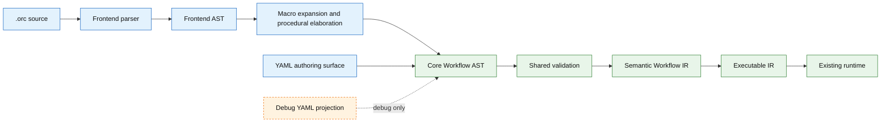
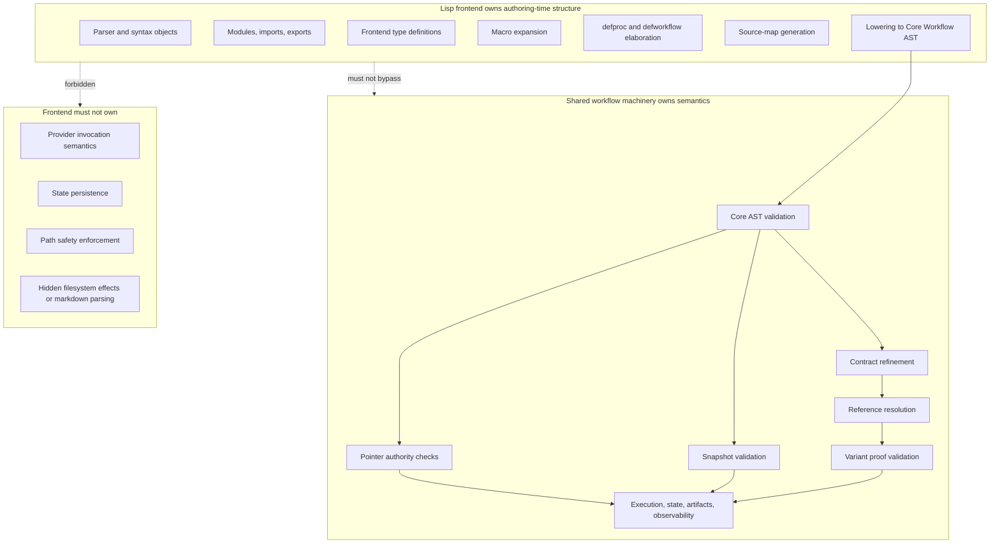
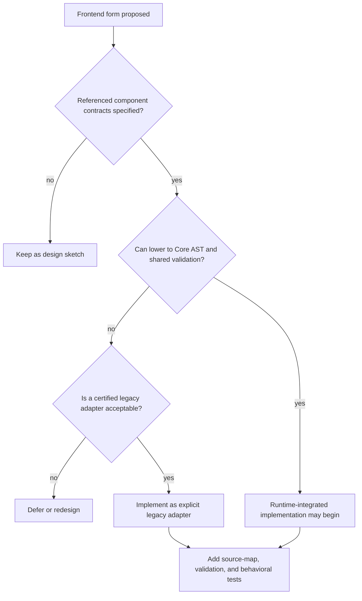
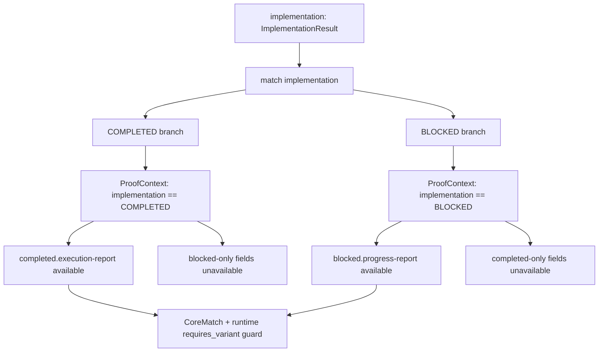
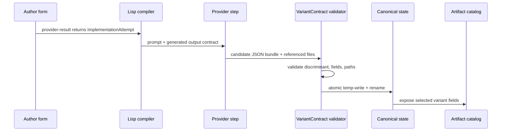
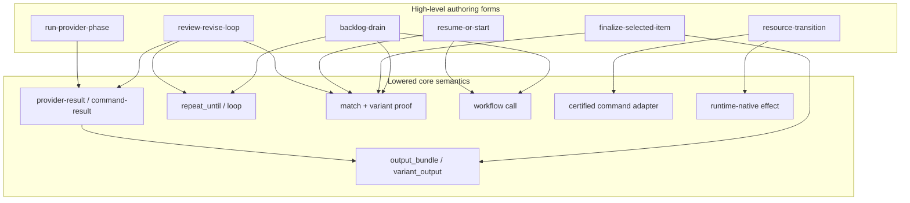
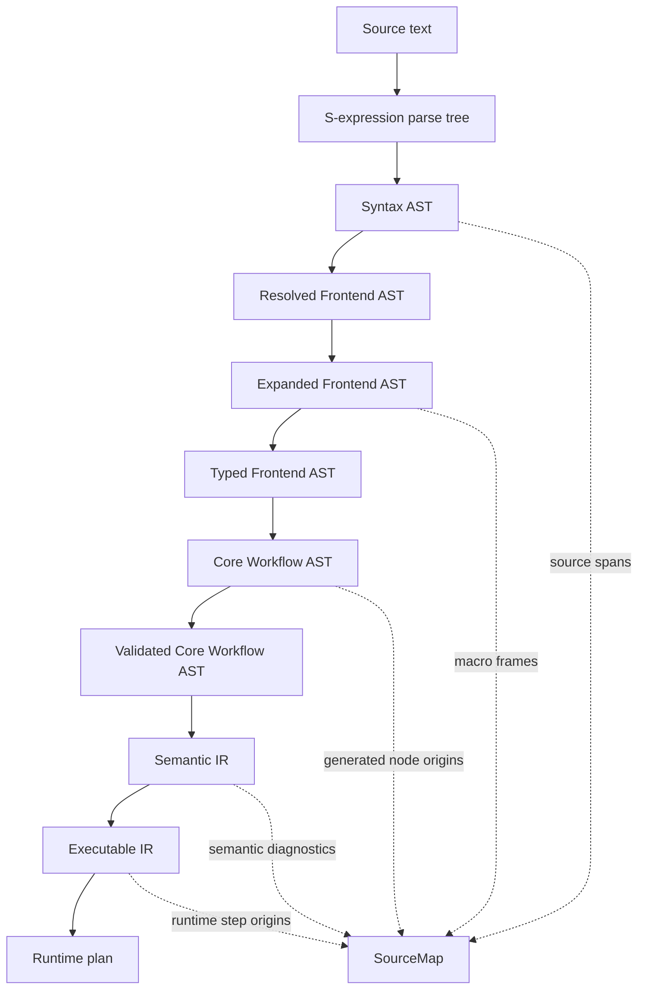
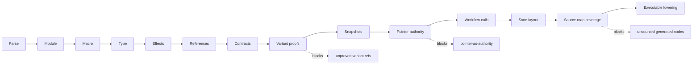
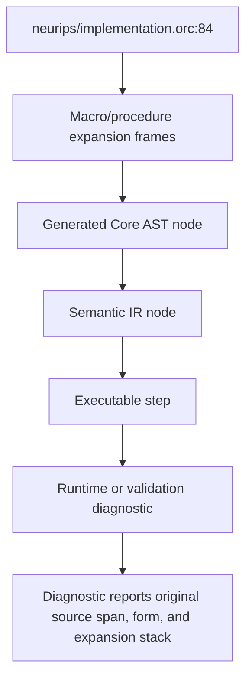

# Workflow Lisp Frontend Specification and Design

Status: accepted baseline / umbrella frontend contract
Target substrate: v2.14+ core workflow AST and semantic IR  
Primary purpose: composable, typed, procedural authoring of deterministic workflows  
Non-purpose: replacing the runtime, weakening validation, or generating brittle YAML-shaped code

Lifecycle note: this document remains the parent language contract for Workflow
Lisp. The initial autonomous drain against this design is complete, but
follow-on language extensions may be tracked as scoped design deltas. Current
accepted deltas include
[Workflow Lisp ProcRef And Partial Application Delta](workflow_lisp_proc_refs_partial_application.md).

Design principles: this specification follows the language-wide principles in
[Workflow Language Design Principles](workflow_language_design_principles.md).
The compact operating rule is:

- design for typed transitions, not brittle gates;
- structured bundles are authority and reports are views;
- artifact values are authority and pointer files are representations;
- freshness requires snapshot/hash evidence, not mtime;
- validate before committing canonical state;
- contracts may only narrow;
- variant-specific references require proof;
- frontends lower to core AST and shared semantic IR, not YAML text;
- macros cannot hide effects;
- procedures compose workflow behavior;
- state paths are derived from contexts, not hand-managed;
- legacy parsing and pointer conventions are quarantined;
- every generated semantic node is source-mapped.

This document assumes the Lisp frontend is not a YAML generator and not merely
a macro veneer. It is a typed procedural authoring language that lowers into
the existing validated workflow pipeline:

```text
Lisp source
  -> frontend AST
  -> macro expansion / procedural elaboration
  -> core workflow AST
  -> shared validation
  -> semantic IR
  -> executable IR
  -> existing runtime
```

The same pipeline, with the authority boundary made explicit:



The design is grounded in the v2.14 handoff's guardrails: the frontend must
generate proven core semantics rather than hide unresolved semantics; the core
substrate includes `materialize_artifacts`, `pre_snapshot`, `variant_output`,
`select_variant_output`, `requires_variant`, `SnapshotRef`, and variant-aware
artifact references; and pointer files are representations, not semantic
authority.

Diagram index:

- Pipeline and authority boundary: introduction.
- Ownership boundaries and implementation gate: Section 0.
- Variant proof flow: Section 11.
- Structured provider result flow: Section 22.
- Standard-library lowering map: Part VI.
- Compiler intermediate and source-map flow: Part VIII and Section 74.
- Validation pass sequence: Section 59.

## How To Read This Document

This is the north-star design for Workflow Lisp. It is not an implementation
status report and it is not a promise that every described surface exists in
the current codebase. Use it to understand the target architecture, the semantic
constraints that must not be weakened, and the staged path from MVP to full
frontend.

For current implementation status, use the active Lisp frontend run state,
implementation plans, test results, and the MVP comparison document. For the
bounded first tranche, start with
[Workflow Lisp Frontend MVP Specification](workflow_lisp_frontend_mvp_specification.md)
and [Workflow Lisp MVP Comparison](../workflow_lisp_mvp_comparison.md).

### Reader Paths

| If you want to... | Read first |
| --- | --- |
| Decide whether the frontend is allowed to exist at all | Core thesis and design goals: Sections 1-3. |
| Understand implementation prerequisites and ownership boundaries | Section 0, then internal component docs linked from that section. |
| Learn the author-facing language | Parts I-II: modules, types, definitions, expressions, calls, and `match`. |
| Understand semantic authority rules | Parts III-IV: effects, artifact authority, reports, contexts, and derived state. |
| Understand provider/command output handling | Part V plus lowering rules for `provider-result`, `command-result`, and `produce-one-of`. |
| Understand the standard library target | Parts VI and XIV. |
| Understand macro safety | Part VII plus effect validation and source-map requirements. |
| Understand compiler/runtime internals | Parts VIII-IX, then Parts X-XII. |
| See the intended end-user shape | Part XV examples and the MVP comparison. |
| Plan implementation work | Parts XVII-XIX: testing, staging, and open decisions. |

### Grouped Contents

| Area | Sections |
| --- | --- |
| Prerequisites and boundaries | Section 0. |
| Thesis, goals, non-goals | Sections 1-3. |
| Language surface | Part I, Sections 4-8. |
| Expressions and control flow | Part II, Sections 9-15. |
| Effects, authority, state, and contexts | Parts III-IV, Sections 16-21. |
| Provider, command, and structured output semantics | Part V, Sections 22-25. |
| Standard procedural library | Part VI, Sections 26-31. |
| Macro system | Part VII, Sections 32-37. |
| Compiler intermediates and lowering | Parts VIII-IX, Sections 38-58. |
| Validation, errors, source maps, observability, CLI | Parts X-XIII, Sections 59-80. |
| Standard library sketch and examples | Parts XIV-XV, Sections 81-91. |
| Lints, testing, staging, and open decisions | Parts XVI-XIX, Sections 92-110. |

## 0. Prerequisites, Boundaries, And Missing Internal Specs

This document is not implementation-ready as a runtime-integrated frontend
until the internal component contracts below are specified and reviewed. Parser
and type-system experiments are allowed, but they must not claim executable
runtime integration until the shared Core AST, Semantic IR, reference, proof,
effect, state-layout, source-map, and standard-library lowering contracts are
resolved.

### Hard Prerequisites

The frontend depends on stable v2.14+ substrate behavior:

- `materialize_artifacts`
- `pre_snapshot`
- `variant_output`
- `select_variant_output`
- `requires_variant`
- `SnapshotRef`
- variant-aware artifact references
- pointer authority rules
- validation-before-commit semantics

It also depends on the shared compiler/runtime contracts listed below. These
contracts are intentionally internal design docs for now; they are not public
DSL feature specifications.

### Boundary With Existing Components

The Lisp frontend owns:

- parsing `.orc` source
- frontend AST and syntax objects
- module/import/export resolution
- frontend type definitions
- pure helper checking
- macro expansion, when macros are implemented
- `defproc` and `defworkflow` elaboration
- source-map generation
- lowering to Core Workflow AST

Existing shared workflow machinery owns:

- Core Workflow AST validation
- contract refinement checks
- reference resolution
- variant proof validation
- snapshot validation
- pointer authority checks
- provider prompt-contract injection
- command/provider execution
- state writes and resume
- artifact publication
- observability

The frontend must not own:

- runtime execution
- provider invocation semantics
- state persistence
- artifact lineage storage
- path safety enforcement
- hidden markdown parsing
- hidden filesystem effects



### Internal Component Contracts Required Before Runtime Implementation

The following component docs define the missing implementation contracts:

1. [Core Workflow AST](workflow_lisp_core_workflow_ast.md)  
   Syntax-neutral workflow representation shared by YAML and Lisp.

2. [Core Statement Taxonomy](workflow_lisp_core_stmt_taxonomy.md)  
   Concrete statement families such as provider step, command step, call,
   match, repeat, materialization, snapshot, variant output, and variant
   selection.

3. [Semantic Workflow IR](workflow_lisp_semantic_workflow_ir.md)  
   Validated type-rich IR that records contracts, refs, effects, proofs, state
   layout, and source maps.

4. [Executable IR](workflow_lisp_executable_ir.md)  
   Current-checkout executable contract documenting validated
   `LoadedWorkflowBundle.ir` / `ExecutableWorkflow` as the runtime-facing
   authority and adjacent projections as derived views.

5. [Reference Catalog](workflow_lisp_reference_catalog.md)  
   Unified catalog for artifact refs, snapshot refs, outcome refs, exit-code
   refs, workflow inputs/outputs, and variant availability.

6. [Type Catalog](workflow_lisp_type_catalog.md)  
   Mapping from Lisp types to workflow contracts, output-bundle schemas, and
   variant-output schemas.

7. [Effect Graph](workflow_lisp_effect_graph.md)  
   Representation and checking of reads, writes, provider calls, command calls,
   workflow calls, state updates, ledger updates, resource moves, snapshots,
   and pointer materializations.

8. [Proof Graph](workflow_lisp_proof_graph.md)  
   How `match`, `requires_variant`, and compiler-generated proof contexts make
   variant-specific fields available.

9. [State Layout](workflow_lisp_state_layout.md)  
   Derivation of phase state paths, snapshot paths, bundle paths, temp paths,
   artifact roots, and pointer paths from typed contexts.

10. [Source Map](workflow_lisp_source_map.md)  
   Required mapping from frontend syntax through Core AST, Semantic IR,
   Executable IR, runtime logs, and diagnostics.

11. [Frontend Standard Library Lowering](workflow_lisp_stdlib_lowering.md)  
    Exact lowering contracts for `provider-result`, `produce-one-of`,
    `run-provider-phase`, `resume-or-start`, `review-revise-loop`,
    `resource-transition`, `finalize-selected-item`, and `backlog-drain`.

12. [Legacy Adapter](workflow_lisp_legacy_adapter.md)  
    Rules for quarantined markdown parsing, old scripts, pointer conventions,
    and command adapters.

13. [Command Adapter Contract](workflow_command_adapter_contract.md)
    Certified command-adapter boundary for procedural behavior implemented by
    scripts or external commands, including inline-glue lint policy, adapter
    fixtures, source maps, and runtime-native promotion criteria.

14. [Debug YAML Renderer](workflow_lisp_debug_yaml_renderer.md)
    Optional, explicitly non-authoritative projection from Core AST or Semantic
    IR.

### Implementation Gate

Runtime-integrated implementation may begin only after the component contracts
above answer:

- what data shape crosses the boundary;
- which existing validation pass owns the check;
- which frontend checks are new;
- which lowering choices are allowed;
- which runtime behavior already exists;
- which runtime behavior would be newly required;
- how errors and source maps are reported.

If a high-level frontend form cannot lower into these contracts, it is not
implementation-ready. It should remain a design sketch or be backed by a
clearly marked legacy adapter.



## 1. Core Thesis

The Lisp frontend exists to solve problems that YAML cannot solve well:

- procedural composability
- typed reusable workflow functions
- module-level reuse
- structured state
- derived phase/resource contexts
- safe higher-order workflow calls
- typed outcome routing
- macro-based authoring compression
- source-mapped validation errors

It must not merely translate:

```yaml
steps:
  - name: X
```

into:

```lisp
(step X ...)
```

That would improve punctuation but not architecture.

The frontend should let authors write workflow logic like:

```lisp
(defworkflow run-selected-backlog-item
  ((ctx ItemCtx)
   (selection SelectionInput)
   (providers NeuripsProviders))
  -> SelectedItemResult

  (let* ((selected
           (resolve-selected-item ctx selection))

         (roadmap
           (call roadmap/sync
             :ctx (phase-ctx ctx 'roadmap-sync)
             :selected selected
             :providers providers.roadmap))

         (plan
           (ensure-approved-plan
             :ctx (phase-ctx ctx 'plan)
             :selected selected
             :roadmap roadmap.current
             :providers providers.plan))

         (implementation
           (call implementation/run
             :ctx (phase-ctx ctx 'implementation)
             :inputs (make-implementation-inputs ctx selected plan)
             :providers providers.implementation)))

    (finalize-selected-item ctx selected plan implementation)))
```

not:

```lisp
(phase-outcome implementation
  :state-path "${inputs.state_root}/implementation_state.json"
  :candidate step.MaterializeImplementationInputs.execution_report_target_path
  ...)
```

A high-level author should rarely spell:

- state JSON path
- snapshot name
- candidate output path
- variant bundle path
- pointer file path
- manual `requires_variant` pairing
- line-prefix report extraction

Those belong in lower-level elaboration, not normal authoring.

## 2. Design Goals

### 2.1 Procedural Composability

The language must support reusable procedural definitions:

```text
defworkflow  exported runtime-callable workflow
defproc      reusable effectful workflow procedure
defun        pure helper
defmacro     compile-time syntax transformer
```

A workflow should be composable like a program, not only like a YAML file.

### 2.2 Direct-To-IR Pipeline

The frontend must lower to the core workflow AST, then use the existing shared
validation and elaboration pipeline.

It must not require YAML as an intermediate.

Generated YAML may exist only as:

- debug projection
- audit rendering
- migration comparison artifact
- golden-test fixture

It is non-authoritative.

### 2.3 Typed Structured State

Human-readable reports are views. They are not semantic authority.

Semantic state must come from structured typed records, bundles, or unions.

Bad:

```lisp
:extract (:line-prefix "Blocker Class:" :strip ("`" "-" "#"))
```

Good:

```lisp
(defrecord Blocker
  (class BlockerClass)
  (reason String)
  (retryable Boolean)
  (owner Optional[String]))

(defunion ImplementationAttempt
  (COMPLETED
    (execution-report Path.execution-report))

  (BLOCKED
    (progress-report Path.progress-report)
    (blocker Blocker)))
```

### 2.4 Collapse Brittle Gates Into Typed Transitions

The frontend should not add more gate-shaped abstractions.

It should replace:

- file exists?
- status == APPROVED?
- recovery bundle missing?
- did this report contain a line?
- did this pointer file point somewhere?

with typed transitions:

- `resume_or_start`
- `resource_transition`
- `provider_result`
- `review_revise_loop`
- `backlog_drain`

### 2.5 Preserve v2.14 Semantic Guarantees

All lowered forms must preserve:

- contract inheritance/refinement
- snapshot evidence
- variant proof
- atomic bundle commit
- pointer authority
- same-version workflow call rules
- provider output-contract injection
- command output validation

The handoff explicitly treats mtime-only freshness, invalid bundle writes before
validation, pointer ambiguity, and unproved variant references as design
hazards. The frontend must not reintroduce them.

## 3. Non-Goals

The frontend does not provide:

- arbitrary Lisp evaluation
- runtime code loading
- general-purpose scripting
- untyped dynamic dispatch
- semantic parsing of markdown reports
- hidden filesystem effects
- hidden provider calls
- a second runtime
- a replacement for shared validation

It also should not expose NeurIPS-specific mechanics as core language
primitives. Domain-specific forms belong in modules or macro libraries.

## Part I. Language Surface

## 4. File Format And Module Form

Recommended file extension:

```text
.orc
```

Every source file begins with a module declaration:

```lisp
(defmodule neurips.implementation
  (:language workflow-lisp "0.1")
  (:target-dsl "2.14")

  (import core)
  (import std/paths :as path)
  (import std/phases :as phase)
  (import neurips/types :as nt)

  (export
    ImplementationInputs
    ImplementationProviders
    ImplementationResult
    run-implementation-phase))
```

### 4.1 Module Responsibilities

A module provides:

- namespace
- imports
- exports
- language version
- target DSL version
- type definitions
- procedural definitions
- macro definitions

### 4.2 Import Forms

```lisp
(import std/paths)
(import std/paths :as path)
(import neurips/implementation :only (run-implementation-phase ImplementationResult))
```

### 4.3 Export Forms

```lisp
(export
  run-implementation-phase
  ImplementationResult
  ImplementationInputs)
```

Only exported names are visible to importing modules.

## 5. Lexical Syntax

### 5.1 Atoms

```text
symbols           implementation/run
keywords          :ctx :inputs :providers
strings           "artifacts/work/report.md"
integers          86400
floats            0.25
booleans          true false
nil               nil
quoted symbols    'implementation
```

### 5.2 Comments

```lisp
; line comment
```

### 5.3 Lists

```lisp
(form arg1 arg2 :keyword value)
```

### 5.4 Vectors

Optional shorthand for literal homogeneous lists:

```lisp
[APPROVE REVISE]
```

May be omitted in v0.1 to keep parsing simple.

## 6. Name Resolution

Names resolve in this order:

1. lexical bindings
2. local definitions
3. import aliases
4. qualified module references
5. standard prelude

Examples:

```text
ctx
selected.plan-path
providers.implementation.execute
implementation/run
path.execution-report
```

The compiler must reject ambiguous unqualified names.

## 7. Types

The frontend has a static type system that maps to workflow contracts and
semantic IR entries.

### 7.1 Primitive Scalar Types

```text
String
Int
Float
Bool
Json
TimestampNs
RunId
Symbol
```

### 7.2 Enum Types

```lisp
(defenum ReviewDecision
  APPROVE
  REVISE)

(defenum DrainStatus
  CONTINUE
  BLOCKED
  EMPTY)

(defenum BlockerClass
  missing_resource
  unavailable_hardware
  roadmap_conflict
  external_dependency_outside_authority
  user_decision_required
  unrecoverable_after_fix_attempt)
```

Enums map to:

- scalar contract with allowed values
- JSON schema enum
- variant discriminants when used in unions

### 7.3 Path Types

Path types are refined contracts.

```lisp
(defpath Path.state-file
  :kind relpath
  :under "state"
  :must-exist false)

(defpath Path.state-existing
  :kind relpath
  :under "state"
  :must-exist true)

(defpath Path.execution-report
  :kind relpath
  :under "artifacts/work"
  :must-exist true)

(defpath Path.execution-report-target
  :kind relpath
  :under "artifacts/work"
  :must-exist-target false)

(defpath Path.review-report
  :kind relpath
  :under "artifacts/review"
  :must-exist true)
```

Path refinements must not weaken inherited contracts.

A value of type:

```text
Path.execution-report
```

is a path value, not a pointer file path.

Pointer files are optional materialized representations.

### 7.4 Records

```lisp
(defrecord ImplementationInputs
  (design Path.design)
  (plan Path.plan)
  (check-commands Path.check-commands)
  (execution-report-target Path.execution-report-target)
  (checks-report-target Path.checks-report-target)
  (review-report-target Path.review-report-target))
```

Records map to:

- typed product values
- structured output bundles
- workflow input groups
- semantic IR product types

### 7.5 Unions

```lisp
(defunion ImplementationResult
  (COMPLETED
    (execution-report Path.execution-report)
    (checks-report Path.checks-report)
    (review-report Path.review-report)
    (review-decision ReviewDecision))

  (BLOCKED
    (progress-report Path.progress-report)
    (blocker Blocker)))
```

Unions map to tagged variant contracts.

Every union has:

- discriminant name
- variant names
- variant-specific fields
- optional shared fields
- static availability metadata

Variant-specific fields are only accessible inside proof contexts created by
`match`, explicit `requires`, or a frontend construct that lowers to one of
those.

### 7.6 Optional And List Types

```text
Optional[String]
List[Path.execution-report]
Map[String, Json]
```

Initial implementation may restrict these to structured bundles and pure values,
not artifact refs, unless existing contracts support them.

### 7.7 Workflow References

```text
WorkflowRef[SelectedItemInput -> SelectedItemResult]
WorkflowRef[(DrainCtx SelectionState) -> SelectionResult]
```

Workflow references are compile-time or module-level values, not runtime-loaded
code.

They are used for higher-order orchestration such as:

```lisp
(backlog-drain
  :selector selector/run
  :run-item selected-item/run
  :gap-drafter gap/draft)
```

The compiler checks signatures before lowering.

### 7.8 Procedure References

```text
ProcRef[PhaseInput -> PhaseResult]
ProcRef[(SelectedItem Design Plan) -> ImplementationResult]
```

Procedure references are compile-time references to named `defproc`
definitions. They provide higher-order procedural composition without adding
runtime procedure values, closures, provider-selected procedures, or dynamic
dispatch in executable IR.

The accepted model is:

- `ProcRef[...]` types reference named `defproc` signatures;
- `(proc-ref name)` creates an explicit compile-time procedure reference;
- `bind-proc` partially binds named arguments and produces a specialized
  compile-time `ProcRef`;
- specialization happens before Core Workflow AST / Semantic IR lowering;
- executable IR and runtime state contain no unresolved procedure values.

Detailed contract:
[Workflow Lisp ProcRef And Partial Application Delta](workflow_lisp_proc_refs_partial_application.md).

## 8. Definition Forms

### 8.1 `defschema`

Defines reusable field schemas independent of concrete records.

```lisp
(defschema ReportTargets
  (execution-report-target Path.execution-report-target)
  (checks-report-target Path.checks-report-target)
  (review-report-target Path.review-report-target))
```

Use when several records share field structure.

### 8.2 `defpath`

Defines path contract refinements.

```lisp
(defpath Path.backlog-active
  :kind relpath
  :under "docs/backlog/active"
  :must-exist true)
```

Lowering:

```text
Contract(kind=relpath, under=..., must_exist=...)
```

### 8.3 `defenum`

Defines scalar enum contract.

```lisp
(defenum SelectionMode
  ACTIVE_SELECTION
  RECOVERED_IN_PROGRESS)
```

### 8.4 `defrecord`

Defines product type.

```lisp
(defrecord SelectedItemInputs
  (selection-mode SelectionMode)
  (selected-item-active-path Path.backlog-active)
  (selected-item-in-progress-path Path.backlog-in-progress)
  (selected-item-context-path Path.state-existing)
  (check-commands-path Path.state-existing))
```

### 8.5 `defunion`

Defines tagged outcome type.

```lisp
(defunion SelectedItemResult
  (CONTINUE
    (item-summary Path.work-report)
    (run-state Path.state-existing))

  (BLOCKED
    (item-summary Path.work-report)
    (reason String)
    (stage FailedStage)))
```

### 8.6 `defun`

Defines pure helper function.

```lisp
(defun phase-name->state-key ((phase Symbol)) -> String
  (string/concat (symbol/name phase) "_state"))
```

Pure functions may:

- construct records
- construct paths symbolically
- select fields
- combine strings
- compute constants
- build type-level descriptors

Pure functions may not:

- read files
- write files
- call providers
- call workflows
- run commands
- inspect wall-clock time
- generate random values

A `defun` either evaluates at compile time or lowers to pure expression IR.

### 8.7 `defmacro`

Defines compile-time AST transformation.

```lisp
(defmacro with-phase ((ctx phase-name) &body body)
  ...)
```

Macros operate on syntax objects, not raw strings.

Macros may:

- construct AST
- introduce hygienic bindings
- expand shorthand into typed forms
- emit source-map frames

Macros may not:

- perform filesystem I/O
- perform network I/O
- depend on wall-clock time
- call providers
- run commands
- weaken contracts
- emit executable IR directly

A macro expands to frontend AST, which must still pass validation.

### 8.8 `defproc`

Defines reusable effectful workflow procedure.

```lisp
(defproc ensure-approved-plan
  ((ctx PhaseCtx)
   (selected SelectedItemInputs)
   (roadmap RoadmapState)
   (providers PlanProviders))
  -> PlanGateResult

  :effects
    ((reads selected selected.selected-item-context-path)
     (uses-provider providers.generate providers.review)
     (writes Path.plan-target Path.review-report)
     (updates-state ctx))

  ...)
```

A `defproc` is not necessarily a separate callable workflow boundary.

It may lower by:

- inlining into caller core AST
- lowering to private generated subworkflow
- lowering to certified runtime effect

The lowering choice must preserve source maps and effect transparency.

#### 8.8.1 Why `defproc` Exists

A macro transforms syntax. A `defproc` represents reusable workflow behavior.

Examples:

- `resume-or-start`
- `resource-transition`
- `review-revise-loop`
- `run-provider-phase`
- `finalize-selected-item`

These are too semantic to be mere macros.

### 8.9 `defworkflow`

Defines exported runtime-callable workflow.

```lisp
(defworkflow run-implementation-phase
  ((ctx PhaseCtx)
   (inputs ImplementationInputs)
   (providers ImplementationProviders))
  -> ImplementationResult

  :effects
    ((reads inputs.design inputs.plan)
     (uses-provider providers.execute providers.review providers.fix)
     (writes Path.execution-report Path.checks-report Path.review-report)
     (updates-state ctx))

  ...)
```

A `defworkflow` maps to a callable workflow in core AST.

It has:

- typed input signature
- typed output signature
- declared effects
- body
- module-qualified name
- target DSL version

Calls to it lower to existing workflow call IR and obey same-version call rules.

## Part II. Expression And Control Forms

## 9. Pure Expressions

```lisp
(let ((x 1)
      (y 2))
  (+ x y))
```

Pure expressions are side-effect-free.

They may appear in:

- path construction
- record construction
- conditions over already-available values
- arguments to procs/workflows

## 10. Sequential Binding: `let*`

```lisp
(let* ((selected (resolve-selected-item ctx selection))
       (plan (ensure-approved-plan ctx selected providers.plan))
       (implementation
         (call implementation/run
           :ctx (phase-ctx ctx 'implementation)
           :inputs (make-implementation-inputs ctx selected plan)
           :providers providers.implementation)))
  (finalize-selected-item ctx selected plan implementation))
```

`let*` establishes sequential dependency order.

Lowering:

- each effectful binding lowers to one or more core statements
- later bindings may reference earlier bound values
- pure bindings lower to expression IR

The runtime remains deterministic and sequential unless the core runtime
explicitly supports parallelism.

## 11. Pattern Matching

```lisp
(match implementation
  ((COMPLETED completed)
   (publish-completed ctx completed))

  ((BLOCKED blocked)
   (record-blocked ctx blocked)))
```

`match` over a union creates a proof context.

Inside:

```lisp
((COMPLETED completed) ...)
```

the compiler knows that:

- `implementation` is variant `COMPLETED`
- `completed.execution-report` is available
- blocked-only fields are unavailable

Lowering:

- core match over discriminant
- `ProofContext variant=COMPLETED`
- variant-aware artifact refs permitted inside branch
- runtime `requires_variant` guard retained

This maps directly to the v2.14 rule that variant-only references require proof
via `match` or explicit `requires_variant`.



## 12. Conditionals

`if` is allowed only for pure or already-proven values.

```lisp
(if selected.active?
  (resource-transition ...)
  selected)
```

For union values, `match` is preferred.

The compiler should warn on:

```lisp
(if (= implementation.state COMPLETED)
  implementation.execution-report
  ...)
```

because this risks recreating unproved variant refs.

Preferred:

```lisp
(match implementation
  ((COMPLETED completed) completed.execution-report)
  ((BLOCKED blocked) ...))
```

## 13. Loops

### 13.1 Bounded Loop

```lisp
(loop/recur
  :max max-iterations
  :state initial-state

  (fn (state)
    ...))
```

Loop body returns:

- `(continue new-state)`
- `(done result)`

Lowering options:

- `repeat_until` core construct
- generated workflow loop
- runtime loop IR

The compiler must preserve:

- boundedness
- typed loop state
- typed result
- no hidden variant proof across iterations unless explicitly supported

General cross-iteration proof is not assumed.

## 14. Workflow Calls

```lisp
(call implementation/run
  :ctx implementation-ctx
  :inputs implementation-inputs
  :providers providers.implementation)
```

Checks:

- callee exists
- callee exported or local
- target DSL version compatible
- argument types match
- effects permitted
- return type matches binding

Lowering:

- `CoreCallStep`
- workflow reference
- typed input bindings
- expected typed outputs

## 15. Higher-Order Workflow Parameters

```lisp
(defworkflow backlog-drain
  ((ctx DrainCtx)
   (selector WorkflowRef[DrainCtx -> SelectionResult])
   (run-item WorkflowRef[SelectedItemInput -> SelectedItemResult])
   (gap-drafter WorkflowRef[GapInput -> GapResult])
   (max-iterations Int))
  -> DrainResult
  ...)
```

Workflow refs are resolved at compile time or module-link time.

They are not runtime arbitrary code.

## Part III. Effects And Authority

## 16. Effect System

Every effectful definition declares or infers effects.

Effect kinds:

- `reads(path-or-artifact)`
- `writes(path-or-contract)`
- `publishes(artifact-name)`
- `uses-provider(provider)`
- `uses-command(command)`
- `calls-workflow(workflow)`
- `updates-state(context)`
- `writes-snapshot(snapshot-kind)`
- `reads-snapshot(snapshot-ref)`
- `moves-resource(resource, from, to)`
- `updates-ledger(ledger)`
- `materializes-pointer(optional)`

Example:

```lisp
:effects
  ((reads inputs.design inputs.plan)
   (uses-provider providers.execute)
   (writes Path.execution-report Path.progress-report)
   (updates-state ctx))
```

### 16.1 Effect Checking

The compiler verifies:

- pure forms have no effects
- `defproc` effects are explicit or inferred
- `defworkflow` effects include all nested effects
- macros cannot hide effects
- resource transitions have resource capabilities
- provider calls have output contracts
- command calls have output validation

### 16.2 Effect Transparency

Expansion must make all effects visible in the semantic IR.

No macro may emit hidden command/provider/state mutations without attaching them
to the source form and effect graph.

## 17. Artifact Authority

An artifact value is authoritative.

Pointer files are optional representations.

A frontend value:

```text
Path.execution-report
```

means the artifact path value itself, not a file containing that path.

Pointer files may be generated only when:

- legacy command adapter requires them
- prompt needs a workspace-visible path
- debug output is requested
- runtime canonical pointer convention requires them

But pointer files are never semantic authority.

This follows the v2.14 pointer-authority model: artifact values are
authoritative, pointer files are optional materialized representations, and
published artifacts store values rather than pointer-file paths.

## 18. Reports Are Views, Not State

Markdown reports may be:

- created
- published
- reviewed
- shown to users
- linked in summaries

They must not be parsed to recover semantic fields.

Forbidden in normal workflow code:

```lisp
:extract (:line-prefix "Blocker Class:")
:parse-markdown-field "Review Decision:"
:grep "APPROVE"
```

Allowed only in:

```lisp
(deflegacy-adapter ...)
```

Example:

```lisp
(deflegacy-adapter parse-old-progress-report
  ((report Path.progress-report))
  -> Blocker

  :deprecated true
  :requires-fixtures true

  (legacy/line-prefix
    :field blocker-class
    :type BlockerClass
    :prefix "Blocker Class:"))
```

Legacy adapters are migration debt.

They must be:

- marked deprecated
- fixture-tested
- linted
- confined to legacy modules
- forbidden in new standard-library procedures

## Part IV. State, Contexts, And Derived Paths

## 19. Context Types

The language should use typed contexts to avoid manual state management.

```lisp
(defrecord RunCtx
  (run-id RunId)
  (state-root Path.state-root)
  (artifact-root Path.artifact-root))

(defrecord PhaseCtx
  (run RunCtx)
  (phase-name Symbol)
  (state-root Path.state-root)
  (artifact-root Path.artifact-root))

(defrecord ItemCtx
  (run RunCtx)
  (item-id String)
  (state-root Path.state-root)
  (artifact-root Path.artifact-root)
  (ledger Path.state-existing))

(defrecord DrainCtx
  (run RunCtx)
  (state-root Path.state-root)
  (manifest Path.state-existing)
  (ledger Path.state-existing))
```

### 19.1 Context Construction

```lisp
(phase-ctx item-ctx 'implementation)
(item-ctx drain-ctx selected-item)
```

### 19.2 Derived State

The compiler/runtime derives:

- phase state bundle path
- snapshot names
- candidate target paths
- temporary bundle paths
- canonical artifact names
- optional pointer paths
- observability labels

High-level code should not manually write:

```text
"${inputs.state_root}/implementation_state.json"
```

unless inside low-level interop.

## 20. Canonical State Layout

State layout belongs to the compiler/runtime, not ordinary authors.

Example conceptual layout:

```text
state/
  phases/
    implementation/
      state.json
      snapshots/
      candidates/
  selected-item/
    state.json
  drain/
    state.json
```

The exact layout is not language syntax. It is produced by the lowering/runtime
state strategy.

## 21. Phase Context

```lisp
(with-phase ctx implementation
  ...)
```

`with-phase` establishes:

- phase name
- phase state namespace
- phase artifact namespace
- standard output targets
- standard snapshot namespace
- observability span

It is a macro over context construction and scoped naming, not a runtime gate.

## Part V. Provider, Command, And Structured Output Semantics

## 22. Provider Result

```lisp
(provider-result providers.execute
  :ctx ctx
  :prompt prompts.implementation.execute
  :inputs (inputs.design inputs.plan)
  :returns ImplementationAttempt
  :artifacts
    ((COMPLETED
       (execution-report
         :target inputs.execution-report-target
         :format markdown))

     (BLOCKED
       (progress-report
         :target (phase-target ctx 'progress-report)
         :format markdown))))
```

Meaning:

- inject typed output contract into provider prompt
- provider must produce structured canonical bundle
- validate bundle
- validate referenced artifacts
- commit bundle atomically
- expose typed selected variant

Lowering:

- `ProviderStep`
- `VariantContract` from `ImplementationAttempt`
- `PromptContract` from return type
- `VariantOutput` validation
- `AtomicBundleWriter`
- `ArtifactEntry` registration



### 22.1 Provider Output Authority

The provider must produce structured state, not only prose.

Example canonical bundle:

```json
{
  "variant": "BLOCKED",
  "progress_report": "artifacts/work/implementation-progress.md",
  "blocker": {
    "class": "missing_resource",
    "reason": "Benchmark artifact unavailable.",
    "retryable": false,
    "owner": null
  }
}
```

The markdown report may say the same thing, but the JSON bundle is
authoritative.

## 23. Command Result

```lisp
(command-result validate-plan
  :argv ("python" "scripts/validate_plan.py"
         "--plan" plan.path
         "--out" (phase-state-target ctx 'plan-validation))
  :returns PlanValidationResult)
```

Meaning:

- run command
- validate structured output bundle
- expose typed result

For commands, no prompt contract is injected.

## 24. Produced Outcome

Some producers create candidate files rather than a canonical structured bundle.
For those, use a higher-level form:

```lisp
(produce-one-of ImplementationAttempt
  :ctx ctx
  :producer
    (provider providers.execute
      :prompt prompts.implementation.execute
      :inputs (inputs.design inputs.plan))
  :candidates
    ((COMPLETED
       (execution-report
         :target inputs.execution-report-target
         :schema Path.execution-report))

     (BLOCKED
       (progress-report
         :target (phase-target ctx 'progress-report)
         :schema Path.progress-report)
       (blocker Blocker
         :source structured-sidecar))))
```

But the preferred provider protocol should be structured `provider-result`.

`produce-one-of` lowers to:

- `pre_snapshot`
- producer step
- snapshot_diff evidence
- `select_variant_output`
- atomic bundle commit
- variant-aware artifact registration

This preserves the v2.14 rule that fresh selection uses content-hash evidence,
not mtime-only checks.

## 25. No Ordinary Text Extractors

The following is invalid outside legacy adapters:

```lisp
(blocker-class BlockerClass
  :from progress-report
  :line-prefix "Blocker Class:")
```

Error:

```text
semantic_field_extracted_from_report
```

Suggested fix:

Have the provider/command produce blocker-class in the structured output bundle.

## Part VI. Standard Procedural Library

The standard library is the compression layer. Its forms are not privileged
syntax unless the compiler can lower them into explicit core statements,
effects, contracts, and source maps.



## 26. `run-provider-phase`

High-level phase execution.

```lisp
(run-provider-phase implementation
  :ctx ctx
  :inputs inputs
  :provider providers.execute
  :prompt prompts.implementation.execute
  :returns ImplementationAttempt)
```

Expected lowering:

- derive phase state path
- derive canonical bundle path
- inject provider output contract
- run provider
- validate typed union
- atomic commit
- register typed artifact refs

It should not require manual state paths.

## 27. `review-revise-loop`

`review-revise-loop` is a standard-library review/fix abstraction, not a
compiler-owned primitive. Its concrete review-result, findings, blocker, and
exhaustion schemas are owned by the stdlib definition; the language/compiler
must provide the generic structured dataflow, effect visibility, source maps,
and generated path handling needed to compile it like other `.orc` library code.

```lisp
(review-revise-loop implementation-review
  :ctx ctx
  :completed completed
  :inputs inputs
  :review-provider providers.review
  :fix-provider providers.fix
  :review-prompt prompts.implementation.review
  :fix-prompt prompts.implementation.fix
  :max 40)
```

Return type:

```lisp
(defunion ReviewLoopResult
  (APPROVED
    (checks-report Path.checks-report)
    (review-report Path.review-report)
    (review-decision ReviewDecision))

  (BLOCKED
    (progress-report Path.progress-report)
    (blocker Blocker))

  (EXHAUSTED
    (last-review-report Path.review-report)
    (reason String)))
```

Required generated shape:

- `repeat_until`
- provider review step
- optional command checks step
- provider fix step
- structured decision output
- typed terminal result

No markdown parsing of review decision.

## 28. `resume-or-start`

```lisp
(resume-or-start plan-gate
  :ctx ctx
  :resume-from selected.final-plan-gate-state
  :valid-when APPROVED

  :start
    (call plan/run
      :ctx (phase-ctx ctx 'plan)
      :selected selected
      :roadmap roadmap
      :providers providers.plan)

  :returns PlanGateResult)
```

Meaning:

- validate prior canonical state
- if reusable, return typed resumed value
- otherwise run fresh workflow/procedure
- normalize both branches to same return type

This replaces brittle recovery gates.

## 29. `resource-transition`

```lisp
(resource-transition backlog-item
  :ctx ctx
  :resource selected.item
  :from Queue.active
  :to Queue.in-progress
  :ledger ctx.ledger
  :event SELECTED)
```

Return type:

```lisp
(defrecord ResourceTransitionResult
  (resource-id String)
  (from Queue)
  (to Queue)
  (new-path Path.backlog-in-progress)
  (transition-id String))
```

### 29.1 Lowering Options

`resource-transition` must not pretend to be more atomic than the substrate
supports.

Valid backends:

- certified command adapter + typed `output_bundle`
- runtime-native `ResourceTransition` effect
- transaction-capable state operation

If it lowers to a command adapter, the adapter must be:

- registered
- fixture-tested
- contract-validated
- source-mapped
- effect-declared

If the design needs true atomic file move + ledger update and the runtime lacks
it, this form should lower to a runtime-native effect in a later core tranche.

## 30. `finalize-selected-item`

```lisp
(finalize-selected-item
  :ctx ctx
  :selected selected
  :plan plan
  :implementation implementation)
```

Meaning:

- match typed phase results
- record completed or blocked item result
- move resources if needed
- write structured selected-item outcome
- publish summary artifact
- return `SelectedItemResult`

This replaces fan-in through multiple handwritten blocked/completed scripts.

## 31. `backlog-drain`

```lisp
(backlog-drain neurips
  :ctx ctx
  :selector selector/run
  :run-item selected-item/run
  :gap-drafter gap/draft
  :max-iterations max-iterations)
```

Return type:

```lisp
(defunion DrainResult
  (EMPTY
    (run-state Path.state-existing))

  (BLOCKED
    (stage FailedStage)
    (reason String)
    (summary Path.work-report))

  (COMPLETED
    (items-processed Int)
    (run-state Path.state-existing)))
```

Lowering:

- `loop/recur` or `repeat_until`
- selector workflow call
- selected item workflow call
- gap drafter workflow call
- typed state accumulator
- terminal typed result

This is the high-level construct that should materially shrink top-level
backlog-drain authoring.

## Part VII. Macro System

## 32. Macro Phases

Compiler phases:

```text
P0 read source
P1 parse S-expressions into syntax objects
P2 resolve module imports and macro bindings
P3 expand macros hygienically
P4 elaborate definitions and type signatures
P5 type-check expressions/procedures/workflows
P6 lower procedures to core workflow AST
P7 shared workflow validation
P8 semantic IR construction
P9 executable IR construction
```

Macro expansion occurs before full typechecking, but macro outputs are
typechecked.

Typed macros may optionally declare expected shapes.

## 33. Syntax Objects

Every syntax object carries:

- datum
- source span
- module context
- hygiene marks
- expansion stack

Example internal shape:

```python
Syntax(
    datum=List([...]),
    span=Span(file="foo.orc", line=12, col=3),
    module="neurips.implementation",
    marks=[MacroMark("with-phase", id="...")],
    expansion_stack=[...],
)
```

## 34. Hygiene

Macros introduce generated names with hygiene marks.

Example:

```lisp
(with-phase ctx implementation
  body)
```

may introduce:

```text
%phase_ctx_17
%phase_state_17
```

but these names cannot capture or be captured by user names.

Authors can request intentional capture only through explicit forms:

```lisp
(bind-as phase-ctx ...)
```

Initial version should avoid intentional capture.

## 35. Macro Determinism

Macros must be deterministic.

Forbidden:

- random
- current time
- filesystem reads
- environment variables
- network
- provider calls
- command execution

Allowed:

- syntax inspection
- static module metadata
- type descriptors
- declared compile-time constants

## 36. Macro Outputs

Macros emit frontend AST only.

Forbidden:

- emitting semantic IR directly
- emitting executable IR directly
- bypassing source-map creation
- bypassing validation

## 37. Macro Error Model

Macro expansion errors:

- `macro_unknown`
- `macro_arity_error`
- `macro_keyword_unknown`
- `macro_keyword_missing`
- `macro_expansion_cycle`
- `macro_hygiene_violation`
- `macro_non_deterministic`
- `macro_emits_invalid_ast`
- `macro_emits_untyped_hole`
- `macro_weakens_contract`
- `macro_hidden_effect`

## Part VIII. Compiler Intermediates

## 38. Intermediate Overview

```text
Source text
  -> SExpr
  -> Syntax AST
  -> Resolved Frontend AST
  -> Expanded Frontend AST
  -> Typed Frontend AST
  -> Core Workflow AST
  -> Validated Core Workflow AST
  -> Semantic IR
  -> Executable IR
  -> Runtime plan
```



## 39. Source Text

Input file:

```text
*.orc
```

Properties:

- human-authored
- module-scoped
- source-mapped
- not trusted until compiled

## 40. S-Expression Parse Tree

Low-level parse result.

Contains:

- lists
- atoms
- strings
- numbers
- source positions

No semantic meaning yet.

## 41. Syntax AST

Adds:

- module context
- hygiene marks
- macro expansion metadata

Used by macro system.

## 42. Resolved Frontend AST

After imports and name resolution.

Contains:

- fully qualified names
- resolved module references
- unexpanded macro calls marked
- definition table

## 43. Expanded Frontend AST

After macros.

Contains no unresolved macro calls.

Still contains:

- `defworkflow`
- `defproc`
- `defun`
- typed expressions
- high-level standard procedures

## 44. Typed Frontend AST

After typechecking.

Contains:

- type of every expression
- effect signature of every effectful form
- proof context annotations
- resolved workflow references
- record/union layouts
- path contract descriptors

Example:

```text
implementation : ImplementationResult
inside COMPLETED branch:
  completed : ImplementationResult.COMPLETED
  completed.execution-report : Path.execution-report
```

## 45. Core Workflow AST

Syntax-neutral structure shared by YAML and Lisp.

Suggested shape:

```python
CoreWorkflow(
    name: QualifiedName,
    version: DslVersion,
    inputs: list[CoreInput],
    outputs: list[CoreOutput],
    statements: list[CoreStmt],
    source_map: SourceMap,
)
```

Core statements:

- `CoreMaterializeArtifacts`
- `CoreProviderStep`
- `CoreCommandStep`
- `CoreCallStep`
- `CoreOutputBundle`
- `CoreVariantOutput`
- `CorePreSnapshot`
- `CoreSelectVariantOutput`
- `CoreMatch`
- `CoreRepeatUntil`
- `CorePublish`
- `CoreAssert`
- `CoreResourceTransitionCandidate` if runtime supports it

If runtime does not support `CoreResourceTransitionCandidate`, the frontend must
lower `resource-transition` to existing core constructs plus a certified command
adapter.

## 46. Validated Core Workflow AST

After shared validation.

Adds:

- `ReferenceCatalog`
- `ContractCatalog`
- `ProofContext` graph
- `WorkflowCallGraph`
- snapshot declarations
- artifact availability table
- effect graph
- pointer authority checks

This is where existing v2.14 validation should run.

## 47. Semantic IR

Semantic IR is validated and type-rich.

Suggested shape:

```python
SemanticWorkflowIR(
    workflows: dict[QualifiedName, SemanticWorkflow],
    types: TypeCatalog,
    contracts: ContractCatalog,
    refs: ReferenceCatalog,
    effects: EffectGraph,
    proofs: ProofGraph,
    state_layout: StateLayout,
    source_map: SourceMap,
)
```

Semantic step examples:

```python
SemanticProviderResult(
    id,
    provider_ref,
    prompt_contract,
    return_type,
    variant_contract,
    artifact_contracts,
    effects,
)

SemanticVariantSelection(
    id,
    snapshot_ref,
    candidates,
    return_union,
    atomic_commit,
)

SemanticWorkflowCall(
    id,
    callee,
    args,
    return_type,
    version_policy,
)
```

Semantic IR is the authoritative compiler output.

## 48. Executable IR

Runtime-ready form.

Contains:

- ordered executable steps
- resolved provider invocations
- resolved command invocations
- materialization actions
- snapshot capture actions
- atomic write actions
- runtime guards
- state projections
- observability hooks

Executable IR no longer contains macros, procedures, or unresolved type forms.

## 49. Runtime Plan

Final runtime plan includes:

- step order
- dependencies
- state paths
- artifact publication plan
- snapshot storage plan
- error handling plan
- observability spans
- resume checkpoints

## Part IX. Lowering Rules

## 50. `defworkflow` Lowering

Source:

```lisp
(defworkflow implementation/run
  ((ctx PhaseCtx)
   (inputs ImplementationInputs)
   (providers ImplementationProviders))
  -> ImplementationResult
  body)
```

Core AST:

```text
CoreWorkflow
  inputs:
    ctx fields as structured inputs or flattened inputs
    inputs fields
    providers fields
  outputs:
    union discriminant
    union fields by variant
  statements:
    lowered body
```

Semantic IR:

```text
SemanticWorkflow
  typed input signature
  typed output union
  workflow call entrypoint
  effect summary
```

## 51. `defproc` Lowering

A `defproc` may lower as inline or private workflow.

Inline lowering:

- use when procedure is local
- use when procedure body is small enough
- use when no explicit runtime boundary is needed

Private subworkflow lowering:

- use when procedure is reused many times
- use when procedure needs separate state namespace
- use when procedure boundary aids resume/debugging

Generated private names are deterministic:

```text
%neurips.implementation.ensure-approved-plan.v1
```

Source maps point back to the original `defproc`.

## 52. `call` Lowering

Source:

```lisp
(call implementation/run
  :ctx implementation-ctx
  :inputs implementation-inputs
  :providers providers.implementation)
```

Core AST:

```text
CoreCallStep
  callee: implementation/run
  args:
    ctx: ...
    inputs: ...
    providers: ...
  expected_return: ImplementationResult
```

Validation:

- same target DSL version
- argument contract compatibility
- provider ref compatibility
- workflow ref known
- return type bound

## 53. `match` Lowering

Source:

```lisp
(match result
  ((COMPLETED c) ...)
  ((BLOCKED b) ...))
```

Core AST:

```text
CoreMatch
  discriminant_ref: result.variant
  arms:
    COMPLETED:
      proof_context: result == COMPLETED
      statements: ...
    BLOCKED:
      proof_context: result == BLOCKED
      statements: ...
```

Semantic IR:

- `ProofContext` entered for branch
- `VariantArtifactEntry` availability narrowed
- runtime `requires_variant` guard retained

## 54. `provider-result` Lowering

Source:

```lisp
(provider-result providers.execute
  :ctx ctx
  :prompt prompts.implementation.execute
  :inputs (inputs.design inputs.plan)
  :returns ImplementationAttempt)
```

Core AST:

```text
CoreProviderStep
  provider: providers.execute
  prompt: prompts.implementation.execute
  prompt_contract: generated from ImplementationAttempt
  output_bundle: generated canonical bundle
  variant_output: generated if return type is union
```

Semantic IR:

```text
SemanticProviderResult
  VariantContract(ImplementationAttempt)
  PromptContract(...)
  AtomicBundleValidation(...)
```

## 55. `produce-one-of` Lowering

Source:

```lisp
(produce-one-of ImplementationAttempt
  :ctx ctx
  :producer ...
  :candidates ...)
```

Core AST:

```text
CorePreSnapshot
CoreProducerStep
CoreSelectVariantOutput
```

Semantic IR:

- `SnapshotEntry`
- `SnapshotDiffEvidence`
- `VariantSelection`
- `AtomicBundleWriter`

This aligns with the v2.14 selection model: snapshot evidence, exactly-one
changed candidate, validation before commit, and artifacts exposed only after
successful commit.

## 56. `resource-transition` Lowering

Possible lowering A: certified command adapter.

```text
CoreCommandStep
CoreOutputBundle
CorePublish
```

Possible lowering B: runtime-native transition.

```text
CoreResourceTransition
```

Rule:

If the form promises atomic move + ledger update, the selected backend must
actually provide that property.

If only a command adapter exists, the language must say:

```text
atomicity is adapter-certified and fixture-tested
```

not pretend it is a core runtime transaction.

## 57. `review-revise-loop` Lowering Contract

Source:

```lisp
(review-revise-loop implementation-review ...)
```

The stdlib definition must compile through the shared effectful composition
model to generated Core AST equivalent to:

```text
CoreRepeatUntil
  iteration state
  review provider-result
  match decision
  optional fix provider-result
  terminal typed output
```

Semantic IR must expose:

- `BoundedLoop`
- `ReviewDecision` enum
- `TerminalResult` union
- provider contracts
- artifact refs by branch

## 58. `backlog-drain` Lowering

Source:

```lisp
(backlog-drain neurips
  :selector selector/run
  :run-item selected-item/run
  :gap-drafter gap/draft
  :ctx ctx
  :max-iterations max)
```

Core AST:

```text
CoreRepeatUntil or LoopIR
  call selector
  match SelectionResult
    EMPTY -> done
    GAP -> call gap_drafter, continue
    SELECTED -> call run_item, match SelectedItemResult
```

Semantic IR:

- loop state type
- `WorkflowRef` signatures
- `DrainResult` union
- effect summary

## Part X. Validation Passes

## 59. Validation Sequence

Recommended sequence:

1. parse validation
2. module validation
3. macro validation
4. type validation
5. effect validation
6. reference validation
7. contract validation
8. variant proof validation
9. snapshot validation
10. pointer authority validation
11. workflow call validation
12. state layout validation
13. source-map coverage validation
14. executable lowering validation



## 60. Type Validation

Checks:

- all names resolve
- record fields exist
- union variants exist
- function arguments match signatures
- workflow call arguments match signatures
- pattern matches are exhaustive or explicitly partial
- return expressions match declared return type

## 61. Effect Validation

Checks:

- pure functions have no effects
- macros do not hide effects
- procedures declare or infer effects
- workflow effect summaries include nested effects
- resource transitions have capabilities
- providers are declared provider values
- commands are explicit command effects

## 62. Contract Validation

Checks:

- path refinements do not weaken source contracts
- literal paths have explicit contracts
- input/ref materialization inherits contracts
- record fields map to valid contracts
- union fields map to valid contracts

The handoff explicitly requires inherited contracts to be narrowed, not
weakened.

## 63. Variant Proof Validation

Checks:

- variant-specific field accessed only inside proof context
- `match` over discriminant creates proof
- explicit `requires` creates proof
- general `if`/`when` does not create proof unless supported
- runtime guard retained

## 64. Snapshot Validation

Checks:

- snapshot refs point to known steps
- snapshot names exist
- snapshot refs used only where allowed
- snapshot candidates match selected variants
- snapshot evidence uses sha256/presence, not mtime as authority

Snapshots are durable evidence, not artifacts, not publishable, and not
prompt-injected.

## 65. Pointer Authority Validation

Checks:

- published relpath artifacts store artifact value
- pointer files are optional representation
- noncanonical sidecars are not semantic inputs
- local pointer and published canonical pointer do not conflict

## 66. Report-Authority Validation

Checks:

- semantic fields are not extracted from markdown reports
- line-prefix extractors are confined to legacy adapters
- legacy adapters are deprecated and fixture-tested
- review decisions come from structured state
- blocker classes come from structured state
- drain status comes from structured state

## Part XI. Error Taxonomy

## 67. Frontend Parse/Module Errors

- `frontend_parse_error`
- `module_not_found`
- `module_cycle`
- `module_export_missing`
- `module_import_ambiguous`
- `target_dsl_unsupported`
- `language_version_unsupported`

## 68. Macro Errors

- `macro_unknown`
- `macro_arity_error`
- `macro_keyword_unknown`
- `macro_keyword_missing`
- `macro_expansion_cycle`
- `macro_hygiene_violation`
- `macro_non_deterministic`
- `macro_hidden_effect`
- `macro_emits_invalid_ast`
- `macro_weakens_contract`

## 69. Type Errors

- `type_unknown`
- `type_mismatch`
- `record_field_unknown`
- `record_field_missing`
- `union_variant_unknown`
- `union_match_non_exhaustive`
- `workflow_signature_mismatch`
- `proc_signature_mismatch`
- `higher_order_workflow_signature_mismatch`
- `return_type_mismatch`

## 70. Effect Errors

- `pure_function_has_effect`
- `macro_has_effect`
- `effect_not_declared`
- `effect_not_permitted`
- `resource_transition_capability_missing`
- `provider_effect_hidden`
- `command_effect_hidden`
- `state_update_hidden`

## 71. Authority Errors

- `semantic_field_extracted_from_report`
- `markdown_report_used_as_state`
- `pointer_used_as_semantic_authority`
- `noncanonical_pointer_sidecar`
- `published_pointer_path_instead_of_value`
- `legacy_adapter_missing_fixture`
- `legacy_adapter_not_deprecated`

## 72. Lowering Errors

- `lowering_no_backend_for_form`
- `resource_transition_requires_runtime_backend`
- `proc_lowering_cycle`
- `workflow_call_version_mismatch`
- `source_map_missing`
- `core_ast_invalid`
- `semantic_ir_invalid`
- `executable_ir_invalid`

## 73. Existing v2.14 Errors Reused

The frontend should surface existing v2.14 errors rather than invent duplicates:

- `contract_refinement_weakened`
- `contract_refinement_type_conflict`
- `pointer_authority_conflict`
- `snapshot_ref_unknown_step`
- `snapshot_ref_unknown_name`
- `snapshot_candidate_unchanged`
- `snapshot_candidate_ambiguous`
- `invalid_variant_bundle`
- `variant_required_field_missing`
- `variant_forbidden_field_present`
- `variant_ref_unproved`
- `variant_ref_wrong_variant`
- `variant_unavailable`
- `atomic_commit_failed`
- `bundle_commit_aborted_invalid_candidate`

These error classes are already part of the v2.14 handoff's intended taxonomy.

## Part XII. Source Maps And Observability

## 74. Source Map Requirements

Every generated core AST node must map to:

- source file
- source line/column
- source form path
- macro expansion stack
- procedure/workflow origin
- generated name origin

Example diagnostic:

```text
variant_ref_unproved

Generated step:
  %implementation.review.publish_execution_report

Origin:
  neurips/implementation.orc:84
  form: (match implementation ...)
  macro stack:
    review-revise-loop
    publish-result
```



## 75. Runtime Observability

Runtime logs should display both:

- generated executable step name
- high-level source form

Example:

```text
Running step %implementation_attempt.provider_execute
  source: neurips/implementation.orc:42
  form: (provider-result providers.execute ...)
```

## 76. Build Artifacts

Recommended compile artifacts:

```text
.orchestrate/build/<hash>/frontend_ast.json
.orchestrate/build/<hash>/expanded_frontend_ast.json
.orchestrate/build/<hash>/typed_frontend_ast.json
.orchestrate/build/<hash>/core_workflow_ast.json
.orchestrate/build/<hash>/semantic_ir.json
.orchestrate/build/<hash>/executable_ir.json
.orchestrate/build/<hash>/source_map.json
.orchestrate/build/<hash>/expanded.debug.yaml   # optional
```

## 76.1 Editor And Lint Tooling Compatibility

The compiler should expose diagnostics and source metadata in a
machine-readable form suitable for future CLI linting and Language Server
Protocol integration.

This is a compatibility requirement on compiler artifacts, not a requirement
to build editor tooling in the first frontend tranche.

Compiler outputs should support:

- stable diagnostic codes;
- source spans for parse, syntax, type, effect, proof, and lowering failures;
- symbol locations for definitions, fields, variants, workflow names, and
  module exports;
- type, contract, availability, and effect metadata for hover-style
  explanations;
- source-map links from frontend forms to generated Core AST, Semantic IR, and
  executable steps;
- lint classifications for brittle authoring patterns such as hidden command
  effects, report parsing, pointer-as-authority, manual state paths, unproved
  variant references, and command adapters without typed contracts.

Deferred tooling may include:

- `orchestrate lint workflow.orc`;
- diagnostics-on-save through LSP;
- hover information for types, contracts, effects, and proof contexts;
- go-to-definition for local definitions and module exports;
- completion for local names, variants, fields, and standard-library forms;
- document symbols;
- formatting and simple code actions.

These tools must consume the same compiler diagnostics, source maps, catalogs,
and validation results used by normal compilation. They must not implement a
parallel parser, type checker, linter, or workflow validator.

## Part XIII. CLI

## 77. Compile

```bash
orchestrate compile workflow.orc \
  --emit-core-ast \
  --emit-semantic-ir \
  --emit-source-map
```

## 78. Run

```bash
orchestrate run workflow.orc \
  --input inputs.json
```

Equivalent to:

```text
compile
validate
lower
execute
```

## 79. Explain Expansion

```bash
orchestrate explain workflow.orc \
  --form run-implementation-phase
```

Shows:

- macro expansions
- generated procedures
- core AST nodes
- semantic IR nodes
- source-map trace

## 80. Emit Debug YAML

```bash
orchestrate compile workflow.orc \
  --emit-debug-yaml expanded.yaml
```

Debug YAML is not semantic authority.

## Part XIV. Standard Library Sketch

## 81. `std/types`

```text
String
Int
Bool
Json
Optional[T]
List[T]
Map[K,V]
```

## 82. `std/paths`

```lisp
(defpath Path.state-root ...)
(defpath Path.state-file ...)
(defpath Path.state-existing ...)
(defpath Path.artifact-root ...)
(defpath Path.work-report ...)
(defpath Path.work-report-target ...)
(defpath Path.review-report ...)
(defpath Path.checks-report ...)
```

## 83. `std/context`

```text
RunCtx
PhaseCtx
ItemCtx
DrainCtx
```

```lisp
(run-ctx ...)
(phase-ctx ctx phase-name)
(item-ctx ctx selected)
```

## 84. `std/provider`

- `provider-result`
- `command-result`
- `produce-one-of`

## 85. `std/phase`

- `run-provider-phase`
- `review-revise-loop`
- `resume-or-start`
- `with-phase`
- `phase-target`
- `phase-state`

## 86. `std/resource`

- `resource-transition`
- `resource-location`
- `queue`
- `ledger-event`

## 87. `std/drain`

- `backlog-drain`
- `SelectionResult`
- `DrainResult`
- `GapResult`

## Part XV. Example End-To-End Design

## 88. Types

```lisp
(defmodule neurips/types
  (:language workflow-lisp "0.1")
  (:target-dsl "2.14")

  (import std/paths :as path)

  (defenum ReviewDecision APPROVE REVISE)

  (defenum BlockerClass
    missing_resource
    unavailable_hardware
    roadmap_conflict
    external_dependency_outside_authority
    user_decision_required
    unrecoverable_after_fix_attempt)

  (defrecord Blocker
    (class BlockerClass)
    (reason String)
    (retryable Bool)
    (owner Optional[String]))

  (defrecord ImplementationInputs
    (design path/design)
    (plan path/plan)
    (check-commands path/check-commands)
    (execution-report-target path/work-report-target)
    (checks-report-target path/checks-report-target)
    (review-report-target path/review-report-target))

  (defrecord ImplementationProviders
    (execute Provider)
    (review Provider)
    (fix Provider))

  (defunion ImplementationAttempt
    (COMPLETED
      (execution-report path/work-report))

    (BLOCKED
      (progress-report path/work-report)
      (blocker Blocker)))

  (defunion ImplementationResult
    (COMPLETED
      (execution-report path/work-report)
      (checks-report path/checks-report)
      (review-report path/review-report)
      (review-decision ReviewDecision))

    (BLOCKED
      (progress-report path/work-report)
      (blocker Blocker))))
```

## 89. Implementation Phase

```lisp
(defmodule neurips/implementation
  (:language workflow-lisp "0.1")
  (:target-dsl "2.14")

  (import std/context :as ctx)
  (import std/phase :as phase)
  (import std/provider :as provider)
  (import neurips/types :as nt)

  (export run)

  (defworkflow run
    ((phase-ctx ctx/PhaseCtx)
     (inputs nt/ImplementationInputs)
     (providers nt/ImplementationProviders))
    -> nt/ImplementationResult

    :effects
      ((reads inputs.design inputs.plan inputs.check-commands)
       (uses-provider providers.execute providers.review providers.fix)
       (writes inputs.execution-report-target
               inputs.checks-report-target
               inputs.review-report-target)
       (updates-state phase-ctx))

    (phase/with-phase phase-ctx implementation
      (let* ((attempt
               (provider/provider-result providers.execute
                 :ctx phase-ctx
                 :prompt prompts.implementation.execute
                 :inputs
                   (inputs.design
                    inputs.plan
                    inputs.execution-report-target)
                 :returns nt/ImplementationAttempt
                 :artifacts
                   ((COMPLETED
                      (execution-report
                        :target inputs.execution-report-target
                        :format markdown))

                    (BLOCKED
                      (progress-report
                        :target (phase/target phase-ctx 'progress-report)
                        :format markdown)))))

             (result
               (match attempt
                 ((COMPLETED completed)
                  (phase/review-revise-loop implementation-review
                    :ctx phase-ctx
                    :completed completed
                    :inputs inputs
                    :review-provider providers.review
                    :fix-provider providers.fix
                    :review-prompt prompts.implementation.review
                    :fix-prompt prompts.implementation.fix
                    :max 40))

                 ((BLOCKED blocked)
                  blocked))))

        result))))
```

Notes:

- no manual state path
- no markdown extraction
- no explicit snapshot name
- no candidate-path bookkeeping
- no manual `requires_variant`
- no pointer file authority

## 90. Selected Item Workflow

```lisp
(defworkflow run-selected-item
  ((item-ctx ItemCtx)
   (selection SelectionInput)
   (providers NeuripsProviders))
  -> SelectedItemResult

  (let* ((selected
           (resolve-selected-item item-ctx selection))

         (queue-transition
           (resource-transition backlog-item
             :ctx item-ctx
             :when selected.active?
             :resource selected.item
             :from Queue.active
             :to Queue.in-progress
             :ledger item-ctx.ledger
             :event SELECTED))

         (roadmap
           (call roadmap/sync
             :ctx (phase-ctx item-ctx 'roadmap-sync)
             :selected selected
             :providers providers.roadmap))

         (plan
           (resume-or-start plan-gate
             :ctx (phase-ctx item-ctx 'plan)
             :resume-from selected.final-plan-gate-state
             :valid-when APPROVED
             :start
               (call plan/run
                 :ctx (phase-ctx item-ctx 'plan)
                 :selected selected
                 :roadmap roadmap
                 :providers providers.plan)
             :returns PlanGateResult))

         (implementation
           (call implementation/run
             :ctx (phase-ctx item-ctx 'implementation)
             :inputs (make-implementation-inputs item-ctx selected plan)
             :providers providers.implementation)))

    (finalize-selected-item
      :ctx item-ctx
      :selected selected
      :queue-transition queue-transition
      :roadmap roadmap
      :plan plan
      :implementation implementation)))
```

## 91. Top-Level Drain

```lisp
(defworkflow drain
  ((ctx DrainCtx)
   (providers NeuripsProviders)
   (max-iterations Int))
  -> DrainResult

  (backlog-drain neurips
    :ctx ctx
    :selector selector/run
    :run-item selected-item/run
    :gap-drafter gap/draft
    :providers providers
    :max-iterations max-iterations))
```

This is the kind of compression that could genuinely improve composability and
size.

## Part XVI. Lints

## 92. Required Lints

- `low_level_state_path_in_high_level_module`
- `manual_snapshot_name_in_high_level_module`
- `manual_candidate_path_in_high_level_module`
- `line_prefix_extractor_in_workflow`
- `semantic_field_extracted_from_report`
- `markdown_report_used_as_state`
- `variant_output_without_variant_specific_fields`
- `manual_when_requires_variant_pair`
- `pointer_used_as_semantic_authority`
- `resource_move_without_transition`
- `recovery_gate_without_resume_or_start`
- `string_status_gate_without_union_match`
- `workflow_call_signature_erased`
- `macro_hidden_effect`

## 93. Lint Levels

```text
error    violates language safety
warn     valid but likely brittle
info     migration hint
```

Examples:

- `line_prefix_extractor_in_workflow`: error
- `manual_snapshot_name_in_high_level_module`: warn
- `variant_output_without_variant_specific_fields`: warn or error in strict mode

## Part XVII. Testing Strategy

## 94. Unit Tests

- parser tests
- module resolver tests
- macro expansion tests
- hygiene tests
- type checker tests
- effect checker tests
- source map tests

## 95. Lowering Tests

For each standard procedure:

- source `.orc`
- expected core AST
- expected semantic IR facts
- expected validation errors for misuse

Each implementation tranche that changes authoring behavior must also name an
end-to-end usage scenario. For Workflow Lisp, that usually means writing or
updating a small `.orc` workflow, compiling it, and running at least a dry-run
when runtime support exists. Focused parser, type, and lowering tests are still
required, but they are not enough by themselves for a composability claim.

## 96. Behavioral Equivalence Tests

For migrated workflows:

- legacy/current behavior
- v2.14 YAML behavior
- Lisp frontend behavior

Compare:

- published artifacts
- typed outcomes
- run state
- error codes
- snapshot evidence
- variant selection

## 97. Negative Tests

Required negative fixtures:

- semantic field parsed from markdown
- variant field accessed outside match
- pointer path published as artifact value
- resource transition without capability
- macro emits hidden provider call
- `defun` performs effect
- workflow ref signature mismatch
- line-prefix legacy adapter without fixture

## 98. Metrics Tests

Track:

- authored LOC
- semantic LOC
- gate-pattern count
- manual pointer count
- manual state-path count
- manual candidate-path count
- helper script count
- variant-proof boilerplate count

Success should be based on reductions in brittle correctness surfaces, not only
LOC.

## Part XVIII. Implementation Staging

## 99. Stage 1: Frontend Core Without Workflow Execution

Implement:

- parser
- syntax objects
- modules
- imports/exports
- `defenum`
- `defpath`
- `defrecord`
- `defunion`
- `defun`
- basic type checking

No effects yet.

## 100. Stage 2: Procedural Substrate

Implement:

- `defworkflow`
- `defproc`
- `call`
- `let*`
- `match`
- effect signatures
- source maps
- core AST lowering

A trivial workflow should compile to core AST and semantic IR.

## 101. Stage 3: Macro System

Implement:

- `defmacro`
- hygiene
- macro expansion frames
- macro determinism checks
- macro error mapping

Keep macros small initially.

## 102. Stage 4: Provider/Command Structured Results

Implement:

- `provider-result`
- `command-result`
- structured bundles
- union return types
- prompt contract generation
- variant output lowering

No markdown extraction.

## 103. Stage 5: Phase And Context Library

Implement:

- `PhaseCtx`
- `with-phase`
- `phase-target`
- `run-provider-phase`
- `produce-one-of`
- `review-revise-loop`
- `resume-or-start`

## 104. Stage 6: Resource And Drain Library

Implement:

- `resource-transition`
- `finalize-selected-item`
- `backlog-drain`
- workflow refs
- `loop/recur`

At this stage, decide whether `resource-transition` can safely lower to
certified command adapters or needs runtime-native core support.

## 105. Stage 7: NeurIPS Migration Experiment

Translate:

- implementation phase
- plan phase
- selected item
- top-level drain

Measure:

- LOC reduction
- gate-pattern reduction
- manual-state reduction
- manual-pointer reduction
- semantic equivalence

Reject the frontend design if translations remain YAML-shaped.

## Part XIX. Open Design Decisions

## 106. Procedure Lowering Policy

Need decide:

- always inline `defproc`
- always private-subworkflow `defproc`
- compiler chooses
- author annotation controls

Recommended:

```lisp
(defproc foo ... :lowering inline ...)
(defproc bar ... :lowering private-workflow ...)
(defproc baz ... :lowering auto ...)
```

Default:

```text
auto
```

## 107. Resource Transition Backend

Need decide whether to add a runtime-native resource transition effect.

A macro/proc cannot honestly guarantee atomic queue move + ledger update unless
the backend supports it.

Recommended:

- start with certified command adapter
- measure pain
- promote to runtime-native effect only if repeated and semantically critical

## 108. Workflow Refs

Need decide whether workflow references are:

- module-level compile-time only
- or structured runtime inputs

Recommended:

```text
compile-time only for v0.1
```

Runtime workflow refs create dynamic loading/versioning problems.

## 109. Debug YAML

Need decide whether to maintain an optional YAML renderer.

Recommended:

```text
yes, but non-authoritative
```

It helps review and migration without making YAML the compiler target.

## 110. Type Flattening

Need decide whether record inputs are flattened into existing workflow inputs or
preserved as structured input bundles.

Recommended:

- preserve in frontend and semantic IR
- flatten only if existing runtime requires it
- record the mapping in source maps

## Final Design Center

The Lisp frontend should be a typed procedural workflow language over the
existing deterministic runtime.

The minimal acceptable architecture is:

- `defmodule`
- `defenum` / `defpath` / `defrecord` / `defunion`
- `defun`
- `defmacro`
- `defproc`
- `defworkflow`
- `call`
- `let*`
- `match`
- effect signatures
- source maps
- core AST lowering
- shared validation
- semantic IR

The minimal acceptable standard library is:

- `provider-result`
- `command-result`
- `run-provider-phase`
- `review-revise-loop`
- `resume-or-start`
- `resource-transition`
- `finalize-selected-item`
- `backlog-drain`

The non-negotiable semantic rules are:

- structured bundles are authority
- reports are views
- artifact values are authority
- pointer files are representations
- freshness uses snapshot evidence, not mtime
- variant refs require proof
- macros cannot hide effects
- the frontend targets core AST / semantic IR, not YAML

That is the difference between a cosmetic Lisp frontend and a language that can
actually improve composability, size, reusability, and modularity.
