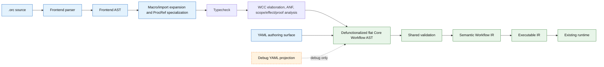
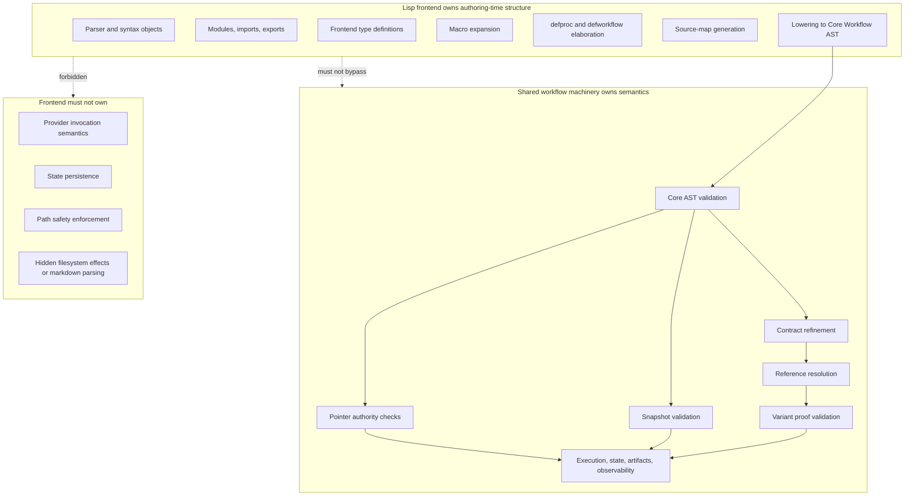
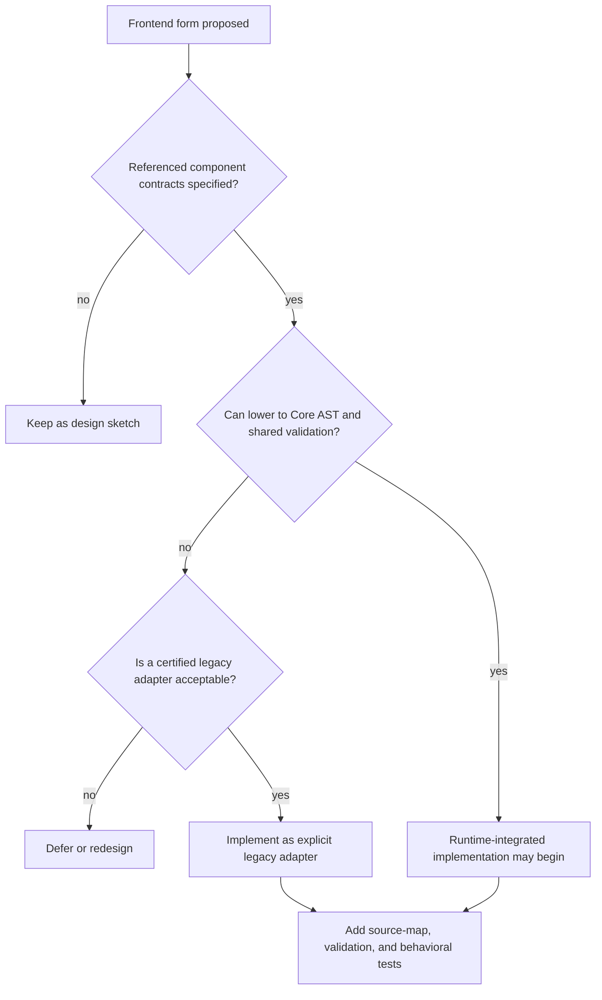
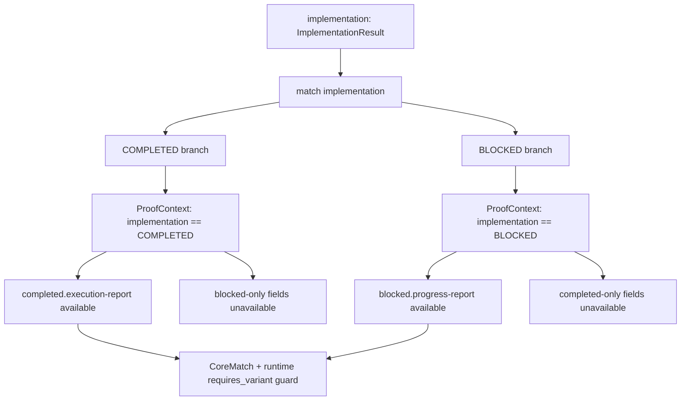
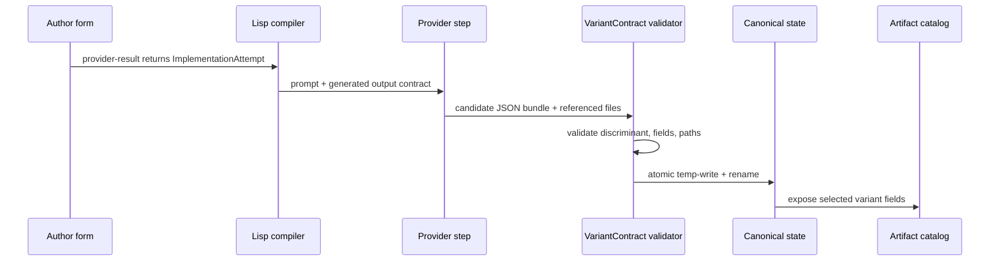
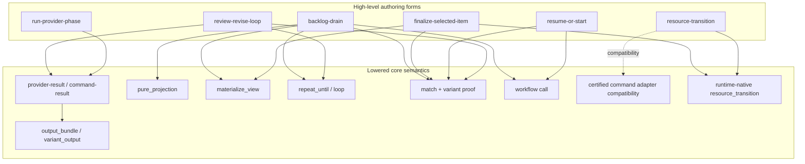
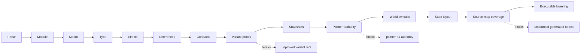
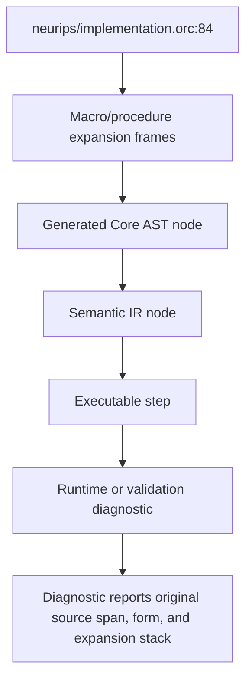

# Workflow Lisp Frontend Specification and Design

Status: accepted baseline / umbrella frontend contract
Target substrate: Workflow Core Calculus (WCC) schema 2 lowering into the
v2.14+ core workflow AST and semantic IR
Primary purpose: composable, typed, procedural authoring of deterministic workflows  
Non-purpose: replacing the runtime, weakening validation, or generating brittle YAML-shaped code

Lifecycle note: this document is the parent language contract for Workflow
Lisp. Focused companion contracts refine current ProcRef, compiler
middle-end, runtime migration, and composition/stdlib behavior:
[Workflow Lisp ProcRef And Partial Application Delta](workflow_lisp_proc_refs_partial_application.md),
[Workflow Lisp Core Calculus And Compiler Middle-End](workflow_lisp_core_calculus_middle_end.md),
[Workflow Lisp Runtime Migration Foundation](workflow_lisp_runtime_migration_foundation.md),
[Workflow Lisp Post-Foundation Composition And Stdlib Migration](workflow_lisp_post_foundation_composition_stdlib_migration.md),
[Workflow Lisp Procedure-First Reuse Contract](workflow_lisp_procedure_first_reuse_contract.md),
and
[Workflow Lisp Native Transportable Returns And Typed Result Guidance](workflow_lisp_native_transportable_returns.md).

Design principles: this specification follows the language-wide principles in
[Workflow Language Design Principles](workflow_language_design_principles.md).
The compact operating rule is:

- design for typed transitions, not brittle gates;
- structured bundles are authority and reports are views;
- artifact values are authority and pointer files are representations;
- freshness requires snapshot/hash evidence, not mtime;
- validate before committing canonical state;
- contracts may only narrow;
- variant-specific references require proof;
- frontends lower to core AST and shared semantic IR, not YAML text;
- macros cannot hide effects;
- procedures compose workflow behavior;
- state paths are derived from contexts, not hand-managed;
- legacy parsing and pointer conventions are quarantined;
- every generated semantic node is source-mapped.

This document assumes the Lisp frontend is not a YAML generator and not merely
a macro veneer. It is a typed procedural authoring language that lowers through
the accepted WCC middle-end into the existing validated workflow pipeline:

```text
Lisp source
  -> frontend AST
  -> macro expansion, import expansion, and ProcRef specialization
  -> typecheck
  -> WCC elaboration
  -> ANF normalization
  -> scope / effect / proof analysis
  -> defunctionalization into flat Core AST
  -> shared validation
  -> semantic IR
  -> executable IR
  -> existing runtime
```

WCC schema 2 is the current default lowering route for the migrated route
subset. The legacy schema 1 route and direct per-form lowerers are retained
only for compatibility, characterization, and resume of historical runs where
explicitly marked.

The same pipeline, with the authority boundary made explicit:



The design is grounded in the v2.14 handoff's guardrails: the frontend must
generate proven core semantics rather than hide unresolved semantics; the core
substrate includes `materialize_artifacts`, `pre_snapshot`, `variant_output`,
`select_variant_output`, `requires_variant`, `SnapshotRef`, and variant-aware
artifact references; and pointer files are representations, not semantic
authority.

Diagram index:

- Pipeline and authority boundary: introduction.
- Ownership boundaries and implementation gate: Section 0.
- Variant proof flow: Section 11.
- Structured provider result flow: Section 22.
- Standard-library lowering map: Part VI.
- Compiler intermediate and source-map flow: Part VIII and Section 74.
- Validation pass sequence: Section 59.

## How To Read This Document

This is the north-star design for Workflow Lisp. It is not an implementation
status report and it is not a promise that every described surface exists in
the current codebase. Use it to understand the target architecture, the semantic
constraints that must not be weakened, and the staged path from MVP to full
frontend.

For current implementation status, use the active Lisp frontend run state,
implementation plans, test results, and the MVP comparison document. For the
bounded first tranche, start with
[Workflow Lisp Frontend MVP Specification](workflow_lisp_frontend_mvp_specification.md)
and [Workflow Lisp MVP Comparison](../workflow_lisp_mvp_comparison.md).

### Reader Paths

| If you want to... | Read first |
| --- | --- |
| Decide whether the frontend is allowed to exist at all | Core thesis and design goals: Sections 1-3. |
| Understand implementation prerequisites and ownership boundaries | Section 0, then internal component docs linked from that section. |
| Learn the author-facing language | Parts I-II: modules, types, definitions, expressions, calls, and `match`. |
| Understand semantic authority rules | Parts III-IV: effects, artifact authority, reports, contexts, and derived state. |
| Understand provider/command output handling | Part V plus lowering rules for `provider-result`, `command-result`, and `produce-one-of`. |
| Understand the standard library target | Parts VI and XIV. |
| Understand macro safety | Part VII plus effect validation and source-map requirements. |
| Understand compiler/runtime internals | Parts VIII-IX, then Parts X-XII. |
| See the intended end-user shape | Part XV examples and the MVP comparison. |
| Plan implementation work | Parts XVII-XX: testing, staging, and resolved/open decisions. |

### Grouped Contents

| Area | Sections |
| --- | --- |
| Prerequisites and boundaries | Section 0. |
| Thesis, goals, non-goals | Sections 1-3. |
| Language surface | Part I, Sections 4-8. |
| Expressions and control flow | Part II, Sections 9-15. |
| Effects, authority, state, and contexts | Parts III-IV, Sections 16-21. |
| Provider, command, and structured output semantics | Part V, Sections 22-25. |
| Standard procedural library | Part VI, Sections 26-31. |
| Macro system | Part VII, Sections 32-37. |
| Compiler intermediates and lowering | Parts VIII-IX, Sections 38-58. |
| Validation, errors, source maps, observability, CLI | Parts X-XIII, Sections 59-80. |
| Standard library sketch and examples | Parts XIV-XV, Sections 81-91. |
| Lints, testing, staging, and resolved/open decisions | Parts XVI-XX, Sections 92-110. |

## 0. Prerequisites, Boundaries, And Missing Internal Specs

This document is not implementation-ready as a runtime-integrated frontend
until the internal component contracts below are specified and reviewed. Parser
and type-system experiments are allowed, but they must not claim executable
runtime integration until the shared Core AST, Semantic IR, reference, proof,
effect, state-layout, source-map, and standard-library lowering contracts are
resolved.

### Hard Prerequisites

The frontend depends on stable v2.14+ substrate behavior:

- `materialize_artifacts`
- `pre_snapshot`
- `variant_output`
- `select_variant_output`
- `requires_variant`
- `SnapshotRef`
- variant-aware artifact references
- pointer authority rules
- validation-before-commit semantics

It also depends on the shared compiler/runtime contracts listed below. These
contracts are intentionally internal design docs for now; they are not public
DSL feature specifications.

### Boundary With Existing Components

The Lisp frontend owns:

- parsing `.orc` source
- frontend AST and syntax objects
- module/import/export resolution
- frontend type definitions
- pure helper checking
- macro expansion, when macros are implemented
- `defproc` and `defworkflow` elaboration
- source-map generation
- lowering to Core Workflow AST

Existing shared workflow machinery owns:

- Core Workflow AST validation
- contract refinement checks
- reference resolution
- variant proof validation
- snapshot validation
- pointer authority checks
- provider prompt-contract injection
- command/provider execution
- state writes and resume
- artifact publication
- observability

The frontend must not own:

- runtime execution
- provider invocation semantics
- state persistence
- artifact lineage storage
- path safety enforcement
- hidden markdown parsing
- hidden filesystem effects



### Internal Component Contracts Required Before Runtime Implementation

The following component docs define the missing implementation contracts:

1. [Core Workflow AST](workflow_lisp_core_workflow_ast.md)  
   Syntax-neutral workflow representation shared by YAML and Lisp.

2. [Core Statement Taxonomy](workflow_lisp_core_stmt_taxonomy.md)  
   Concrete statement families such as provider step, command step, call,
   match, repeat, materialization, snapshot, variant output, and variant
   selection.

3. [Semantic Workflow IR](workflow_lisp_semantic_workflow_ir.md)  
   Validated type-rich IR that records contracts, refs, effects, proofs, state
   layout, and source maps.

4. [Executable IR](workflow_lisp_executable_ir.md)  
   Current-checkout executable contract documenting validated
   `LoadedWorkflowBundle.ir` / `ExecutableWorkflow` as the runtime-facing
   authority and adjacent projections as derived views.

5. [Reference Catalog](workflow_lisp_reference_catalog.md)  
   Unified catalog for artifact refs, snapshot refs, outcome refs, exit-code
   refs, workflow inputs/outputs, and variant availability.

6. [Type Catalog](workflow_lisp_type_catalog.md)  
   Mapping from Lisp types to workflow contracts, output-bundle schemas, and
   variant-output schemas.

7. [Effect Graph](workflow_lisp_effect_graph.md)  
   Representation and checking of reads, writes, provider calls, command calls,
   workflow calls, state updates, ledger updates, resource moves, snapshots,
   and pointer materializations.

8. [Proof Graph](workflow_lisp_proof_graph.md)  
   How `match`, `requires_variant`, and compiler-generated proof contexts make
   variant-specific fields available.

9. [State Layout](workflow_lisp_state_layout.md)  
   Derivation of phase state paths, snapshot paths, bundle paths, temp paths,
   artifact roots, and pointer paths from typed contexts.

10. [Source Map](workflow_lisp_source_map.md)  
   Required mapping from frontend syntax through Core AST, Semantic IR,
   Executable IR, runtime logs, and diagnostics.

11. [Workflow Lisp Core Calculus And Compiler Middle-End](workflow_lisp_core_calculus_middle_end.md)
    Accepted compiler middle-end for current Workflow Lisp lowering. WCC
    schema 2 elaborates typed frontend programs into ANF-normalized calculus,
    performs scope/effect/proof analysis, and defunctionalizes second-class
    join points into the existing flat Core AST. New compiler-lane work must
    target this route; legacy schema 1 is compatibility only.

12. [Frontend Standard Library Lowering](workflow_lisp_stdlib_lowering.md)
    Exact lowering contracts for `provider-result`, `produce-one-of`,
    `run-provider-phase`, `resume-or-start`, `review-revise-loop`,
    `resource-transition`, `finalize-selected-item`, and `backlog-drain`.

13. [Legacy Adapter](workflow_lisp_legacy_adapter.md)
    Rules for quarantined markdown parsing, old scripts, pointer conventions,
    and command adapters.

14. [Command Adapter Contract](workflow_command_adapter_contract.md)
    Certified command-adapter boundary for procedural behavior implemented by
    scripts or external commands, including inline-glue lint policy, adapter
    fixtures, source maps, and runtime-native promotion criteria.

15. [Debug YAML Renderer](workflow_lisp_debug_yaml_renderer.md)
    Optional, explicitly non-authoritative projection from Core AST or Semantic
    IR.

16. [Workflow Lisp Runtime Migration Foundation](workflow_lisp_runtime_migration_foundation.md)
    Runtime-migration contract for runtime-owned command/provider
    structured-output targets, private frontend-lowered typed value transport,
    strict migration-parity gates, prompt extern source semantics, and the
    `StateLayout` / `PathAllocator` boundary.

17. [Workflow Lisp Post-Foundation Composition And Stdlib Migration](workflow_lisp_post_foundation_composition_stdlib_migration.md)
    Composition and stdlib-migration contract for generic effectful
    composition hardening, imported/std `.orc` reuse, stdlib review/revise
    convergence, entrypoint bootstrap/defaults, canonical `resume-or-start`
    validation, and staged adapter-lint inventory.

18. [Workflow Lisp Procedure-First Reuse Contract](workflow_lisp_procedure_first_reuse_contract.md)
    Accepted boundary-role, lowering-identity, transitive-effect, and
    workflow-to-procedure migration contract. This specification owns the
    durable language rules; the companion records rationale, feasibility
    cases, migration tests, and non-candidate guidance.

### Implementation Gate

Runtime-integrated implementation may begin only after the component contracts
above answer:

- what data shape crosses the boundary;
- which existing validation pass owns the check;
- which frontend checks are new;
- which lowering choices are allowed;
- which runtime behavior already exists;
- which runtime behavior would be newly required;
- how errors and source maps are reported.

If a high-level frontend form cannot lower into these contracts, it is not
implementation-ready. It should remain a design sketch or be backed by a
clearly marked legacy adapter.

Current companion contracts:

- The runtime migration foundation is the lower-level authority boundary for
  `.orc` promotion work. It covers:
  command structured-output conformance, frontend-lowered typed value
  transport, provider structured-output target binding, strict migration
  promotion gates, and `StateLayout` / `PathAllocator` ownership. Prompt
  extern source semantics and canonical `resume-or-start` proof alignment are
  part of that boundary when compatibility or promotion proof traverses those
  paths.
- The WCC middle-end is the current compiler-lane baseline for new Workflow
  Lisp lowering in the migrated route subset. It owns elaboration, ANF
  normalization, scope/effect/proof analysis, and defunctionalization into the
  existing flat Core AST. New nested-control, loop, stdlib-composition, and
  returned-variant work must target WCC/schema 2. Legacy schema 1 and direct
  per-form lowerers are compatibility routes, not the default architecture.
- The composition/stdlib migration contract starts from the existing stdlib
  review/revise route, ProcRef specialization, loop exhaustion, structural
  constraints, and imported generic-loop evidence.
- The procedure-first reuse contract makes workflows durable public
  run/resume/invocation/publication boundaries and procedures the normal
  internal reuse unit. Procedure-first migrations lower inline; a private
  workflow requires a migration contract/evidence need for a private
  state/resume/debug namespace; `auto`
  is not a persisted identity promise.

Current review/revise stdlib status:

- the promoted `review-revise-loop` route is stdlib-owned, not a
  compiler-owned primitive;
- generic `.orc` expansion, compile-time specialization, structural constraints,
  authored loop exhaustion, parametric loop-state carriers, imported generic
  loop-state consumers, and bridge-retirement checks are implemented for the
  first review/revise tranche;
- the old review-loop bridge path is retained only as compatibility or
  historical migration context where explicitly marked;
- first-tranche schema and lowering requirements are normative in this
  specification; the companion review/revise integration design records the
  migration rationale, prerequisite sequencing, optional extensions, and
  historical design-gap trail.



## 1. Core Thesis

The Lisp frontend exists to solve problems that YAML cannot solve well:

- procedural composability
- typed reusable workflow functions
- module-level reuse
- structured state
- derived phase/resource contexts
- safe higher-order workflow calls
- typed outcome routing
- macro-based authoring compression
- source-mapped validation errors

It must not merely translate:

```yaml
steps:
  - name: X
```

into:

```lisp
(step X ...)
```

That would improve punctuation but not architecture.

The frontend should let authors write workflow logic like:

```lisp
(defworkflow run-selected-backlog-item
  ((ctx ItemCtx)
   (selection SelectionInput)
   (providers NeuripsProviders))
  -> SelectedItemResult

  (let* ((selected
           (resolve-selected-item ctx selection))

         (roadmap
           (call roadmap/sync
             :ctx (phase-ctx ctx 'roadmap-sync)
             :selected selected
             :providers providers.roadmap))

         (plan
           (ensure-approved-plan
             :ctx (phase-ctx ctx 'plan)
             :selected selected
             :roadmap roadmap.current
             :providers providers.plan))

         (implementation
           (call implementation/run
             :ctx (phase-ctx ctx 'implementation)
             :inputs (make-implementation-inputs ctx selected plan)
             :providers providers.implementation)))

    (finalize-selected-item ctx selected plan implementation)))
```

not:

```lisp
(phase-outcome implementation
  :state-path "${inputs.state_root}/implementation_state.json"
  :candidate step.MaterializeImplementationInputs.execution_report_target_path
  ...)
```

A high-level author should rarely spell:

- state JSON path
- snapshot name
- candidate output path
- variant bundle path
- pointer file path
- manual `requires_variant` pairing
- line-prefix report extraction

Those belong in lower-level elaboration, not normal authoring.

## 2. Design Goals

### 2.1 Procedural Composability

The language must support reusable procedural definitions:

```text
defworkflow  exported runtime-callable workflow
defproc      reusable effectful workflow procedure
defun        pure helper
defmacro     compile-time syntax transformer
```

A workflow should be composable like a program, not only like a YAML file.

### 2.2 Direct-To-IR Pipeline

The frontend must lower to the core workflow AST, then use the existing shared
validation and elaboration pipeline.

It must not require YAML as an intermediate.

Generated YAML may exist only as:

- debug projection
- audit rendering
- migration comparison artifact
- golden-test fixture

It is non-authoritative.

### 2.3 Typed Structured State

Human-readable reports are views. They are not semantic authority.

Semantic state must come from structured typed records, bundles, or unions.

Bad:

```lisp
:extract (:line-prefix "Blocker Class:" :strip ("`" "-" "#"))
```

Good:

```lisp
(defrecord Blocker
  (class BlockerClass)
  (reason String)
  (retryable Boolean)
  (owner Optional[String]))

(defunion ImplementationAttempt
  (COMPLETED
    (execution-report Path.execution-report))

  (BLOCKED
    (progress-report Path.progress-report)
    (blocker Blocker)))
```

### 2.4 Collapse Brittle Gates Into Typed Transitions

The frontend should not add more gate-shaped abstractions.

It should replace:

- file exists?
- status == APPROVED?
- recovery bundle missing?
- did this report contain a line?
- did this pointer file point somewhere?

with typed transitions:

- `resume_or_start`
- `resource_transition`
- `provider_result`
- `review_revise_loop`
- `backlog_drain`

### 2.5 Preserve v2.14 Semantic Guarantees

All lowered forms must preserve:

- contract inheritance/refinement
- snapshot evidence
- variant proof
- atomic bundle commit
- pointer authority
- same-version workflow call rules
- provider output-contract injection
- command output validation

The handoff explicitly treats mtime-only freshness, invalid bundle writes before
validation, pointer ambiguity, and unproved variant references as design
hazards. The frontend must not reintroduce them.

## 3. Non-Goals

The frontend does not provide:

- arbitrary Lisp evaluation
- runtime code loading
- general-purpose scripting
- untyped dynamic dispatch
- semantic parsing of markdown reports
- hidden filesystem effects
- hidden provider calls
- a second runtime
- a replacement for shared validation

It also should not expose NeurIPS-specific mechanics as core language
primitives. Domain-specific forms belong in modules or macro libraries.

## Part I. Language Surface

## 4. File Format And Module Form

Recommended file extension:

```text
.orc
```

Every source file begins with a module declaration:

```lisp
(defmodule neurips.implementation
  (:language workflow-lisp "0.1")
  (:target-dsl "2.14")

  (import core)
  (import std/paths :as path)
  (import std/phases :as phase)
  (import neurips/types :as nt)

  (export
    ImplementationInputs
    ImplementationProviders
    ImplementationResult
    run-implementation-phase))
```

### 4.1 Module Responsibilities

A module provides:

- namespace
- imports
- exports
- language version
- target DSL version
- type definitions
- procedural definitions
- macro definitions

### 4.2 Import Forms

```lisp
(import std/paths)
(import std/paths :as path)
(import neurips/implementation :only (run-implementation-phase ImplementationResult))
```

### 4.3 Export Forms

```lisp
(export
  run-implementation-phase
  ImplementationResult
  ImplementationInputs)
```

Only exported names are visible to importing modules.

## 5. Lexical Syntax

### 5.1 Atoms

```text
symbols           implementation/run
keywords          :ctx :inputs :providers
strings           "artifacts/work/report.md"
integers          86400
floats            0.25
booleans          true false
nil               nil
quoted symbols    'implementation
```

### 5.2 Comments

```lisp
; line comment
```

### 5.3 Lists

```lisp
(form arg1 arg2 :keyword value)
```

### 5.4 Vectors

Optional shorthand for literal homogeneous lists:

```lisp
[APPROVE REVISE]
```

May be omitted in v0.1 to keep parsing simple.

## 6. Name Resolution

Names resolve in this order:

1. lexical bindings
2. local definitions
3. import aliases
4. qualified module references
5. standard prelude

Examples:

```text
ctx
selected.plan-path
providers.implementation.execute
implementation/run
path.execution-report
```

The compiler must reject ambiguous unqualified names.

Imported bindings are the primary route for stdlib forms such as `with-phase` /
`phase-scope`, `finalize-selected-item`, and `backlog-drain`. Promoted
owner-lane evidence must compile through the imported stdlib definition. Any
retained bare-form compatibility lane is characterization-only and is not part
of the current authoring contract.

Compiler-known list heads are classified through the form registry before
elaboration. The registry distinguishes core special forms, core effect bridges,
stdlib extensions, and temporary compiler intrinsics. A stdlib extension such as
`review-revise-loop` must resolve through an imported stdlib binding or an
allowed stdlib macro expansion before ordinary typechecking and WCC
elaboration; promoted compilation must not silently elaborate it through a
literal-name compiler branch.

Imported stdlib macros may also emit helper-composed `let*` bindings whose
initializers call imported `defproc`s. Those helper calls remain ordinary
procedure calls for typechecking, effect visibility, WCC lowering, and source
maps; after hygiene rewriting, the introduced helper-result locals behave like
ordinary typed lexical bindings for downstream field access and constructor
arguments. The macro does not create variant proof on its own.

## 7. Types

The frontend has a static type system that maps to workflow contracts and
semantic IR entries.

### 7.1 Primitive Scalar Types

```text
String
Int
Float
Bool
Json
TimestampNs
RunId
Symbol
```

### 7.2 Enum Types

```lisp
(defenum DrainStatus
  CONTINUE
  BLOCKED
  EMPTY)

(defenum BlockerClass
  missing_resource
  unavailable_hardware
  roadmap_conflict
  external_dependency_outside_authority
  user_decision_required
  unrecoverable_after_fix_attempt)
```

For the first-tranche parametric review/revise route, `ReviewDecision` is not a
global two-token enum. It is a stdlib-owned union with `APPROVE`, `REVISE`, and
`BLOCKED` variants as defined by
`workflow_lisp_review_revise_stdlib_parametric_integration.md`.

Enums map to:

- scalar contract with allowed values
- JSON schema enum
- variant discriminants when used in unions

### 7.3 Path Types

Path types are refined contracts.

```lisp
(defpath Path.state-file
  :kind relpath
  :under "state"
  :must-exist false)

(defpath Path.state-existing
  :kind relpath
  :under "state"
  :must-exist true)

(defpath Path.execution-report
  :kind relpath
  :under "artifacts/work"
  :must-exist true)

(defpath Path.execution-report-target
  :kind relpath
  :under "artifacts/work"
  :must-exist-target false)

(defpath Path.review-report
  :kind relpath
  :under "artifacts/review"
  :must-exist true)
```

Path refinements must not weaken inherited contracts.

A value of type:

```text
Path.execution-report
```

is a path value, not a pointer file path.

Pointer files are optional materialized representations.

### 7.4 Records

```lisp
(defrecord ImplementationInputs
  (design Path.design)
  (plan Path.plan)
  (check-commands Path.check-commands)
  (execution-report-target Path.execution-report-target)
  (checks-report-target Path.checks-report-target)
  (review-report-target Path.review-report-target))
```

Records map to:

- typed product values
- structured output bundles
- workflow input groups
- semantic IR product types

### 7.5 Unions

```lisp
(defunion ImplementationAttempt
  (COMPLETED
    (execution-report Path.execution-report)

  (BLOCKED
    (progress-report Path.progress-report)
    (blocker Blocker)))
```

Unions map to tagged variant contracts.

Every union has:

- discriminant name
- variant names
- variant-specific fields
- optional shared fields
- static availability metadata

Variant-specific fields are only accessible inside proof contexts created by
`match`, explicit `requires`, or a frontend construct that lowers to one of
those.

### 7.6 Optional And List Types

```text
Optional[String]
List[Path.execution-report]
Map[String, Json]
```

Initial implementation may restrict these to structured bundles and pure values,
not artifact refs, unless existing contracts support them.

### 7.7 Workflow References

```text
WorkflowRef[SelectedItemInput -> SelectedItemResult]
WorkflowRef[(DrainCtx SelectionState) -> SelectionResult]
```

Workflow references are compile-time/module-link values, not runtime-loaded
code or structured runtime inputs. They target named `defworkflow` boundaries,
resolve before WCC and Core AST projection, and are erased before executable IR
and runtime state.

They are used for higher-order orchestration such as:

```lisp
(backlog-drain
  :selector selector/run
  :run-item selected-item/run
  :gap-drafter gap/draft)
```

The compiler checks signatures before lowering.

Use `WorkflowRef` only when whole-workflow identity is part of static
orchestration. Use `ProcRef` for normal internal reusable behavior.
Compile-time formal WorkflowRef/ProcRef parameters are supported and erased;
neither reference type may become a runtime-bound public workflow input
contract or cross outputs, records, unions, artifacts, provider or command
results, ledgers, or loop-carried runtime state.

### 7.8 Procedure References

```text
ProcRef[PhaseInput -> PhaseResult]
ProcRef[(SelectedItem Design Plan) -> ImplementationResult]
```

Procedure references are compile-time references to named `defproc`
definitions. They provide higher-order procedural composition without adding
runtime procedure values, closures, provider-selected procedures, or dynamic
dispatch in executable IR.

The accepted model is:

- `ProcRef[...]` types reference named `defproc` signatures;
- `(proc-ref name)` creates an explicit compile-time procedure reference;
- `bind-proc` partially binds named arguments and produces a specialized
  compile-time `ProcRef`;
- specialization happens before WCC elaboration, Core Workflow AST projection,
  and Semantic IR projection;
- executable IR and runtime state contain no unresolved procedure values.

Detailed contract:
[Workflow Lisp ProcRef And Partial Application Delta](workflow_lisp_proc_refs_partial_application.md).

### 7.9 Type Parameters And Structural Constraints

Generic `.orc` procedures may declare compile-time type parameters. The
first-tranche surface is intentionally monomorphized before WCC elaboration and
Core AST projection: each call site resolves every type parameter to one
concrete type, checks any declared constraints, emits or reuses a deterministic
specialization, and then typechecks/lowers the concrete helper through the
ordinary WCC path.

The implemented contract is instantiate-then-typecheck:
definition-time generic-body checking is provisional for capabilities granted by
declared structural constraints, while the authoritative body typecheck and
effect summary are recomputed on the instantiated helper before lowering.

Type parameters and compile-time references must not appear in:

- Core Workflow AST;
- Semantic IR;
- Executable IR;
- runtime state;
- artifact contracts;
- output bundles;
- provider or command payloads.

The implemented structural constraint family is the review/revise first
tranche:

```text
T is-record
T is-union
T has-field name Type
T has-union-variant VARIANT
T has-union-variant VARIANT (field Type ...)
T has-shared-union-field name Type
P ProcRef[(A B ...) -> R]
```

Constraint checking is compile-time. Unsatisfied constraints fail before
lowering. Variant-specific fields remain governed by proof metadata (the
compiler-internal representation of refined match binders) after
specialization: generic code still needs a proof-bearing `match` before
accessing variant-specific fields.

Specialization identity includes at least:

- source module and definition name;
- source definition digest;
- concrete type argument identities;
- compile-time ProcRef identities;
- target DSL version;
- language/compiler version;
- generated-name schema version;
- call-site identity when needed for source maps or generated path identity.

## 8. Definition Forms

### 8.1 `defschema`

Defines reusable field schemas independent of concrete records.

```lisp
(defschema ReportTargets
  (execution-report-target Path.execution-report-target)
  (checks-report-target Path.checks-report-target)
  (review-report-target Path.review-report-target))
```

Use when several records share field structure.

### 8.2 `defpath`

Defines path contract refinements.

```lisp
(defpath Path.backlog-active
  :kind relpath
  :under "docs/backlog/active"
  :must-exist true)
```

Lowering:

```text
Contract(kind=relpath, under=..., must_exist=...)
```

### 8.3 `defenum`

Defines scalar enum contract.

```lisp
(defenum SelectionMode
  ACTIVE_SELECTION
  RECOVERED_IN_PROGRESS)
```

### 8.4 `defrecord`

Defines product type.

```lisp
(defrecord SelectedItemInputs
  (selection-mode SelectionMode)
  (selected-item-active-path Path.backlog-active)
  (selected-item-in-progress-path Path.backlog-in-progress)
  (selected-item-context-path Path.state-existing)
  (check-commands-path Path.state-existing))
```

### 8.5 `defunion`

Defines tagged outcome type.

```lisp
(defunion SelectedItemResult
  (CONTINUE
    (item-summary Path.work-report)
    (run-state Path.state-existing))

  (BLOCKED
    (item-summary Path.work-report)
    (reason String)
    (stage FailedStage)))
```

Current authored construction for a declared union variant is explicit:

```lisp
(variant SelectedItemResult CONTINUE
  :item-summary report-path
  :run-state state-path)
```

The authored `variant` form lowers directly to the existing
`UnionVariantExpr`. It requires an explicit union type name, an explicit
variant name, and keyword/value field pairs. The resulting expression has the
declared union type. Constructing a union value does not create proof for
variant-specific field access; later reads still require `match`,
`requires_variant`, or another proof-bearing path.

### 8.6 `defun`

Defines pure helper function.

```lisp
(defun phase-name->state-key ((phase Symbol)) -> String
  (string/concat (symbol/name phase) "_state"))
```

Pure functions may:

- construct records
- construct paths symbolically
- select fields
- combine strings
- compute constants
- build type-level descriptors

Pure functions may not:

- read files
- write files
- call providers
- call workflows
- run commands
- inspect wall-clock time
- generate random values

A `defun` either evaluates at compile time or lowers to pure expression IR.

### 8.7 `defmacro`

Defines compile-time AST transformation.

```lisp
(defmacro with-phase ((ctx phase-name) &body body)
  ...)
```

Macros operate on syntax objects, not raw strings.

Macros may:

- construct AST
- introduce hygienic bindings
- expand shorthand into typed forms
- emit source-map frames
- emit helper-composed `let*` bindings whose imported `defproc` calls remain
  ordinary effect-visible workflow expressions

Macros may not:

- perform filesystem I/O
- perform network I/O
- depend on wall-clock time
- call providers
- run commands
- weaken contracts
- emit executable IR directly

A macro expands to frontend AST, which must still pass validation. Imported
helper-result locals introduced by that AST are typed and lowered as ordinary
lexical bindings after hygiene rewriting; direct macro-owned variant proof
remains deferred to ordinary helper bodies and `match`.

### 8.8 `defproc`

Defines reusable effectful workflow procedure.

```lisp
(defproc ensure-approved-plan
  ((ctx PhaseCtx)
   (selected SelectedItemInputs)
   (roadmap RoadmapState)
   (providers PlanProviders))
  -> PlanGateResult

  :effects
    ((reads selected selected.selected-item-context-path)
     (uses-provider providers.generate providers.review)
     (writes Path.plan-target Path.review-report)
     (updates-state ctx))

  ...)
```

A `defproc` is the normal unit for reusable internal effectful behavior. It is
not a public callable workflow boundary merely because another unit calls it
or because it is exported from a library.

It may lower by:

- inlining into caller core AST;
- lowering to a private generated workflow when its migration contract and
  evidence identify a private state, resume, or debug namespace; or
- lowering to a certified runtime effect.

Procedure-first workflow migrations select `:lowering inline` explicitly so
the retained public workflow owns state and checkpoint identity.
`:lowering private-workflow` creates a deterministic internal boundary, never a
public invocation or publication surface. The namespace need is review
evidence in the current slice, not a new source annotation. `:lowering auto` remains compatible
for identity-free helpers, but the compiler-selected route is not a stable
checkpoint, resume, state-path, or debug-identity promise. Every choice must
preserve source maps and effect transparency.

Generic procedures may add a compile-time parameter header and structural
constraint header before their ordinary argument list. Illustrative shape:

```lisp
(defproc helper
  :forall (CompletedT InputsT ResultT)
  :where
    ((CompletedT is-record)
     (InputsT is-record)
     (ResultT has-union-variant APPROVED))
  ((completed CompletedT)
   (inputs InputsT))
  -> ResultT
  ...)
```

Generic `defproc` bodies are not runtime-generic. The compiler specializes them
to concrete monomorphic helpers before ordinary typechecking, WCC elaboration,
Core AST projection, Semantic IR, Executable IR, and runtime execution. Runtime
state must not carry type parameters, procedure values, provider refs, prompt
refs, or closure environments.

For imported specializations, the helper body's free names resolve in the
defining module's environment, extended with the specializing call site's
concrete type, ProcRef, and value bindings.

#### 8.8.1 Why `defproc` Exists

A macro transforms syntax. A `defproc` represents reusable workflow behavior.

Examples:

- `resume-or-start`
- `resource-transition`
- `review-revise-loop`
- `run-provider-phase`
- `finalize-selected-item`

These are too semantic to be mere macros.

### 8.9 `defworkflow`

Defines exported runtime-callable workflow.

```lisp
(defworkflow run-implementation-phase
  ((ctx PhaseCtx)
   (inputs ImplementationInputs)
   (providers ImplementationProviders))
  -> ImplementationResult

  :effects
    ((reads inputs.design inputs.plan)
     (uses-provider providers.execute providers.review providers.fix)
     (writes Path.execution-report Path.checks-report Path.review-report)
     (updates-state ctx))

  ...)
```

A `defworkflow` maps to a callable workflow in core AST. Use it for a durable
public run, resume, externally invocable workflow-entry registration, an
independently addressable child-workflow identity, operator-visible lifecycle,
public input/output, or artifact-publication boundary. Ordinary module export
or an internal call does not establish that role. Internal reusable behavior
belongs in typed `defproc` definitions beneath the retained boundary.

Implemented parameter forms:

- `(name Type)`
- `(name Type :default <literal>)`

The bounded `:default` surface is part of the workflow boundary contract, not a
body-level expression feature. Authored
`defworkflow` defaults are supported only for boundary parameters that flatten
to exactly one public workflow input contract and whose type is one of:

- `String` from a string literal
- path / relpath boundary types from a string literal
- `Int` from an integer literal
- `Float` from a float literal
- `Bool` from a boolean literal
- enum boundary types from an enum-member symbol

Structured record/union defaults, collection defaults, `nil`, `WorkflowRef`,
`ProcRef`, and dynamic default expressions are not part of this slice. When a
caller omits a defaulted workflow input, the compiled input contract `default`
field is authoritative and caller-provided values still win over that default.

It has:

- typed input signature
- typed output signature
- declared effects
- body
- module-qualified name
- target DSL version

Calls to it lower to existing workflow call IR and obey same-version call rules.
Workflow calls preserve the callee's independent public identity. A call site
that needs reuse but not that identity is a workflow-to-procedure migration
candidate only after it passes the procedure-first migration test in Section
105.4.

## Part II. Expression And Control Forms

## 9. Pure Expressions

```lisp
(let ((x 1)
      (y 2))
  (+ x y))
```

Pure expressions are side-effect-free.

They may appear in:

- path construction
- record construction
- union construction with `variant`
- conditions over already-available values
- arguments to procs/workflows

## 10. Sequential Binding: `let*`

```lisp
(let* ((selected (resolve-selected-item ctx selection))
       (plan (ensure-approved-plan ctx selected providers.plan))
       (implementation
         (call implementation/run
           :ctx (phase-ctx ctx 'implementation)
           :inputs (make-implementation-inputs ctx selected plan)
           :providers providers.implementation)))
  (finalize-selected-item ctx selected plan implementation))
```

`let*` establishes sequential dependency order.

Lowering:

- each effectful binding lowers to one or more core statements
- later bindings may reference earlier bound values
- pure bindings lower to expression IR

The runtime remains deterministic and sequential unless the core runtime
explicitly supports parallelism.

### 10.2 Closed Pure-Expression Surface

Workflow Lisp now accepts a closed, effect-free pure-expression surface that is
shared by compile-time folding and runtime projection execution. The runtime
evaluator owns the semantics; the frontend typechecks and lowers into that
shared payload rather than maintaining a separate evaluator.

Maximal runtime-visible pure regions lower through WCC/schema 2 into one
generated `pure_projection` step with a validated payload, typed binding refs,
payload digest, and a private managed result bundle. Literal-only trees may
still fold away entirely at compile time through the same evaluator.

Supported operators are exact and closed:

| Group | Operators | Allowed operand/result shapes | Notes |
| --- | --- | --- | --- |
| Equality | `=`, `!=` | `String`, `Int`, `Bool`, `Symbol`, same-type enums | No float equality, deep union equality, or deep record equality. |
| Ordering | `<`, `<=`, `>`, `>=` | `Int x Int`, `Float x Float` -> `Bool` | Ordering is allowed for `Float`; equality is not. |
| Boolean | `and`, `or`, `not` | `Bool` -> `Bool` | Computed `Bool` values remain proof-neutral. |
| Arithmetic | `+`, `-`, `*`, `min`, `max` | `Int` -> `Int` | `+`, `-`, and `*` fail closed on signed 64-bit overflow. |
| String | `string/concat`, `string/empty?`, `symbol/name` | `String`/`Symbol` | Path values are not strings for concatenation. |
| Option | `some?`, `or-else` | `Optional[T]` with typed fallback | Optional access still requires proof or an explicit option operator. |
| Record | `record-update` | base record plus typed field overrides | Unknown fields remain `record_field_unknown`. |

Deliberate exclusions stay enforced by typed diagnostics:

- no division or modulo;
- no path string concatenation;
- no collection operators;
- no regex, time, IO, randomness, workflow calls, provider calls, or command execution;
- no proof creation from computed equality/comparison alone.

## 11. Pattern Matching

```lisp
(match implementation
  ((COMPLETED completed)
   (publish-completed ctx completed))

  ((BLOCKED blocked)
   (record-blocked ctx blocked)))
```

The author-facing model is **refined match binders**: inside each `match` arm,
the binder is the selected variant payload, so that variant's fields are in
scope directly on the binder. Compiler, lowering, validation, and runtime
surfaces represent the same refinement as **proof metadata**; proof tokens are
not authored values.

`match` over a union creates a proof context.

Inside:

```lisp
((COMPLETED completed) ...)
```

the compiler knows that:

- `implementation` is variant `COMPLETED`
- `completed.execution-report` is available
- blocked-only fields are unavailable

Lowering:

- core match over discriminant
- `ProofContext variant=COMPLETED`
- variant-aware artifact refs permitted inside branch
- runtime `requires_variant` guard retained

This maps directly to the v2.14 rule that variant-only references require proof
via `match` or explicit `requires_variant`.



## 12. Conditionals

`if` is allowed only for pure or already-proven values.

```lisp
(if selected.active?
  (resource-transition ...)
  selected)
```

Computed pure `Bool` conditions are allowed when the condition is effect-free
and typechecks as `Bool`. They may lower into a generated `pure_projection`
boundary when the condition is not already a literal or direct reference.

That widening does not create proof. A computed pure `Bool` condition may route
control flow, but it does not unlock variant-specific fields, optional payload
access, or union narrowing. `match` remains the only construct that establishes
variant proof context.

For union values, `match` is preferred and remains the required proof surface.

The compiler should warn on:

```lisp
(if (= implementation.state COMPLETED)
  implementation.execution-report
  ...)
```

because this risks recreating unproved variant refs.

Preferred:

```lisp
(match implementation
  ((COMPLETED completed) completed.execution-report)
  ((BLOCKED blocked) ...))
```

## 13. Loops

### 13.1 Bounded Loop

```lisp
(loop/recur
  :max max-iterations
  :state initial-state

  (fn (state)
    ...))
```

Loop body returns:

- `(continue new-state)`
- `(done result)`

Lowering options:

- `repeat_until` core construct
- generated workflow loop
- runtime loop IR

The compiler must preserve:

- boundedness
- typed loop state
- typed result
- no hidden variant proof across iterations unless explicitly supported

General cross-iteration proof is not assumed.

`loop/recur` may declare authored loop state and an explicit exhaustion
projection. The first-tranche exhaustion surface lowers scalar loop-frame
markers to `repeat_until.on_exhausted.outputs` and then constructs the final
typed result from the last materialized loop-frame outputs.

Required behavior:

- exhausting `:max` after a completed iteration may produce a typed
  non-completion result when an explicit `:on-exhausted` projection is present;
- direct scalar field accesses rooted in the loop binding lower through
  `repeat_until.on_exhausted.outputs` as loop-frame refs on the WCC/schema-2
  route, so exhausted variants may preserve state-derived scalar fields without
  adding effectful work;
- arbitrary computed scalar `:on-exhausted` expressions still are not evaluated
  at exhaustion time; authors must carry those values through loop state before
  exhaustion if they need them in the terminal result;
- imported stdlib bounded-exhaustion routes now use the same pure exhaustion
  projection and perform any terminal `resource-transition` /
  `materialize-view` work only after the loop result is bound in ordinary
  post-loop workflow code;
- body failures, loop-output resolution failures, and predicate failures remain
  ordinary failures, not exhaustion results;
- direct non-scalar `on_exhausted` overrides are rejected;
- imported generic `.orc` bodies may carry specialized loop-frame fields through
  ordinary `loop/recur :state` only after specialization has erased type
  parameters from the runtime-visible state contract; and
- a nested loop-body `match` arm may materialize sibling workflow-call outputs
  onto `continue` state and later loop frames on the ordinary WCC/schema-2
  route, but any later variant-specific access still requires fresh proof on
  the carried value rather than hidden cross-iteration proof.

## 14. Workflow Calls

```lisp
(call implementation/run
  :ctx implementation-ctx
  :inputs implementation-inputs
  :providers providers.implementation)
```

Checks:

- callee exists
- callee exported or local
- target DSL version compatible
- argument types match
- effects permitted
- return type matches binding

Lowering:

- `CoreCallStep`
- workflow reference
- typed input bindings
- expected typed outputs

## 15. Higher-Order Workflow Parameters

```lisp
(defworkflow backlog-drain
  ((ctx DrainCtx)
   (selector WorkflowRef[DrainCtx -> SelectionResult])
   (run-item WorkflowRef[SelectedItemInput -> SelectedItemResult])
   (gap-drafter WorkflowRef[GapInput -> GapResult])
   (max-iterations Int))
  -> DrainResult
  ...)
```

Workflow refs are resolved at compile time or module-link time.

They are not runtime arbitrary code.

## Part III. Effects And Authority

## 16. Effect System

Every effectful definition declares or infers effects.

Effect kinds:

- `reads(path-or-artifact)`
- `writes(path-or-contract)`
- `publishes(artifact-name)`
- `uses-provider(provider)`
- `uses-command(command)`
- `calls-workflow(workflow)`
- `updates-state(context)`
- `writes-snapshot(snapshot-kind)`
- `reads-snapshot(snapshot-ref)`
- `moves-resource(resource, from, to)`
- `updates-ledger(ledger)`
- `materializes-pointer(optional)`

Example:

```lisp
:effects
  ((reads inputs.design inputs.plan)
   (uses-provider providers.execute)
   (writes Path.execution-report Path.progress-report)
   (updates-state ctx))
```

### 16.1 Effect Checking

Procedure effects have two views:

- the **direct effect summary** contains effects introduced lexically by the
  procedure body, excluding called procedure, selected ProcRef, and called
  workflow bodies; and
- the **caller-visible transitive effect summary** joins those direct effects
  with every statically resolved procedure, ProcRef hook, and child workflow
  reachable from the body.

Generic declarations retain their direct body effects. After type parameters
and ProcRefs resolve, the compiler authoritatively typechecks each specialized
monomorphic helper and recomputes its caller-visible transitive summary before
lowering. `TypedProcedureDef.direct_effect_summary` carries the body-local
view and procedure-call edges; `transitive_effect_summary` carries the resolved
caller-visible closure. Inline and private-workflow lowering consume that
resolved transitive view. Inline structural visibility supports effect
evidence; it does not replace a truthful summary.

Stage 3 also owns each procedure's resolved lowering mode and generated
private-workflow name and passes the same resolved procedures to classic and
WCC lowering. The classic schema-1 iteration-scope inline-to-private override
remains compatibility behavior only; it cannot support a WCC migration or
promotion claim. These implemented substrates do not replace family-specific
effect, identity, runtime, parity, and review gates.

The compiler verifies:

- pure forms have no effects
- `defproc` effects are explicit or inferred
- `defworkflow` effects include all nested effects
- macros cannot hide effects
- resource transitions have resource capabilities
- provider calls have output contracts
- command calls have output validation
- provider, command, transition, bridge, publication, and child-workflow
  effects remain explicit on procedure-composed routes

### 16.2 Effect Transparency

Expansion must make all effects visible in the semantic IR.

No macro may emit hidden command/provider/state mutations without attaching them
to the source form and effect graph.

Imported `.orc` expansion follows the same rule. Effects introduced by imported
stdlib definitions and by selected compile-time ProcRef bodies are part of the
caller-visible effect summary. A stdlib helper that calls provider-result,
command-result, or a ProcRef whose body uses provider/command effects must
expose those effects to typechecking, Semantic IR, shared validation, runtime
planning, and explain/debug output.

Supported procedure composition includes typed provider and command results,
certified command adapters, declared reads/writes/state/snapshot/ledger/view
effects, runtime-native resource transitions, statically resolved child
workflow calls, and explicit bridge/compatibility effects when their ordinary
lowering contract is preserved. Public artifact names and publication policy
remain owned by the retained `defworkflow`; returning an artifact or value from
a procedure never publishes it implicitly.

## 17. Artifact Authority

An artifact value is authoritative.

Pointer files are optional representations.

A frontend value:

```text
Path.execution-report
```

means the artifact path value itself, not a file containing that path.

Pointer files may be generated only when:

- legacy command adapter requires them
- prompt needs a workspace-visible path
- debug output is requested
- runtime canonical pointer convention requires them

But pointer files are never semantic authority.

This follows the v2.14 pointer-authority model: artifact values are
authoritative, pointer files are optional materialized representations, and
published artifacts store values rather than pointer-file paths.

### 17.1 Private Frontend-Lowered Value Lane

The runtime migration foundation adds a private executable value-transport lane
for lowered Workflow Lisp values that are richer than the public authored-YAML
boundary. The frontend may lower scalar, relpath, list, map, record-like,
tagged, and nested relpath-containing values into validated executable
contracts without making those shapes ordinary public YAML artifacts.

When such values must cross materialization, publish, consume, prompt
rendering, or reusable-call boundaries:

- normalized typed values remain semantic authority;
- scalar/list/map materialized files are value views, not pointer authority;
- collection or record-like private artifacts use executable-private catalog
  identities plus additive state ledgers, not the public `artifact_versions`
  shape;
- prompt consume rendering is a deterministic view over resolved values;
- public authored YAML compatibility restrictions remain in force unless
  `specs/dsl.md` deliberately widens them.

For review/revise loops, review-provider output is decision evidence, not
carried-artifact identity authority. Consumed evidence such as checks reports,
progress reports, or prior execution reports must be carried by inputs or loop
state. A review decision may judge that evidence, but it must not replace the
authoritative path carried into the loop.

## 18. Reports Are Views, Not State

Markdown reports may be:

- created
- published
- reviewed
- shown to users
- linked in summaries

They must not be parsed to recover semantic fields.

Forbidden in normal workflow code:

```lisp
:extract (:line-prefix "Blocker Class:")
:parse-markdown-field "Review Decision:"
:grep "APPROVE"
```

Allowed only in:

```lisp
(deflegacy-adapter ...)
```

Example:

```lisp
(deflegacy-adapter parse-old-progress-report
  ((report Path.progress-report))
  -> Blocker

  :deprecated true
  :requires-fixtures true

  (legacy/line-prefix
    :field blocker-class
    :type BlockerClass
    :prefix "Blocker Class:"))
```

Legacy adapters are migration debt.

They must be:

- marked deprecated
- fixture-tested
- linted
- confined to legacy modules
- forbidden in new standard-library procedures

### 18.1 Materialized Value Views

`materialize-view` renders a typed value to a deterministic file
representation for a consumer that cannot consume the typed value directly.
The typed value remains semantic authority. The rendered file is a view,
prompt input, report, public artifact, or compatibility bridge only according
to its declared authority class.

```lisp
(materialize-view terminal-result
  :renderer canonical-json
  :role drain-summary)
```

Lowering:

- the frontend emits a generated `materialize_view` runtime step on the
  WCC/schema-2 route;
- the renderer id and renderer version are part of the executable contract;
- the rendered path is allocated through `StateLayout` with generated-path role
  `materialized_value_view`;
- Semantic IR records a `materialize_view` effect with source-map provenance;
- resume may reuse a valid deterministic view, but schema, renderer, or input
  mismatch fails closed; and
- shared validation rejects materialized views as typed semantic inputs unless a
  separate compatibility contract explicitly classifies the value as a bridge.

Materialized views replace deterministic report, pointer, and summary writer
scripts when those scripts merely render typed state. They do not replace
providers, commands, or resource transitions that perform external work or
durable mutation.

## Part IV. State, Contexts, And Derived Paths

## 19. Context Types

The language uses typed contexts, generic resources, and runtime-owned
allocation to avoid manual state management. The runtime's durable workflow
ontology is intentionally small:

```lisp
(defrecord RunCtx
  (run-id RunId)
  (state-root Path.state-root)
  (artifact-root Path.artifact-root)
  (temp-root Path.state-root))

(defrecord Resource[TState]
  (resource-id String)
  (resource-kind Symbol)
  (state-type Symbol)
  (version Int))

(defrecord AllocationScope
  (owner String)
  (semantic-role Symbol))
```

`RunCtx` is the only runtime-bootstrapped context. `Resource[TState]`
represents durable workflow-managed state by identity, type, version, and
provenance; the concrete backing store is a runtime detail. Domain contexts are
ordinary stdlib or workflow-family records over that generic core:

```lisp
(defrecord PhaseCtx
  (run RunCtx)
  (phase-name Symbol)
  (phase Resource[PhaseState])
  (allocation AllocationScope))

(defrecord ItemCtx
  (run RunCtx)
  (item Resource[WorkItemState])
  (allocation AllocationScope))

(defrecord DrainCtx
  (run RunCtx)
  (drain Resource[DrainState])
  (backlog Resource[BacklogState])
  (allocation AllocationScope))
```

### 19.1 Context Construction

```lisp
(phase-ctx run 'implementation)
(item-ctx drain-ctx selected-item)
(drain-ctx run steering target-design baseline-design)
```

Context constructors are ordinary stdlib or workflow-family helpers. They lower
to pure projection, resource-open/reference, and `StateLayout` allocation
effects. The compiler/runtime recognizes private executable context values by
their structural anchors, not by a closed table of domain names: a context is
private when its type transitively contains `RunCtx`, `Resource`, or a
runtime-derived allocation.

### 19.2 Boundary Authority Classes

Every path-like boundary value, generated binding, view, artifact target,
resource handle, and context binding has an authority class:

| Class | Meaning | Treatment |
| --- | --- | --- |
| `public_authored` | The caller genuinely chooses the value | Public workflow input or output |
| `compatibility_bridge` | Legacy or external surface retained for compatibility | Explicitly labeled bridge, not hidden semantic authority |
| `runtime_derived` | Derived from `RunCtx`, resource identity, or `StateLayout` | Hidden internal binding |
| `generated_internal` | Compiler/runtime-owned bundle, write root, temp path, sidecar, checkpoint, or helper binding | Private generated value |
| `materialized_view` | Deterministic rendering of a typed value | View; never semantic authority by itself |
| `public_artifact` | Intentionally published user-facing artifact | Public output with declared contract |

Promoted `.orc` entrypoints expose only `public_authored` values and explicitly
accepted compatibility bridges. `RunCtx`, `Resource` internals, generated
write roots, bundle targets, view targets, and private runtime paths stay off
the public authored boundary.

### 19.3 Derived State

The compiler/runtime derives:

- phase state bundle path
- snapshot names
- candidate target paths
- temporary bundle paths
- canonical artifact names
- optional pointer paths
- observability labels

High-level code should not manually write:

```text
"${inputs.state_root}/implementation_state.json"
```

unless inside low-level interop.

## 20. Canonical State Layout

State layout belongs to the compiler/runtime, not ordinary authors.

Example conceptual layout:

```text
state/
  phases/
    implementation/
      state.json
      snapshots/
      candidates/
  selected-item/
    state.json
  drain/
    state.json
```

The exact layout is not language syntax. It is produced by the lowering/runtime
state strategy.

Post-foundation implementations use the `StateLayout` / `PathAllocator`
boundary from the runtime migration foundation:

- `StateLayout` owns semantic allocation requests;
- `PathAllocator` owns concrete path names for those requests;
- source spans are provenance, not stable identity;
- stable identity comes from semantic ownership such as workflow/module,
  generated role, authored target, call-frame identity, loop/iteration scope,
  and lowering schema version;
- generated command/provider result bundles, variant projection bundles,
  materialized value views, reusable-call write roots, entrypoint managed write
  roots, source-map entries, and Semantic IR layout projections must share one
  allocation/provenance boundary;
- the authored `materialize-view` form lowers only to the generated
  `materialize_view` runtime family on WCC/schema 2; rendered files are
  representations only and shared validation must reject them as semantic
  authority when consumed as bridge-backed state or `resume-or-start` state;
- promotion-relevant private generated paths are run-isolated by default, while
  preserved non-isolated shapes are compatibility/public surfaces and not
  promotion evidence.

## 21. Phase Context

```lisp
(with-phase ctx implementation
  ...)
```

`with-phase` establishes:

- phase name
- phase state namespace
- phase artifact namespace
- standard output targets
- standard snapshot namespace
- observability span

It is a macro over context construction and scoped naming, not a runtime gate.

## Part V. Provider, Command, And Structured Output Semantics

## 22. Provider Result

```lisp
(provider-result providers.execute
  :ctx ctx
  :prompt prompts.implementation.execute
  :inputs (inputs.design inputs.plan)
  :returns ImplementationAttempt
  :artifacts
    ((COMPLETED
       (execution-report
         :target inputs.execution-report-target
         :format markdown))

     (BLOCKED
       (progress-report
         :target (phase-target ctx 'progress-report)
         :format markdown))))
```

Meaning:

- inject typed output contract into provider prompt
- resolve declared structured-output target through runtime path-safety logic
- expose the target through the runtime-owned structured-output binding
- provider must produce structured canonical bundle
- validate bundle
- validate referenced artifacts
- commit bundle atomically
- expose typed selected variant

Lowering:

- `ProviderStep`
- `VariantContract` from `ImplementationAttempt`
- `PromptContract` from return type
- `VariantOutput` validation
- `AtomicBundleWriter`
- `ArtifactEntry` registration



### 22.1 Provider Output Authority

The provider must produce structured state, not only prose.

Example canonical bundle:

```json
{
  "variant": "BLOCKED",
  "progress_report": "artifacts/work/implementation-progress.md",
  "blocker": {
    "class": "missing_resource",
    "reason": "Benchmark artifact unavailable.",
    "retryable": false,
    "owner": null
  }
}
```

The markdown report may say the same thing, but the JSON bundle is
authoritative.

### 22.2 Provider Structured-Output Target Binding

For provider steps with `output_bundle.path` or `variant_output.path`, prompt
text is not the only authority for the write location. The runtime resolves the
declared target before provider invocation, exposes that target through
`ORCHESTRATOR_OUTPUT_BUNDLE_PATH` or an accepted provider-equivalent reserved
binding, and validates only the declared target after provider execution.

Provider templates, provider sessions, managed-job wrappers, or authored
parameters must not redirect the structured-output target. A provider that
writes a valid-looking bundle to a sibling path fails with a missing/invalid
declared bundle; the runtime must not copy wrong-path bundles into place as
recovery.

### 22.3 Prompt Extern Source Semantics

Workflow Lisp prompt extern manifests distinguish workflow-source assets from
workspace prompt inputs:

- string prompt extern entries are backward-compatible shorthand for
  `asset_file`;
- explicit `{ "asset_file": "..." }` entries are workflow-source-relative and
  may not escape the workflow source tree;
- explicit `{ "input_file": "..." }` entries are workspace-relative and are
  used for workspace-owned or runtime-generated prompt material.

The frontend lowers these source kinds onto the existing provider prompt source
fields. It does not invent a new runtime prompt transport.

## 23. Command Result

```lisp
(command-result validate-plan
  :argv ("python" "scripts/validate_plan.py"
         "--plan" plan.path
         "--out" (phase-state-target ctx 'plan-validation))
  :returns PlanValidationResult)
```

Meaning:

- run command
- resolve declared bundle target through runtime path-safety logic
- set runtime-owned `ORCHESTRATOR_OUTPUT_BUNDLE_PATH` after authored env merge
- create or validate the bundle parent before launch
- validate structured output bundle
- expose typed result

For commands, no prompt contract is injected.

The runtime-owned command bundle target wins over any authored
`env.ORCHESTRATOR_OUTPUT_BUNDLE_PATH`. Exit `0` plus a missing or invalid
declared bundle is an output-contract failure, and stdout JSON does not satisfy
a declared `output_bundle.path`. Command-produced `variant_output.path` uses the
same target-binding rule only after the normative DSL/IO clarification required
by the runtime migration foundation.

## 24. Produced Outcome

Some producers create candidate files rather than a canonical structured bundle.
For those, use a higher-level form:

```lisp
(produce-one-of ImplementationAttempt
  :ctx ctx
  :producer
    (provider providers.execute
      :prompt prompts.implementation.execute
      :inputs (inputs.design inputs.plan))
  :candidates
    ((COMPLETED
       (execution-report
         :target inputs.execution-report-target
         :schema Path.execution-report))

     (BLOCKED
       (progress-report
         :target (phase-target ctx 'progress-report)
         :schema Path.progress-report)
       (blocker Blocker
         :source structured-sidecar))))
```

But the preferred provider protocol should be structured `provider-result`.

`produce-one-of` lowers to:

- `pre_snapshot`
- producer step
- snapshot_diff evidence
- `select_variant_output`
- atomic bundle commit
- variant-aware artifact registration

This preserves the v2.14 rule that fresh selection uses content-hash evidence,
not mtime-only checks.

## 25. No Ordinary Text Extractors

The following is invalid outside legacy adapters:

```lisp
(blocker-class BlockerClass
  :from progress-report
  :line-prefix "Blocker Class:")
```

Error:

```text
semantic_field_extracted_from_report
```

Suggested fix:

Have the provider/command produce blocker-class in the structured output bundle.

## Part VI. Standard Procedural Library

The standard library is the compression layer. Its forms are not privileged
syntax unless the compiler can lower them into explicit core statements,
effects, contracts, and source maps.



## 26. `run-provider-phase`

High-level phase execution.

```lisp
(run-provider-phase implementation
  :ctx ctx
  :inputs inputs
  :provider providers.execute
  :prompt prompts.implementation.execute
  :returns ImplementationAttempt)
```

Expected lowering:

- derive phase state path
- derive canonical bundle path
- inject provider output contract
- run provider
- validate typed union
- atomic commit
- register typed artifact refs

It should not require manual state paths.

## 27. `review-revise-loop`

`review-revise-loop` is a standard-library review/fix abstraction, not a
compiler-owned primitive. Its concrete review-result, findings, blocker, and
exhaustion schemas are owned by the stdlib definition; the language/compiler
must provide the generic structured dataflow, effect visibility, source maps,
and generated path handling needed to compile it like other `.orc` library code.

Review/fix provider and prompt selection belong inside the caller-supplied
procedures, not on the public `review-revise-loop` signature.

```lisp
(review-revise-loop implementation-review
  :ctx ctx
  :completed completed
  :inputs inputs
  :review (proc-ref review-implementation)
  :fix (proc-ref fix-implementation)
  :max 40)
```

First-tranche stdlib schema:

```lisp
(defpath ReviewFindingsJsonPath
  :kind relpath
  :under "artifacts/work"
  :must-exist true)

(defrecord ReviewFindings
  (schema_version String)
  (items_path ReviewFindingsJsonPath))

(defunion ReviewDecision
  (APPROVE
    (review_report ReviewReportPath)
    (findings ReviewFindings))

  (REVISE
    (review_report ReviewReportPath)
    (findings ReviewFindings))

  (BLOCKED
    (review_report ReviewReportPath)
    (blocker_class BlockerClass)
    (findings ReviewFindings)))

(defunion ReviewLoopResult
  (APPROVED
    (review_report ReviewReportPath)
    (findings ReviewFindings))

  (BLOCKED
    (review_report ReviewReportPath)
    (blocker_class BlockerClass)
    (findings ReviewFindings))

  (EXHAUSTED
    (last_review_report ReviewReportPath)
    (findings ReviewFindings)
    (reason String)))
```

`ReviewDecision` is the per-iteration review result. `ReviewLoopResult` is the
terminal loop result. `BLOCKED` is part of `ReviewDecision`, not a side channel
outside it, and blocked terminal state carries `blocker_class BlockerClass`.

There is no first-tranche generic `ReviewFinding` item record. The stdlib loop
standardizes the typed `ReviewFindings` carrier plus the minimum validated
artifact envelope at `items_path`: `schema_version` must equal
`"ReviewFindings.v1"`; `items_path` must point to JSON under `artifacts/work`;
that JSON must be a non-pointer object with a top-level `items` member.
Malformed findings fail as output-contract errors.

Semantic contract:

- `CompletedT` and `InputsT` are caller-owned records.
- `review` and `fix` are compile-time ProcRefs.
- `review` returns typed `ReviewDecision`.
- `fix` consumes findings from the immediately preceding `REVISE` decision:
  `ProcRef[(CompletedT InputsT ReviewFindings) -> CompletedT]`.
- the stdlib loop returns exact `ReviewLoopResult` variants.
- workflow-specific terminal unions are projected outside the loop by ordinary
  `match` with refined match binders.
- `APPROVE` and `BLOCKED` are terminal.
- `REVISE` invokes fix and continues; it is not completion.
- `EXHAUSTED` is typed terminal non-completion.
- findings validation runs before `ReviewFindings` is published to loop state
  and again before `fix` consumes findings after resume.
- carried evidence identity comes from inputs or loop state, not from
  `ReviewDecision` output.

Required generated shape:

- `repeat_until`
- call to review `ProcRef`
- optional command/provider work inside the review or fix procedures
- call to fix `ProcRef` on `REVISE`
- structured stdlib-owned `ReviewDecision`
- typed stdlib-owned `ReviewLoopResult`

No markdown parsing of review decision. No runtime `ProcRef`, provider ref,
prompt ref, type parameter, closure, or type object is carried in executable
state.

## 28. `resume-or-start`

```lisp
(resume-or-start plan-gate
  :ctx ctx
  :resume-from selected.final-plan-gate-state
  :valid-when APPROVED

  :start
    (call plan/run
      :ctx (phase-ctx ctx 'plan)
      :selected selected
      :roadmap roadmap
      :providers providers.plan)

  :returns PlanGateResult)
```

Meaning:

- validate prior canonical state
- if reusable, return typed resumed value
- otherwise run fresh workflow/procedure
- normalize both branches to same return type

This replaces brittle recovery gates.

## 29. `resource-transition`

```lisp
(resource-transition
  :transition write-drain-status
  :resource drain-run-state
  :expect-version current-version
  :request (record DrainStatusRequest
    :status "BLOCKED"
    :reason "runtime_native_fixture"
    :summary_path summary-path))
```

Return type:

```lisp
(defrecord DrainStatusResult
  (status String)
  (summary_path WorkReportTarget))
```

The generalized authored surface is a declared `Transition<TRequest, TResult>`
reference plus one concrete resource binding. The selected `deftransition`
declaration owns:

- request/result types;
- preconditions;
- update ops and write set;
- idempotency fields;
- result projection; and
- audit projection.

The runtime owns:

- version checks;
- precondition evaluation;
- idempotent replay;
- result validation;
- append-only transition-audit rows; and
- resume replay keyed on idempotency evidence.

The legacy queue-move/resource-routing shape remains available as a
compatibility/library route. It keeps the old `:from` / `:to` / `:ledger` /
`:event` shape and lowers through the certified `apply_resource_transition`
adapter only when an explicit compatibility contract selects that backend.

### 29.1 Lowering Options

`resource-transition` must not pretend to be more atomic than the substrate
supports.

Valid backends:

- legacy certified command adapter + typed `output_bundle`
- compiler-generated runtime-native `resource_transition` statement family
- transaction-capable state operation

If it lowers to a command adapter, the adapter must be:

- registered
- fixture-tested
- contract-validated
- source-mapped
- effect-declared

Repeated semantically critical transitions target the runtime-native backend on
the WCC/schema-2 route. Certified adapters are migration backends, not the
long-term target, for those transitions.

If a transition needs stronger atomic file move, ledger, or multi-resource
transactionality than the runtime-native backend provides, the authored surface
must select a backend that actually provides those guarantees. It must not
overclaim atomicity.

## 30. `finalize-selected-item`

```lisp
(finalize-selected-item
  :ctx ctx
  :selected selected
  :plan plan
  :implementation implementation)
```

Meaning:

- match typed phase results
- record completed or blocked item result through a declared transition
- update workflow-managed resources if needed
- write structured selected-item outcome
- materialize summary views from typed terminal state
- return `SelectedItemResult`

This replaces fan-in through multiple handwritten blocked/completed scripts.

The authoring route is the imported `std/resource` definition. The semantic
route is typed `match` plus runtime-native declared transition plus
`materialize-view` summary rendering. Bare-form lowerers and command adapters
for the same behavior are compatibility surfaces and are not part of the
current stdlib contract.

## 31. `backlog-drain`

```lisp
(backlog-drain neurips
  :ctx ctx
  :selector selector/run
  :run-item selected-item/run
  :gap-drafter gap/draft
  :max-iterations max-iterations)
```

Return type:

```lisp
(defunion DrainResult
  (EMPTY)

  (BLOCKED
    (stage FailedStage)
    (reason String)
    (summary MaterializedView[DrainSummary]))

  (COMPLETED
    (items-processed Int)
    (summary MaterializedView[DrainSummary])))
```

Lowering:

- `loop/recur` or `repeat_until`
- selector workflow call
- selected item workflow call
- gap drafter workflow call
- typed loop state accumulator
- pure projections for routing and terminal values
- runtime-native resource transitions for durable state changes
- materialized views for reports and compatibility outputs
- terminal typed result

This is the high-level construct that should materially shrink top-level
backlog-drain authoring.

The authoring route is the imported `std/drain` definition. Lowering must expose
the generated calls, transitions, projections, views, source maps, and Semantic
IR effects; it must not hide selection, terminal routing, or resource mutation
inside command scripts.

## Part VII. Macro System

## 32. Macro Phases

Compiler phases:

```text
P0 read source
P1 parse S-expressions into syntax objects
P2 resolve module imports and macro bindings
P3 expand macros hygienically
P4 elaborate definitions and type signatures
P5 type-check expressions/procedures/workflows
P6 lower procedures to core workflow AST
P7 shared workflow validation
P8 semantic IR construction
P9 executable IR construction
```

Macro expansion occurs before full typechecking, but macro outputs are
typechecked.

Typed macros may optionally declare expected shapes.

## 33. Syntax Objects

Every syntax object carries:

- datum
- source span
- module context
- hygiene marks
- expansion stack

Example internal shape:

```python
Syntax(
    datum=List([...]),
    span=Span(file="foo.orc", line=12, col=3),
    module="neurips.implementation",
    marks=[MacroMark("with-phase", id="...")],
    expansion_stack=[...],
)
```

## 34. Hygiene

Macros introduce generated names with hygiene marks.

Example:

```lisp
(with-phase ctx implementation
  body)
```

may introduce:

```text
%phase_ctx_17
%phase_state_17
```

but these names cannot capture or be captured by user names.

Authors can request intentional capture only through explicit forms:

```lisp
(bind-as phase-ctx ...)
```

Initial version should avoid intentional capture.

## 35. Macro Determinism

Macros must be deterministic.

Forbidden:

- random
- current time
- filesystem reads
- environment variables
- network
- provider calls
- command execution

Allowed:

- syntax inspection
- static module metadata
- type descriptors
- declared compile-time constants

## 36. Macro Outputs

Macros emit frontend AST only.

Forbidden:

- emitting semantic IR directly
- emitting executable IR directly
- bypassing source-map creation
- bypassing validation

## 37. Macro Error Model

Macro expansion errors:

- `macro_unknown`
- `macro_arity_error`
- `macro_keyword_unknown`
- `macro_keyword_missing`
- `macro_expansion_cycle`
- `macro_hygiene_violation`
- `macro_non_deterministic`
- `macro_emits_invalid_ast`
- `macro_emits_untyped_hole`
- `macro_weakens_contract`
- `macro_hidden_effect`

## Part VIII. Compiler Intermediates

## 38. Intermediate Overview

```text
Source text
  -> SExpr
  -> Syntax AST
  -> Resolved Frontend AST
  -> Expanded Frontend AST
  -> Typed Frontend AST
  -> WCC schema 2
  -> ANF-normalized WCC
  -> scoped/effect/proof-analyzed WCC
  -> Core Workflow AST
  -> Validated Core Workflow AST
  -> Semantic IR
  -> Executable IR
  -> Runtime plan
```



```mermaid
flowchart TD
    Source["Source text"] --> SExpr["S-expression parse tree"]
    SExpr --> Syntax["Syntax AST"]
    Syntax --> Resolved["Resolved Frontend AST"]
    Resolved --> Expanded["Expanded Frontend AST"]
    Expanded --> Typed["Typed Frontend AST"]
    Typed --> WCC["WCC schema 2"]
    WCC --> ANF["ANF-normalized WCC"]
    ANF --> Scoped["Scope/effect/proof analysis"]
    Scoped --> Core["Defunctionalized flat Core Workflow AST"]
    Core --> Validated["Validated Core Workflow AST"]
    Validated --> Semantic["Semantic IR"]
    Semantic --> Exec["Executable IR"]
    Exec --> Plan["Runtime plan"]

    Syntax -. source spans .-> SourceMap["SourceMap"]
    Expanded -. macro frames .-> SourceMap
    WCC -. elaboration frames .-> SourceMap
    Scoped -. scope and proof frames .-> SourceMap
    Core -. generated node origins .-> SourceMap
    Semantic -. semantic diagnostics .-> SourceMap
    Exec -. runtime step origins .-> SourceMap
```

## 39. Source Text

Input file:

```text
*.orc
```

Properties:

- human-authored
- module-scoped
- source-mapped
- not trusted until compiled

## 40. S-Expression Parse Tree

Low-level parse result.

Contains:

- lists
- atoms
- strings
- numbers
- source positions

No semantic meaning yet.

## 41. Syntax AST

Adds:

- module context
- hygiene marks
- macro expansion metadata

Used by macro system.

## 42. Resolved Frontend AST

After imports and name resolution.

Contains:

- fully qualified names
- resolved module references
- unexpanded macro calls marked
- definition table

## 43. Expanded Frontend AST

After macros.

Contains no unresolved macro calls.

Still contains:

- `defworkflow`
- `defproc`
- `defun`
- typed expressions
- high-level standard procedures

## 44. Typed Frontend AST

After typechecking.

Contains:

- type of every expression
- effect signature of every effectful form
- proof context annotations
- resolved workflow references
- record/union layouts
- path contract descriptors

Example:

```text
attempt : ImplementationAttempt
inside COMPLETED branch:
  completed : ImplementationAttempt.COMPLETED
  completed.execution-report : Path.execution-report
```

## 44.1 Workflow Core Calculus

WCC schema 2 is the current default compiler middle-end for new Workflow Lisp
compiles in the migrated route subset. It is compiler-internal, not runtime
state and not a second execution authority.

The typechecked frontend elaborates into WCC, then the compiler applies:

- ANF normalization to atomize effectful subexpressions;
- scope/effect/proof analysis over the normalized program; and
- defunctionalization of second-class join points into the existing flat Core
  Workflow AST.

The legacy schema 1 route and direct per-form lowerers remain only for
explicitly marked compatibility, characterization, and historical-run resume.
New compiler-lane work for nested structured control, loops, stdlib
composition, returned-variant normalization, and branch-local proof handling
must target WCC/schema 2.

Detailed contract:
[Workflow Lisp Core Calculus And Compiler Middle-End](workflow_lisp_core_calculus_middle_end.md).

## 45. Core Workflow AST

Syntax-neutral structure shared by YAML and Lisp.

Suggested shape:

```python
CoreWorkflow(
    name: QualifiedName,
    version: DslVersion,
    inputs: list[CoreInput],
    outputs: list[CoreOutput],
    statements: list[CoreStmt],
    source_map: SourceMap,
)
```

Core statements:

- `CoreMaterializeArtifacts`
- `CoreProviderStep`
- `CoreCommandStep`
- `CoreCallStep`
- `CorePureProjectionStep`
- `CoreMaterializeViewStep`
- `CoreOutputBundle`
- `CoreVariantOutput`
- `CorePreSnapshot`
- `CoreSelectVariantOutput`
- `CoreMatch`
- `CoreRepeatUntil`
- `CorePublish`
- `CoreAssert`
- `CoreResourceTransitionStep`

Generated pure projections, materialized views, and resource transitions are
first-class Core statement families on the WCC/schema-2 route. Certified
command-adapter lowering remains available only when an explicit compatibility
contract declares the adapter backend for the same typed effect.

## 46. Validated Core Workflow AST

After shared validation.

Adds:

- `ReferenceCatalog`
- `ContractCatalog`
- `ProofContext` graph
- `WorkflowCallGraph`
- snapshot declarations
- artifact availability table
- effect graph
- pointer authority checks

This is where existing v2.14 validation should run.

## 47. Semantic IR

Semantic IR is validated and type-rich.

Suggested shape:

```python
SemanticWorkflowIR(
    workflows: dict[QualifiedName, SemanticWorkflow],
    types: TypeCatalog,
    contracts: ContractCatalog,
    refs: ReferenceCatalog,
    effects: EffectGraph,
    proofs: ProofGraph,
    state_layout: StateLayout,
    source_map: SourceMap,
)
```

`state_layout` records projections derived from `StateLayout` /
`PathAllocator` allocation metadata. The allocator returns neutral allocation
records; runtime binding, workflow-boundary projection, source maps, and
Semantic IR each consume those records rather than synthesizing generated paths
independently.

Semantic step examples:

```python
SemanticProviderResult(
    id,
    provider_ref,
    prompt_contract,
    return_type,
    variant_contract,
    artifact_contracts,
    effects,
)

SemanticVariantSelection(
    id,
    snapshot_ref,
    candidates,
    return_union,
    atomic_commit,
)

SemanticWorkflowCall(
    id,
    callee,
    args,
    return_type,
    version_policy,
)
```

Semantic IR is the authoritative compiler output.

## 48. Executable IR

Runtime-ready form.

Contains:

- ordered executable steps
- resolved provider invocations
- resolved command invocations
- materialization actions
- snapshot capture actions
- atomic write actions
- runtime guards
- state projections
- observability hooks

Executable IR no longer contains macros, procedures, or unresolved type forms.

Dedicated stdlib proving fixtures may also compile under a named
runtime-proof validation profile. That lane still has to assemble ordinary
`LoadedWorkflowBundle` values, derive Semantic IR / runtime-plan projections,
and pass executable IR validation, but it does not by itself certify that the
same workflow is promotion-ready as a public or parent-callable boundary.

## 49. Runtime Plan

Final runtime plan includes:

- step order
- dependencies
- state paths
- artifact publication plan
- snapshot storage plan
- error handling plan
- observability spans
- resume checkpoints

## Part IX. Elaboration And WCC Projection Rules

This part describes how surface forms enter the WCC route and what flat Core
AST projection they may produce after WCC elaboration, ANF normalization,
scope/effect/proof analysis, and defunctionalization.

The Core AST sketches below are projection shapes, not permission for
surface-specific direct flat-step lowerers. For promoted routes, construct
classes covered by WCC must elaborate to WCC first. Direct schema-1/per-form
lowerers are legacy compatibility or characterization paths only.

## 50. `defworkflow` Elaboration

Source:

```lisp
(defworkflow implementation/run
  ((ctx PhaseCtx)
   (inputs ImplementationInputs)
   (providers ImplementationProviders))
  -> ImplementationResult
  body)
```

WCC and Core projection:

```text
defworkflow boundary
  -> WCC module/function boundary
  -> defunctionalized CoreWorkflow
  inputs:
    ctx fields as structured inputs or flattened inputs
    inputs fields
    providers fields
  outputs:
    union discriminant
    union fields by variant
  statements:
    lowered body
```

Semantic IR:

```text
SemanticWorkflow
  typed input signature
  typed output union
  workflow call entrypoint
  effect summary
```

## 51. `defproc` Elaboration

A `defproc` elaborates to a WCC function after import expansion,
specialization, and typechecking. The compiler may project it as inline WCC or
as a private workflow boundary before Core AST generation.

Inline projection:

- required for workflow-to-procedure migrations;
- use when the caller owns runtime state, checkpoint, resume, and debug
  identity; and
- preserve procedure-definition, specialization/ProcRef, and call-site source
  provenance on generated nodes.

Private subworkflow projection:

- use only when migration contract/evidence identifies a private state
  namespace or independently useful private resume/debug boundary;
- keep the boundary internal and deterministic; and
- do not replace a public workflow invocation or publication boundary.

The current slice records that namespace need as reviewed evidence, not a new
source annotation. `auto` may choose either projection only when that choice is identity-free. It
does not promise stable persisted routing. Reuse count and body size may inform
compiler cost decisions but do not by themselves justify a private identity.

Generated private names are deterministic:

```text
%neurips.implementation.ensure-approved-plan.v1
```

Source maps point back to the original `defproc`.
Imported private-subworkflow projections elaborate against the defining
module's type environment. Specialized procedures use the defining module's
environment for free-name resolution and extend it with specializing-unit
concrete bindings for type arguments, ProcRefs, and values.

After those bindings resolve, the accepted effect-validation route must
recompute the specialized helper's caller-visible transitive effects before
either projection is chosen. The chosen projection must preserve public-wrapper
outputs, artifacts, publication ownership, state layout, checkpoint identity,
and resume behavior.

## 52. `call` Elaboration

Source:

```lisp
(call implementation/run
  :ctx implementation-ctx
  :inputs implementation-inputs
  :providers providers.implementation)
```

WCC and Core projection:

```text
perform workflow call
  -> CoreCallStep
  callee: implementation/run
  args:
    ctx: ...
    inputs: ...
    providers: ...
  expected_return: ImplementationResult
```

Validation:

- same target DSL version
- argument contract compatibility
- provider ref compatibility
- workflow ref known
- return type bound

## 53. `match` Elaboration

Source:

```lisp
(match result
  ((COMPLETED c) ...)
  ((BLOCKED b) ...))
```

WCC and Core projection:

```text
case result.variant
  join branch exits
  -> CoreMatch or defunctionalized routing equivalent
  discriminant_ref: result.variant
  arms:
    COMPLETED:
      proof_context: result == COMPLETED
      statements: ...
    BLOCKED:
      proof_context: result == BLOCKED
      statements: ...
```

Semantic IR:

- `ProofContext` entered for branch
- `VariantArtifactEntry` availability narrowed
- runtime `requires_variant` guard retained

## 54. `provider-result` Elaboration

Source:

```lisp
(provider-result providers.execute
  :ctx ctx
  :prompt prompts.implementation.execute
  :inputs (inputs.design inputs.plan)
  :returns ImplementationAttempt)
```

WCC and Core projection:

```text
perform provider call :effect provider_call
  -> CoreProviderStep
  provider: providers.execute
  prompt: prompts.implementation.execute
  prompt_contract: generated from ImplementationAttempt
  output_bundle: generated canonical bundle
  variant_output: generated if return type is union
```

Semantic IR:

```text
SemanticProviderResult
  VariantContract(ImplementationAttempt)
  PromptContract(...)
  AtomicBundleValidation(...)
```

## 55. `produce-one-of` Elaboration

Source:

```lisp
(produce-one-of ImplementationAttempt
  :ctx ctx
  :producer ...
  :candidates ...)
```

WCC and Core projection:

```text
perform snapshot
perform producer
perform select-variant-output
  -> CorePreSnapshot
  -> CoreProducerStep
  -> CoreSelectVariantOutput
```

Semantic IR:

- `SnapshotEntry`
- `SnapshotDiffEvidence`
- `VariantSelection`
- `AtomicBundleWriter`

This aligns with the v2.14 selection model: snapshot evidence, exactly-one
changed candidate, validation before commit, and artifacts exposed only after
successful commit.

## 56. `resource-transition` Elaboration

Compatibility lowering A: certified command adapter.

```text
perform certified adapter transition
  -> CoreCommandStep
  -> CoreOutputBundle
  -> CorePublish
```

Declared-transition lowering B: generated runtime-native transition.

```text
perform runtime-native resource transition
  -> compiler-generated resource_transition step
  -> CoreResourceTransitionStep
  -> ExecutableNodeKind.RESOURCE_TRANSITION
```

Rule:

If the form promises atomic move + ledger update, the selected backend must
actually provide that property.

If only a command adapter exists, the language must say:

```text
atomicity is adapter-certified and fixture-tested
```

not pretend it is a core runtime transaction.

For the declared runtime-native route, the runtime must own transition schema
validation, version checks, idempotency, audit append, and replay semantics.

## 57. `review-revise-loop` Elaboration Contract

Source:

```lisp
(review-revise-loop implementation-review ...)
```

The stdlib definition must compile through ordinary imported/std `.orc` into
WCC. After specialization and WCC analysis, defunctionalization may project a
Core AST shape equivalent to:

```text
loop/recur or bounded rec-join
  -> CoreRepeatUntil or equivalent defunctionalized routing
  iteration state
  call specialized review ProcRef
  match decision
  optional call specialized fix ProcRef
  final projection to stdlib-owned terminal result
```

Semantic IR must expose:

- `BoundedLoop`
- stdlib-owned `ReviewDecision`
- stdlib-owned `ReviewLoopResult`
- effects of the selected review/fix procedures
- artifact refs by branch

The generated monomorphic helper uses ordinary loop state. A conceptual
loop-frame contains the current completed value, latest review report, latest
findings, optional blocker class, optional reason, iteration count, and a scalar
decision marker. After specialization all fields are concrete; no type
parameter or ProcRef may remain in lowered state.

Review decisions elaborate through ordinary proof-gated `match` / WCC `case`:

- `APPROVE` materializes the current completed value, review report, findings,
  and terminal decision marker.
- `REVISE` calls the specialized fix ProcRef, materializes its returned
  completed value plus the review report/findings, and continues.
- `BLOCKED` materializes the current completed value, review report, findings,
  blocker class, and terminal decision marker.
- max-iteration exhaustion uses the authored loop exhaustion projection to set
  an `EXHAUSTED` marker and then constructs `ReviewLoopResult.EXHAUSTED` from
  the final loop-frame outputs.

The final projection must read loop-frame outputs. It must not read only the
first review step or a body-local step that was not materialized onto the loop
frame.

Promoted elaboration must not depend on `ReviewReviseLoopExpr`, a lowerer branch
keyed to literal `review-revise-loop`, or review-loop-specific Python
construction of terminal variants. Legacy bridge fixtures, if any remain, must
be explicitly marked legacy.

## 58. `backlog-drain` Elaboration

Source:

```lisp
(backlog-drain neurips
  :selector selector/run
  :run-item selected-item/run
  :gap-drafter gap/draft
  :ctx ctx
  :max-iterations max)
```

WCC and Core projection:

```text
loop/recur or bounded rec-join
  -> CoreRepeatUntil or defunctionalized routing equivalent
  call selector
  match SelectionResult
    EMPTY -> done
    GAP -> call gap_drafter, continue
    SELECTED -> call run_item, match SelectedItemResult
```

Semantic IR:

- loop state type
- `WorkflowRef` signatures
- `DrainResult` union
- effect summary

## Part X. Validation Passes

## 59. Validation Sequence

Recommended sequence:

1. parse validation
2. module validation
3. macro validation
4. type validation
5. effect validation
6. reference validation
7. contract validation
8. variant proof validation
9. snapshot validation
10. pointer authority validation
11. workflow call validation
12. state layout validation
13. source-map coverage validation
14. executable lowering validation

Stage 3 may expose more than one validation profile over this sequence:
frontend-only proof stops before shared bundle construction, shared-callable
proof runs the ordinary public-boundary/shared-validation lane, and dedicated
runtime-proof runs the shared bundle plus executable checks needed for
validated executable bundles while leaving parent-callable/public-boundary
promotion proof to the stricter shared-callable lane.



## 60. Type Validation

Checks:

- all names resolve
- record fields exist
- union variants exist
- structural generic constraints are satisfied before lowering
- every type parameter specializes to one concrete type at each call site
- no type parameter escapes into runtime-visible contracts
- function arguments match signatures
- ProcRef arguments resolve to compile-time named procedures with matching
  signatures
- WorkflowRef arguments resolve to compile-time/module-link named workflows
  with matching signatures
- neither ProcRef nor WorkflowRef escapes into a runtime-transported contract,
  executable value, or state carrier
- workflow call arguments match signatures
- pattern matches are exhaustive or explicitly partial
- return expressions match declared return type

On WCC/schema-2 routes, workflow-call type validation still gates first. After
one call binding typechecks against the callee parameter, the lowering pass may
materialize compiler-generated `pure_projection` producer steps for eligible
typed pure binding expressions (scalar literals, enum-member literals, pure-op
results, record-update results, and `let*` references to those values). The
generated producer remains internal lowering state rather than a new authored
workflow boundary surface, and effectful binding expressions remain invalid.

## 61. Effect Validation

Checks:

- pure functions have no effects
- macros do not hide effects
- procedures declare or infer effects
- workflow effect summaries include nested effects
- specialized procedures recompute caller-visible transitive effects after
  concrete type and ProcRef resolution
- resource transitions have capabilities
- providers are declared provider values
- commands are explicit command effects
- imported stdlib definitions expose provider/command effects introduced by
  their bodies
- selected compile-time ProcRef bodies contribute their provider/command effects
  to the caller-visible effect summary
- child-workflow, bridge, and publication effects remain explicit and
  publication ownership remains on the public workflow boundary

## 62. Contract Validation

Checks:

- path refinements do not weaken source contracts
- literal paths have explicit contracts
- input/ref materialization inherits contracts
- record fields map to valid contracts
- union fields map to valid contracts
- stdlib review findings validate the `ReviewFindings.v1` carrier contract
- review-loop terminal projection cannot replace carried evidence identity with
  a review-provider-produced field

The handoff explicitly requires inherited contracts to be narrowed, not
weakened.

## 63. Variant Proof Validation

Checks:

- variant-specific field accessed only inside proof context
- `match` over discriminant creates proof
- explicit `requires` creates proof
- general `if`/`when` does not create proof unless supported
- runtime guard retained

## 64. Snapshot Validation

Checks:

- snapshot refs point to known steps
- snapshot names exist
- snapshot refs used only where allowed
- snapshot candidates match selected variants
- snapshot evidence uses sha256/presence, not mtime as authority

Snapshots are durable evidence, not artifacts, not publishable, and not
prompt-injected.

## 65. Pointer Authority Validation

Checks:

- published relpath artifacts store artifact value
- pointer files are optional representation
- noncanonical sidecars are not semantic inputs
- local pointer and published canonical pointer do not conflict

## 66. Report-Authority Validation

Checks:

- semantic fields are not extracted from markdown reports
- line-prefix extractors are confined to legacy adapters
- legacy adapters are deprecated and fixture-tested
- review decisions come from structured state
- blocker classes come from structured state
- drain status comes from structured state
- review findings paths and review reports are views over validated artifacts,
  not authority for carried evidence identity

## Part XI. Error Taxonomy

## 67. Frontend Parse/Module Errors

- `frontend_parse_error`
- `module_not_found`
- `module_cycle`
- `module_export_missing`
- `module_import_ambiguous`
- `target_dsl_unsupported`
- `language_version_unsupported`

## 68. Macro Errors

- `macro_unknown`
- `macro_arity_error`
- `macro_keyword_unknown`
- `macro_keyword_missing`
- `macro_expansion_cycle`
- `macro_hygiene_violation`
- `macro_non_deterministic`
- `macro_hidden_effect`
- `macro_emits_invalid_ast`
- `macro_weakens_contract`

## 69. Type Errors

- `type_unknown`
- `type_mismatch`
- `record_field_unknown`
- `record_field_missing`
- `union_variant_unknown`
- `union_match_non_exhaustive`
- `workflow_signature_mismatch`
- `proc_signature_mismatch`
- `higher_order_workflow_signature_mismatch`
- `return_type_mismatch`
- `stdlib_special_form_disallowed`
- `parametric_constraint_malformed`
- `parametric_constraint_unknown`
- `parametric_constraint_unsatisfied`
- `parametric_capability_undeclared`
- `loop_state_requires_typed_fields`
- `loop_state_duplicate_field`
- `loop_state_unknown_field`
- `loop_state_field_type_mismatch`
- `loop_state_runtime_transport_forbidden`
- `loop_state_unresolved_type_parameter`
- `loop_state_not_projectable`

## 70. Effect Errors

- `pure_function_has_effect`
- `macro_has_effect`
- `effect_not_declared`
- `effect_not_permitted`
- `resource_transition_capability_missing`
- `provider_effect_hidden`
- `command_effect_hidden`
- `state_update_hidden`

## 71. Authority Errors

- `semantic_field_extracted_from_report`
- `markdown_report_used_as_state`
- `pointer_used_as_semantic_authority`
- `noncanonical_pointer_sidecar`
- `published_pointer_path_instead_of_value`
- `legacy_adapter_missing_fixture`
- `legacy_adapter_not_deprecated`

## 72. Lowering Errors

WCC is the current ownership boundary for compiler-lane expressivity. Unsupported
authoring surfaces should fail during parsing, typechecking, or explicit
surface validation. Once a program typechecks for the migrated route subset,
failure during WCC elaboration, ANF normalization, scope/effect/proof analysis,
or defunctionalization is a compiler defect unless the failure depends on a
runtime-only condition such as live filesystem path safety. A shared-validation
failure over WCC-generated Core AST is likewise treated as a compiler defect
unless the shared validator is enforcing a runtime condition the compiler could
not know.

- `lowering_no_backend_for_form`
- `resource_transition_requires_runtime_backend`
- `proc_lowering_cycle`
- `specialization_cycle`
- `workflow_call_version_mismatch`
- `source_map_missing`
- `review_loop_special_lowerer_used`
- `core_ast_invalid`
- `semantic_ir_invalid`
- `executable_ir_invalid`

## 73. Existing v2.14 Errors Reused

The frontend should surface existing v2.14 errors rather than invent duplicates:

- `contract_refinement_weakened`
- `contract_refinement_type_conflict`
- `pointer_authority_conflict`
- `snapshot_ref_unknown_step`
- `snapshot_ref_unknown_name`
- `snapshot_candidate_unchanged`
- `snapshot_candidate_ambiguous`
- `invalid_variant_bundle`
- `variant_required_field_missing`
- `variant_forbidden_field_present`
- `variant_ref_unproved`
- `variant_ref_wrong_variant`
- `variant_unavailable`
- `atomic_commit_failed`
- `bundle_commit_aborted_invalid_candidate`

These error classes are already part of the v2.14 handoff's intended taxonomy.

## Part XII. Source Maps And Observability

## 74. Source Map Requirements

Every generated core AST node must map to:

- source file
- source line/column
- source form path
- macro expansion stack
- procedure/workflow origin
- generated name origin

Imported stdlib and generic-specialization routes must also map:

- caller call site;
- imported stdlib definition;
- specialization arguments;
- generated monomorphic helper or private workflow;
- generated loop frame;
- generated match arms;
- generated materialization/projection steps;
- generated paths and bundle roots;
- selected ProcRef definitions.

Missing source-map origin for any generated helper, step, boundary field, path,
or projection is a compile-time failure in promoted routes.

Generated structured-result contracts must preserve authored union-field
identity through runtime validation. Each authored variant field has a stable
source-map subject whose origin resolves to that field's exact source span and
form path. Shared field names retain one origin per variant, and runtime
validation selects the origin for the active contract rule. Runtime violations
carry only the stable subject reference; the canonical source-map sidecar owns
the authored span, expansion, and form metadata.

Runtime source attribution must not recompile source, infer identity from a
field name, or make the generated contract a second source-map authority. A
build produced before field-level lineage was available may fall back to its
enclosing generated step, but a newly promoted route must fail source-map
validation if its emitted field subject is dangling or ambiguous. Both the
canonical source-map validator and the Semantic IR source-map bridge must
recognize the field origin section and its validation subjects. The detailed
component contract is
[Workflow Lisp Source Map](workflow_lisp_source_map.md).

Example diagnostic:

```text
variant_ref_unproved

Generated step:
  %implementation.review.publish_execution_report

Origin:
  neurips/implementation.orc:84
  form: (match implementation ...)
  macro stack:
    review-revise-loop
    publish-result
```



## 75. Runtime Observability

Runtime logs should display both:

- generated executable step name
- high-level source form

Example:

```text
Running step %implementation_attempt.provider_execute
  source: neurips/implementation.orc:42
  form: (provider-result providers.execute ...)
```

## 76. Build Artifacts

Recommended compile artifacts:

```text
.orchestrate/build/<hash>/frontend_ast.json
.orchestrate/build/<hash>/expanded_frontend_ast.json
.orchestrate/build/<hash>/typed_frontend_ast.json
.orchestrate/build/<hash>/core_workflow_ast.json
.orchestrate/build/<hash>/semantic_ir.json
.orchestrate/build/<hash>/executable_ir.json
.orchestrate/build/<hash>/source_map.json
.orchestrate/build/<hash>/expanded.debug.yaml   # optional
```

## 76.1 Editor And Lint Tooling Compatibility

The compiler should expose diagnostics and source metadata in a
machine-readable form suitable for future CLI linting and Language Server
Protocol integration.

This is a compatibility requirement on compiler artifacts, not a requirement
to build editor tooling in the first frontend tranche.

Compiler outputs should support:

- stable diagnostic codes;
- source spans for parse, syntax, type, effect, proof, and lowering failures;
- symbol locations for definitions, fields, variants, workflow names, and
  module exports;
- type, contract, availability, and effect metadata for hover-style
  explanations;
- source-map links from frontend forms to generated Core AST, Semantic IR, and
  executable steps;
- lint classifications for brittle authoring patterns such as hidden command
  effects, report parsing, pointer-as-authority, manual state paths, unproved
  variant references, and command adapters without typed contracts.

Deferred tooling may include:

- `orchestrate lint workflow.orc`;
- diagnostics-on-save through LSP;
- hover information for types, contracts, effects, and proof contexts;
- go-to-definition for local definitions and module exports;
- completion for local names, variants, fields, and standard-library forms;
- document symbols;
- formatting and simple code actions.

These tools must consume the same compiler diagnostics, source maps, catalogs,
and validation results used by normal compilation. They must not implement a
parallel parser, type checker, linter, or workflow validator.

## Part XIII. CLI

## 77. Compile

```bash
orchestrate compile workflow.orc \
  --emit-core-ast \
  --emit-semantic-ir \
  --emit-source-map
```

## 78. Run

```bash
orchestrate run workflow.orc \
  --input inputs.json
```

Equivalent to:

```text
compile
validate
lower
execute
```

### 78.1 Migration Parity Gates

Replacing a YAML primary with a `.orc` candidate requires machine-readable
migration evidence, not compile/dry-run success alone. The runtime migration
foundation defines two strict gate modes:

- `--require-non-regressive`: selected targets must have schema-valid, fresh,
  complete evidence and tooling-computed `non_regressive=true`;
- `--require-promotable`: selected targets must also be eligible for primary
  surface selection.

`primary_surface` is a gate-derived view or gate-evaluation output, not an
authored manifest field and not a per-target report authority field. A
non-regressive but ineligible candidate may pass evidence checks and still must
not replace the YAML primary.

## 79. Explain Expansion

```bash
orchestrate explain workflow.orc \
  --form run-implementation-phase
```

Shows:

- macro expansions
- generated procedures
- core AST nodes
- semantic IR nodes
- source-map trace

`orchestrate explain` is useful only when source maps, Semantic IR layout,
effect summaries, and generated-path allocation metadata are stable enough to
explain. It is not a prerequisite for stdlib migration and must not be treated
as semantic authority.

## 80. Emit Debug YAML

```bash
orchestrate compile workflow.orc \
  --emit-debug-yaml expanded.yaml
```

Debug YAML is not semantic authority.

## Part XIV. Standard Library Sketch

## 81. `std/types`

```text
String
Int
Bool
Json
Optional[T]
List[T]
Map[K,V]
Resource[TState]
Transition[TRequest,TResult]
MaterializedView[T]
```

## 82. `std/paths`

```lisp
(defpath Path.state-root ...)
(defpath Path.state-file ...)
(defpath Path.state-existing ...)
(defpath Path.artifact-root ...)
(defpath Path.work-report ...)
(defpath Path.work-report-target ...)
(defpath Path.review-report ...)
(defpath Path.checks-report ...)
```

## 83. `std/context`

`orchestrator/workflow_lisp/stdlib_modules/std/context.orc` is an ordinary
stdlib type module exporting these records:

- `RunCtx`
- `PhaseCtx`
- `ItemCtx`
- `DrainCtx`
- `SelectionCtx`
- `RecoveryCtx`

These are Workflow Lisp library records, not runtime-owned domain nouns.
Private executable-context recognition is structural and `RunCtx`-anchored.
Hidden promoted-entry bindings record schema-versioned per-input role metadata
in
`PrivateExecContextBinding.projection_hints`:

- `context_binding_schema_version = 1`
- `context_input_roles[input_name] in {run_anchor:run-id, run_anchor:state-root, run_anchor:artifact-root, compile_time_default}`

The runtime bootstrap lane derives only `RunCtx` anchor values directly at
execution time. Any additional generated context input must already carry a
compile-time default or the compile fails closed. Author-facing workflow
boundaries expose only public authored inputs. Generated
private executable-context bindings, managed write roots, and compatibility
bridge values are runtime-owned boundary classes and must stay off the public
input surface even when they appear as generated internal inputs in lowered
artifacts.

## 84. `std/provider`

- `provider-result`
- `command-result`
- `produce-one-of`

## 85. `std/phase`

- `run-provider-phase`
- `review-revise-loop`
- `ReviewFindingsJsonPath`
- `ReviewFindings`
- `ReviewDecision`
- `ReviewLoopResult`
- `resume-or-start`
- `with-phase`
- `phase-target`
- `phase-state`

## 86. `std/resource`

- `resource-transition`
- `resource-location`
- `queue`
- `ledger-event`
- imported stdlib module for declared transitions and selected-item finalization
- owns `finalize-selected-item` as typed match/projection plus transition/view
  composition

## 87. `std/drain`

- `backlog-drain`
- `SelectionResult`
- `DrainResult`
- `GapResult`
- imported stdlib module for drain/backlog orchestration
- owns `backlog-drain` as ordinary imported `.orc` composition over typed
  selector results, loop state, workflow calls, transitions, projections, and
  materialized views

## Part XV. Example End-To-End Design

## 88. Types

```lisp
(defmodule neurips/types
  (:language workflow-lisp "0.1")
  (:target-dsl "2.14")

  (import std/paths :as path)
  (import std/phase :as phase)

  (defenum BlockerClass
    missing_resource
    unavailable_hardware
    roadmap_conflict
    external_dependency_outside_authority
    user_decision_required
    unrecoverable_after_fix_attempt)

  (defrecord Blocker
    (class BlockerClass)
    (reason String)
    (retryable Bool)
    (owner Optional[String]))

  (defrecord ImplementationInputs
    (design path/design)
    (plan path/plan)
    (check-commands path/check-commands)
    (execution-report-target path/work-report-target)
    (checks-report-target path/checks-report-target)
    (review-report-target path/review-report-target))

  (defrecord ImplementationProviders
    (execute Provider)
    (review Provider)
    (fix Provider))

  (defunion ImplementationAttempt
    (COMPLETED
      (execution-report path/work-report))

    (BLOCKED
      (progress-report path/work-report)
      (blocker Blocker)))

  (defunion ImplementationResult
    (APPROVED
      (execution-report path/work-report)
      (review_report path/review-report)
      (findings phase/ReviewFindings))

    (EXECUTION_BLOCKED
      (progress-report path/work-report)
      (blocker Blocker))

    (REVIEW_BLOCKED
      (execution-report path/work-report)
      (review_report path/review-report)
      (blocker_class BlockerClass)
      (findings phase/ReviewFindings))

    (EXHAUSTED
      (execution-report path/work-report)
      (last_review_report path/review-report)
      (findings phase/ReviewFindings)
      (reason String))))
```

## 89. Implementation Phase

```lisp
(defmodule neurips/implementation
  (:language workflow-lisp "0.1")
  (:target-dsl "2.14")

  (import std/context :as ctx)
  (import std/phase :as phase)
  (import std/provider :as provider)
  (import neurips/types :as nt)

  (export run)

  (defworkflow run
    ((phase-ctx ctx/PhaseCtx)
     (inputs nt/ImplementationInputs)
     (providers nt/ImplementationProviders))
    -> nt/ImplementationResult

    :effects
      ((reads inputs.design inputs.plan inputs.check-commands)
       (uses-provider providers.execute providers.review providers.fix)
       (writes inputs.execution-report-target
               inputs.checks-report-target
               inputs.review-report-target)
       (updates-state phase-ctx))

    (phase/with-phase phase-ctx implementation
      (let* ((attempt
               (provider/provider-result providers.execute
                 :ctx phase-ctx
                 :prompt prompts.implementation.execute
                 :inputs
                   (inputs.design
                    inputs.plan
                    inputs.execution-report-target)
                 :returns nt/ImplementationAttempt
                 :artifacts
                   ((COMPLETED
                      (execution-report
                        :target inputs.execution-report-target
                        :format markdown))

                    (BLOCKED
                      (progress-report
                        :target (phase/target phase-ctx 'progress-report)
                        :format markdown)))))

             (result
               (match attempt
                 ((COMPLETED completed)
                  (match
                    (phase/review-revise-loop implementation-review
                      :ctx phase-ctx
                      :completed completed
                      :inputs inputs
                      :review (proc-ref implementation-review)
                      :fix (proc-ref implementation-fix)
                      :max 40)

                    ((APPROVED approved)
                     (nt/ImplementationResult.APPROVED
                       :execution-report completed.execution-report
                       :review_report approved.review_report
                       :findings approved.findings))

                    ((BLOCKED blocked)
                     (nt/ImplementationResult.REVIEW_BLOCKED
                       :execution-report completed.execution-report
                       :review_report blocked.review_report
                       :blocker_class blocked.blocker_class
                       :findings blocked.findings))

                    ((EXHAUSTED exhausted)
                     (nt/ImplementationResult.EXHAUSTED
                       :execution-report completed.execution-report
                       :last_review_report exhausted.last_review_report
                       :findings exhausted.findings
                       :reason exhausted.reason))))

                 ((BLOCKED blocked)
                  (nt/ImplementationResult.EXECUTION_BLOCKED
                    :progress-report blocked.progress-report
                    :blocker blocked.blocker)))))

        result))))
```

Notes:

- the stdlib loop returns `phase/ReviewLoopResult`; workflow-specific terminal
  unions are projected by caller code with an ordinary `match` using
  refined match binders
- no manual state path
- no markdown extraction
- no explicit snapshot name
- no candidate-path bookkeeping
- no manual `requires_variant`
- no pointer file authority

## 90. Selected Item Workflow

```lisp
(defworkflow run-selected-item
  ((item-ctx ItemCtx)
   (selection SelectionInput)
   (providers NeuripsProviders))
  -> SelectedItemResult

  (let* ((selected
           (resolve-selected-item item-ctx selection))

         (queue-transition
           (resource-transition backlog-item
             :ctx item-ctx
             :when selected.active?
             :resource selected.item
             :from Queue.active
             :to Queue.in-progress
             :ledger item-ctx.ledger
             :event SELECTED))

         (roadmap
           (call roadmap/sync
             :ctx (phase-ctx item-ctx 'roadmap-sync)
             :selected selected
             :providers providers.roadmap))

         (plan
           (resume-or-start plan-gate
             :ctx (phase-ctx item-ctx 'plan)
             :resume-from selected.final-plan-gate-state
             :valid-when APPROVED
             :start
               (call plan/run
                 :ctx (phase-ctx item-ctx 'plan)
                 :selected selected
                 :roadmap roadmap
                 :providers providers.plan)
             :returns PlanGateResult))

         (implementation
           (call implementation/run
             :ctx (phase-ctx item-ctx 'implementation)
             :inputs (make-implementation-inputs item-ctx selected plan)
             :providers providers.implementation)))

    (finalize-selected-item
      :ctx item-ctx
      :selected selected
      :queue-transition queue-transition
      :roadmap roadmap
      :plan plan
      :implementation implementation)))
```

## 91. Top-Level Drain

```lisp
(defworkflow drain
  ((ctx DrainCtx)
   (providers NeuripsProviders)
   (max-iterations Int))
  -> DrainResult

  (backlog-drain neurips
    :ctx ctx
    :selector selector/run
    :run-item selected-item/run
    :gap-drafter gap/draft
    :providers providers
    :max-iterations max-iterations))
```

This is the kind of compression that could genuinely improve composability and
size.

## Part XVI. Lints

## 92. Required Lints

- `low_level_state_path_in_high_level_module`
- `manual_snapshot_name_in_high_level_module`
- `manual_candidate_path_in_high_level_module`
- `line_prefix_extractor_in_workflow`
- `semantic_field_extracted_from_report`
- `markdown_report_used_as_state`
- `variant_output_without_variant_specific_fields`
- `manual_when_requires_variant_pair`
- `pointer_used_as_semantic_authority`
- `resource_move_without_transition`
- `recovery_gate_without_resume_or_start`
- `string_status_gate_without_union_match`
- `workflow_call_signature_erased`
- `macro_hidden_effect`

## 93. Lint Levels

```text
error    violates language safety
warn     valid but likely brittle
info     migration hint
```

Examples:

- `line_prefix_extractor_in_workflow`: error
- `manual_snapshot_name_in_high_level_module`: warn
- `variant_output_without_variant_specific_fields`: warn or error in strict mode

The boundary lints `low_level_state_path_in_high_level_module` and
`variant_output_without_variant_specific_fields` treat structurally effect-free
projection workflows as interior typed dataflow only. They do not fire on those
projection boundaries, and they continue to fire unchanged on every effectful
workflow boundary.

For promoted migration routes, retiring a certified routing adapter in favor of
an effect-free projection workflow requires both evidence lanes:

- a declared dual-run artifact that compares the adapter lane against the typed
  projection lane on bounded vectors; and
- compiled liveness showing the retired adapter is `unreferenced` on the
  promoted route.

This rule allows a shared authored projection module such as
`workflows/library/lisp_frontend_design_delta/projections.orc` to own routing
decisions directly. Non-routing bridge values remain explicit compatibility
surfaces when a legacy consumer still requires them.

## Part XVII. Testing Strategy

## 94. Unit Tests

- parser tests
- module resolver tests
- macro expansion tests
- hygiene tests
- type checker tests
- effect checker tests
- source map tests

## 95. Lowering Tests

For each standard procedure:

- source `.orc`
- expected core AST
- expected semantic IR facts
- expected validation errors for misuse

Each implementation tranche that changes authoring behavior must also name an
end-to-end usage scenario. For Workflow Lisp, that usually means writing or
updating a small `.orc` workflow, compiling it, and running at least a dry-run
when runtime support exists. Focused parser, type, and lowering tests are still
required, but they are not enough by themselves for a composability claim.

## 96. Behavioral Equivalence Tests

For migrated workflows:

- legacy/current behavior
- v2.14 YAML behavior
- Lisp frontend behavior

Compare:

- published artifacts
- typed outcomes
- run state
- error codes
- snapshot evidence
- variant selection

## 97. Negative Tests

Required negative fixtures:

- semantic field parsed from markdown
- variant field accessed outside match
- pointer path published as artifact value
- resource transition without capability
- macro emits hidden provider call
- imported stdlib expansion hides provider or command effects
- type parameter leaks into runtime-visible loop state or contracts
- loop-state carrier includes runtime-forbidden values such as ProcRefs,
  provider refs, prompt refs, or workflow refs
- review output attempts to replace carried evidence identity
- promoted `review-revise-loop` attempts to use legacy provider/prompt operands
  or compiler-special review-loop lowering
- `defun` performs effect
- workflow ref signature mismatch
- line-prefix legacy adapter without fixture

## 98. Metrics Tests

Track:

- authored LOC
- semantic LOC
- gate-pattern count
- manual pointer count
- manual state-path count
- manual candidate-path count
- helper script count
- variant-proof boilerplate count

Success should be based on reductions in brittle correctness surfaces, not only
LOC.

## Part XVIII. Implementation Staging

These stages are retained as provenance for the frontend rollout. They are not
the current compiler-lane roadmap where they conflict with WCC. The current
compiler substrate is WCC/schema 2 for the migrated M0-M5 route subset, with
legacy schema 1 retained for compatibility and historical-run resume.

Post-WCC compiler-lane work is governed by this baseline plus the component
contracts it routes to: private executable context, typed projection,
certified adapters/resource transitions, parent-callable family parity,
promotion evidence, and post-promotion simplification.

## 99. Stage 1: Frontend Core Without Workflow Execution

Implement:

- parser
- syntax objects
- modules
- imports/exports
- `defenum`
- `defpath`
- `defrecord`
- `defunion`
- `defun`
- basic type checking

No effects yet.

## 100. Stage 2: Procedural Substrate

Implement:

- `defworkflow`
- `defproc`
- `call`
- `let*`
- `match`
- effect signatures
- source maps
- WCC elaboration and Core AST projection

A trivial workflow should compile to core AST and semantic IR.

## 101. Stage 3: Macro System

Implement:

- `defmacro`
- hygiene
- macro expansion frames
- macro determinism checks
- macro error mapping

Keep macros small initially.

## 102. Stage 4: Provider/Command Structured Results

Implement:

- `provider-result`
- `command-result`
- structured bundles
- union return types
- prompt contract generation
- variant output lowering

No markdown extraction.

## 103. Stage 5: Phase And Context Library

Implement:

- `PhaseCtx`
- `with-phase`
- `phase-target`
- `run-provider-phase`
- `produce-one-of`
- `review-revise-loop`
- `resume-or-start`

Review/revise route:

- promoted `review-revise-loop` is implemented as a stdlib-owned macro/generic
  procedure route that lowers through ordinary typed forms;
- the promoted route uses exact stdlib-owned `ReviewDecision`,
  `ReviewFindings`, and `ReviewLoopResult`;
- review/fix hooks are compile-time ProcRefs;
- old compiler-special review-loop expression and stdlib-specialization bridge
  types are not part of the promoted expression table;
- any residual review-loop-specific helpers are compatibility/quarantine
  surfaces, not the semantic route.

## 104. Stage 6: Resource And Drain Library

Implement:

- `resource-transition`
- `finalize-selected-item`
- `backlog-drain`
- workflow refs
- `loop/recur`

Semantically critical `resource-transition` behavior lowers to the
runtime-native declared transition backend. Certified adapters remain explicit
compatibility backends when they implement the same typed transition contract.

## 105. Stage 7: NeurIPS Migration Experiment

Translate:

- implementation phase
- plan phase
- selected item
- top-level drain

Measure:

- LOC reduction
- gate-pattern reduction
- manual-state reduction
- manual-pointer reduction
- semantic equivalence

Reject the frontend design if translations remain YAML-shaped.

Baseline note: the WCC M0-M5 route supersedes the direct Core-AST
compiler-substrate interpretation of these stages. Migrated-route evidence
identifies the lowering route and schema version; promoted work uses
`wcc_default`/schema 2 as the current compiler guidance.

Promotion of YAML primaries remains separate from implementation of frontend
capability. A `.orc` candidate must have machine-computed non-regressive parity
evidence before replacing a YAML primary, even if the candidate compiles,
validates, and dry-runs.

## 105.1 Runtime Migration Foundation Contract

Promotion-grade Workflow Lisp composition relies on these runtime-foundation
contracts:

- command structured-output conformance;
- frontend-lowered typed value transport;
- provider structured-output target binding;
- strict migration promotion gates;
- `StateLayout` / `PathAllocator` ownership for generated private paths;
- prompt extern source semantics;
- canonical `resume-or-start` proof alignment for compatibility paths that
  traverse reusable-state recovery.

Generic provider-heavy `.orc` workflows are valid promotion evidence only when
these contracts are satisfied by the exercised runtime path.

## 105.2 Post-Foundation Composition And Stdlib Migration

Composition and stdlib migration requires:

1. inventory the implemented composition and stdlib route;
2. harden generic effectful composition;
3. harden imported/std `.orc` reuse;
4. prove `review-revise-loop` through the ordinary stdlib route with no
   promoted compiler-name special case;
5. add entrypoint bootstrap/defaults so wrappers match YAML public boundaries;
6. keep canonical `resume-or-start` validation typed and parity-testable;
7. inventory adapter lint debt before strict enforcement;
8. use `--require-non-regressive` for evidence and `--require-promotable` for
   any primary-surface decision.

## 105.3 Native Transportable Returns And Typed Result Guidance

Wave 1 (native transportable returns) is landed: `defworkflow`, effectful
`defproc`, `provider-result`, `command-result`, and workflow calls share one
`is_transportable_result_type` decision instead of separate record/union
allowlists. Every currently transportable type (`String`, `Int`, `Float`,
`Bool`, enums, declared path refinements, `Optional[T]`, `List[T]`,
`Map[String, T]`, records, and unions) is valid in every return position.

A non-record/non-union ("root") result lowers to one generated
`output_bundle` field named `__result__` with `json_pointer: ""`; the
provider or command writes the direct JSON value, not an object wrapper.
Authored Workflow Lisp never names or projects `__result__`; the compiler
binds the validated artifact directly as the declared type. A reusable
workflow boundary declares exactly one generated output named `__result__`
for a root-valued return, and `call` carries it through the outer call-step
artifacts unchanged.

DSL v2.15 is the public wire version for this widened contract. Ordinary
loader entrypoints and Workflow Lisp shared validation accept it uniformly.
v2.14 authored YAML and existing record/union `.orc` programs are unaffected
and remain non-regressive.

Full contract, wire schema, and verification strategy:
[Workflow Lisp Native Transportable Returns And Typed Result Guidance](workflow_lisp_native_transportable_returns.md).
Typed result guidance is implemented. Plain returns remain canonical; an
annotated occurrence uses `(result T :description ... :format-hint ...
:example <pure-constant>)`, and record/union payload fields accept the same
three optional keys. Examples are typed pure constants; path examples enforce
path safety but not target existence. Composition preserves metadata without
including it in type or specialization identity.

Effect boundaries lower guidance into v2.15 bundle `guidance`, direct field
keys, ordered ancestor `guidance_context`, and discriminant-ordered
`guidance_by_variant`. Overall callable/workflow return guidance lowers once
to top-level `result_guidance` and survives Surface, Core, Semantic, and
Executable IR. It is not injected into provider prompts and does not change
outputs, runtime plans, value validation, fingerprints, checkpoints, or
resume.

## 105.4 Procedure-First Reuse And Migration

Workflows are durable public run/resume/invocation/publication boundaries.
Typed procedures are the normal internal reuse unit. A workflow-to-procedure
migration keeps a public `defworkflow` wrapper and passes all of these tests:

The resolved-effect substrate is implemented:
`TypedProcedureDef.direct_effect_summary` retains the body-local view,
`transitive_effect_summary` is recomputed after generic/ProcRef
specialization, and lowering/Semantic IR consume the resolved caller-visible
view. Stage 3 owns resolved procedure lowering modes and generated names. A
pilot still must pass the family-specific effect, identity, runtime, parity,
and review gates below, and it may not depend on the classic schema-1
iteration-scope lowering override.

1. the callee owns no independently required external invocation, run/resume,
   publication, public output, or operator-visible identity;
2. its typed signature and every direct/transitive effect are supported on the
   procedure route;
3. migrated definitions and calls select `:lowering inline` explicitly;
4. specialization resolves type parameters and ProcRefs and recomputes the
   caller-visible transitive effect summary before lowering;
5. production WCC lowering and shared validation pass without a consumer-name
   special case; and
6. computed before/after evidence preserves public inputs/outputs, terminal
   outcomes, artifacts/publications, source maps, state/write roots,
   checkpoint identities, and resume/reuse behavior.

Persisted identity is strict-compatible by default. A mismatch stops the
migration unless a separately reviewed general atomic upgrader applies or the
accepted reviewed internal identity-retirement class applies; that evidence-
only exception is unavailable to public/exported callees, promoted/live routes,
or supported old-identity consumers. All other comparison axes above remain
unconditional, and no retirement record remaps old state. See
[Procedure-Migration Identity Compatibility](workflow_lisp_procedure_migration_identity_compatibility.md).

Compilation or dry-run alone is not promotion evidence. Keep a workflow when
it is externally run or resumed, is an independently addressable child
workflow, owns public publication/output lifecycle, requires a stable
independent checkpoint namespace without an accepted remap, or uses an
unproven procedure effect boundary. `:lowering private-workflow` is available
only when migration contract/evidence identifies a private
state/resume/debug namespace and does not turn a public boundary into an
internal one. That need is review evidence in the current slice, not a new
source annotation.

Detailed rationale, feasibility cases, and verification requirements:
[Workflow Lisp Procedure-First Reuse Contract](workflow_lisp_procedure_first_reuse_contract.md).

## Part XIX. Resolved Design Decisions

## 106. Procedure Lowering Policy (Resolved)

The accepted policy is role-based and author-selectable:

```lisp
(defproc foo ... :lowering inline ...)
(defproc bar ... :lowering private-workflow ...)
(defproc baz ... :lowering auto ...)
```

`inline` is required for workflow-to-procedure migrations and other
caller-owned identity-sensitive composition. `private-workflow` requires a
review-evidenced internal state/resume/debug namespace need; the current slice
adds no namespace source annotation. `auto` remains the compatible
default for identity-free procedures but promises no stable persisted route.

## 107. Resource Transition Backend

Resolved: repeated semantically critical `resource-transition` behavior lowers
to a runtime-native declared transition effect on the WCC/schema-2 route.
Certified adapters remain valid compatibility backends only when they implement
the same typed transition contract with declared inputs, outputs, effects,
fixtures, path-safety rules, and source-map provenance.

A transition must not claim stronger atomicity than its backend provides. The
runtime-native file-backed backend may provide single-resource atomic commit and
fail-closed multi-resource sequencing with audit evidence; stronger
transactionality requires a backend that actually supports it.

## 108. Workflow Refs (Resolved)

Workflow references are compile-time/module-link only. They are statically
signature-checked references to named `defworkflow` boundaries and are erased
before executable IR and runtime state. Compile-time formal WorkflowRef
parameters are supported; WorkflowRefs cannot become runtime-bound public
workflow input contracts and cannot be returned, persisted, published, or
dynamically selected.

Runtime workflow refs create dynamic loading/versioning problems.

## Part XX. Open Design Decisions

## 109. Debug YAML

Need decide whether to maintain an optional YAML renderer.

Recommended:

```text
yes, but non-authoritative
```

It helps review and migration without making YAML the compiler target.

## 110. Type Flattening

Need decide whether record inputs are flattened into existing workflow inputs or
preserved as structured input bundles.

Recommended:

- preserve in frontend and semantic IR
- flatten only if existing runtime requires it
- record the mapping in source maps

## Final Design Center

The Lisp frontend should be a typed procedural workflow language over the
existing deterministic runtime.

The minimal acceptable architecture is:

- `defmodule`
- `defenum` / `defpath` / `defrecord` / `defunion`
- `defun`
- `defmacro`
- `defproc`
- `defworkflow`
- `call`
- `let*`
- `match`
- effect signatures
- source maps
- WCC elaboration and Core AST projection
- shared validation
- semantic IR

The minimal acceptable standard library is:

- `provider-result`
- `command-result`
- `run-provider-phase`
- `review-revise-loop`
- `resume-or-start`
- `resource-transition`
- `finalize-selected-item`
- `backlog-drain`

The non-negotiable semantic rules are:

- structured bundles are authority
- reports are views
- artifact values are authority
- pointer files are representations
- freshness uses snapshot evidence, not mtime
- variant refs require proof
- macros cannot hide effects
- the frontend targets core AST / semantic IR, not YAML

That is the difference between a cosmetic Lisp frontend and a language that can
actually improve composability, size, reusability, and modularity.
