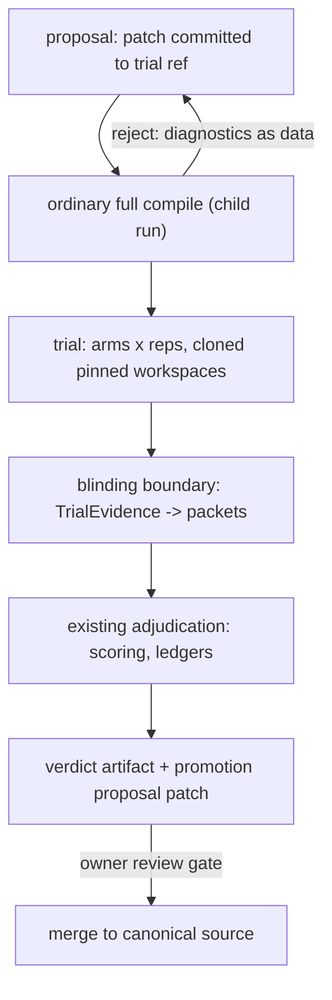

# Workflow Lisp Trial Runs: Controlled Experiments Over Pinned Repository Workspaces

## Metadata

- **Status:** accepted design; no implementation authorized by this document
  (see [Tranche Sequence And Gates](#tranche-sequence-and-gates) for what each
  tranche additionally requires before work starts)
- **Kind:** target architecture and experiment-platform design
- **Owner:** agent-orchestration maintainers
- **Reviewers:** ordered independent `E_DESIGNS_SPEC_APPROVED`, then
  `E_DESIGNS_QUALITY_APPROVED` on 2026-07-31
- **Created:** 2026-07-27
- **Related docs:**
  - [Program-search boundary invariants](workflow_lisp_program_search_boundaries.md)
    (binding; compliance table below)
  - [Lean ORC-effectiveness pilot design](../superpowers/specs/2026-07-26-orc-effectiveness-lean-pilot-design.md)
    (accepted; this design's Layer 0 and admission gate)
  - [Parked evolution substrate and feature design](../superpowers/specs/2026-07-22-workflow-lisp-evolution-substrate-and-feature-design.md)
    (parked by owner decision `8aeb2949`; this design deliberately does not
    revive its substrate layer — see
    [Deliberately Not Selected](#deliberately-not-selected))
  - [Lean-pilot deterministic report](../reports/2026-07-26-orc-effectiveness-lean-pilot.md)
    (completed Layer-0 evidence and claim limits)
  - [Provider at-least-once loosening amendment](../plans/2026-07-26-provider-at-least-once-loosening-amendment.md)
    (landed through ML; supplies the at-least-once attempt and single-writer
    run contract this design assumes)
  - [Pure-result replay](workflow_lisp_pure_result_replay.md)
    (accepted M2 persistence-parsimony boundary; trial state and replay must
    remain subordinate to it)
  - [Workflow language design principles](workflow_language_design_principles.md)
    (Principles 28, 29, and 30 bind refusals, type density, and provider
    attention respectively)
  - [Substrate maintenance track](../plans/2026-07-26-substrate-maintenance-track.md)
    and the Q/L roadmap (MR-4 and L3 own the compiler-session/reentrancy
    substrate needed only by a later in-process compilation optimization, not
    by the E0-E3 tranche gates)
  - `specs/dsl.md`, `specs/providers.md`, `specs/state.md`, and
    `specs/versioning.md` target-2.11 `adjudicated_provider` sections (the
    historical origin of the reuse candidate, not this design's target)
- **Implementation target:** none selected. Ordered design review is complete;
  a reviewed component plan and explicit E0 selection remain required before
  implementation. The landed ML
  kill-mid-provider crash/resume contract and the lean-pilot owner-decision
  handoff are additional E0/E1 entry prerequisites owned by the E roadmap.

Purpose: define the smallest coherent platform on which (1) the effectiveness
of `.orc` orchestration can be measured against controls on real repository
tasks, and (2) bounded, generational program evolution can later be run —
without adding runtime `eval`, code values, or a parallel evaluation system.

Authority: normative runtime behavior remains in `specs/`. This document
schedules no spec change by itself. E0 is a library-and-tests tranche with no
new language target; E1 and E2 land spec amendments first, then code, at a DSL
target chosen at admission. Target 2.23 is already implemented; the first new
language target remains unassigned and must be post-2.23. Where this document
conflicts with
`workflow_lisp_program_search_boundaries.md`, the boundaries document wins.

Copy safety: all `.orc` fragments and record shapes in this document are
conceptual and **not copy-safe**. They name proposed contracts, not
implemented syntax.

## Provenance And Inputs

Three inputs, reconciled here:

1. **Owner direction (2026-07-26/27, session record):** provide a trivial
   direct-to-provider control; provide a primitive that executes a `.orc`
   (sub)expression in another workspace pinned by git ref + hash; run
   experiment arms concurrently; reuse the existing adjudication machinery.
   Repository clones were requested for exact workspace pinning and disposal,
   not accepted as an execution sandbox. Language substrates (for example,
   incremental compilation) are named dependencies on existing tracks rather
   than speculative work in this design. Generated-candidate execution remains
   governed without exception by invariant 6 below.
2. **External thesis memo (2026-07-27, baseline `f29aab84`):** contributes the
   three-treatment experiment separation, the evaluation-methodology package
   (blinding, authority hierarchy, preregistration, ablations, stop rules),
   repository-identity normalization, gene-bounded mutation surfaces, and
   materialization economics. Its closure-extraction `in-workspace`, its
   revival of the parked variant substrate, and its sandbox program are not
   adopted (rationale below).
3. **Lean pilot design (accepted 2026-07-26):** already owns the first
   DIRECT/COORDINATOR/ORC experiment and explicitly gates "building a
   reusable experiment platform" on its outcome. This design is that
   platform, written to slot under the pilot's handoff rather than around it.

## Motivating Question

The doubts report established that no inspectable example demonstrates the
system's value. The lean pilot asks the question once, by hand, on one task
family. This design makes the question *repeatable*: every admitted workflow,
task corpus, and candidate variant uses the same controls, blinding, evidence
discipline, and generated-candidate environment gate. Two questions, never
collapsed:

1. Does orchestration beat one direct provider call by enough to justify its
   extra inference? (DIRECT vs ORC)
2. Does the compiled `.orc` representation beat a conventional typed
   coordinator implementing the same topology? (COORDINATOR vs ORC)

Only the second is this project's distinctive thesis. Every experiment run on
this platform must declare which question each comparison answers.

## Layered Structure

- **Layer 0 — lean pilot (separate evidence program).** External sealed
  controller, three treatments, calibration + A1 nanoBragg task. Its durable
  owner-decision handoff is an admission input; completion status is routed by
  the pilot's own plan and reports, not asserted by this design.
- **Layer 1 — experiment platform (this design's tranches E0–E2).** Canonical
  control workflow; workspace-pinned child runs; a trial form with concurrent
  arms feeding the existing adjudication machinery through a blinding
  boundary.
- **Layer 2 — evolution methodology (tranche E3).** An external search
  controller that proposes gene-bounded candidate commits, trials them via
  Layer 1, and emits promotion proposals. No new language surface.

This is the canonical tranche mapping consumed by the current E roadmap:

| Tranche | Sole meaning in this design |
| --- | --- |
| E0 | canonical one-call direct control and accounting-parity fixtures |
| E1 | pinned-workspace child execution through `run-ref` |
| E2 | concurrent trial arms, evidence freezing, blinding, and adjudication |
| E3 | external gene-bounded controller over the admitted E0–E2 contracts |

Historical E-numbering is context only and cannot select or redefine these
tranches. C1 is the review-pending companion named by the E roadmap; C2/C3
remain deferred unless separately incorporated. None is selected by this
mapping.



## E0 — Canonical Direct Control

A versioned library workflow, `workflows/library/control/direct_task.orc`
(conceptual name): typed `task: String` plus provider policy inputs, exactly
one provider invocation whose composed prompt is the task text plus only the
runtime-owned output contract, and a minimal typed completion result.

Requirements:

- **Canonical, not conventional.** All experiments use this one definition of
  "direct"; a hand-rolled minimal workflow per experiment is a confound. The
  workflow is digest-identified like any other source.
- **Provably one call.** Conformance tests assert: exactly one provider
  invocation per arm; no retries beyond the experiment's declared policy; no
  injected orchestration content beyond the standard output-contract suffix.
  (Behavioral assertions on invocation count and composition stages — not
  prompt-text assertions.)
- **Accounting parity.** The control emits the same evidence surface as any
  other arm: provider identity/policy, attempt identity, cost/token usage,
  elapsed time, terminal status, validated result, produced artifacts. A
  control that is cheaper to *account* is not a control.
- **Workspace-native output.** For agentic tasks the deliverable is the
  workspace delta, not a structured bundle; the control must not be forced to
  produce report artifacts the treatment produces, or the evaluator can
  unblind on artifact shape.

E0 is library + tests only: no runtime, loader, or spec changes. It is also
independently useful outside experiments (the cheapest possible workflow for
genuinely trivial tasks — trivial tasks should remain trivial in `.orc`).

## E1 — Workspace-Pinned Child Runs

One new execution form (conceptual syntax):

```lisp
(run-ref
  :source (:repo <locator> :commit <sha>)      ; exact revision, resolved
  :program (:bundle <workflow-name>)           ; mode 1: from caller's bundle
  ;; or   (:path "experiments/candidate.orc" :entry <workflow-name>) ; mode 2
  :inputs (:task task)                         ; explicit typed data only
  :policy <trial-policy-ref>)
```

### Semantics

1. **Materialize** the repository at the exact commit into a run-owned
   directory outside the parent workspace. One content-addressed local mirror
   per `(locator, sha)`; per-arm workspaces materialize from that verified
   snapshot without further network access (local object sharing /
   reflink-or-copy is implementation guidance, not contract).
2. **Resolve the program** from the declared locus:
   - **Mode 1 (bundle):** the child program is a named workflow already in
     the caller's compiled bundle. The clone supplies files and working
     directory only. This is the default experiment mode: arms are authored
     and certified together with the controller.
   - **Mode 2 (clone path):** the child program is `.orc` source at a
     clone-relative path at that pinned commit, compiled from scratch by the
     ordinary full pipeline. This is the self-evolution mode: a candidate
     cannot execute until its source is committed, so git itself is the
     admission ledger — provider-proposed text becomes executable only by
     being materialized as a commit, passing the full compiler, and satisfying
     the execution-environment boundary below. Compilation is necessary but
     never sufficient authority to run a generated candidate.
3. **Execute as an ordinary child run.** The child is launched as a standard
   top-level orchestrator run (subprocess) with WORKSPACE = the arm
   directory and clone-local run state (`.orchestrate/` inside the arm
   workspace). No nested state managers and no new execution semantics are
   introduced. Parent state has one writer: the parent coordinator records the
   trial ledger entry and child-run reference; child state is written only by
   the ordinary child-run writer under its own root. Each root holds the
   landed fail-fast run-lifetime writer lock; a second writer is rejected
   rather than coordinated after the fact. A failed child compiler process is
   surfaced as structured diagnostics in the arm outcome. This operational
   failure boundary is not an OS-security boundary.
4. **Return typed evidence.** Declared child outputs (typed, validated at the
   child's own boundary) plus the normalized `WorkspaceDelta` (below) plus
   run accounting.

There is **no quoting, no code value, no closure conversion, and no runtime
evaluation of expression text**. "Subexpression granularity" is achieved by
authoring a small named wrapper workflow around the expression (mode 1 in the
controller's own source; mode 2 in the trial ref). An inline-expression sugar
(compiler-extracted child entrypoints with checked captures) is a possible
later ergonomic layer; it is explicitly out of scope here and shelved with an
evidence trigger (see Deliberately Not Selected).

### Typing and effect classification

`run-ref` is a new step-level execution form, mutually exclusive with every
other execution form, and a durable effect boundary: it participates in
checkpoints, at-least-once discard/rerun, and committed-result reuse like a
provider step. It is not a `call` variant — `call` is inline, same-run,
same-workspace; `run-ref` is a subprocess child run with its own state root
and workspace.

Result typing differs by program locus:

- **Mode 1 (bundle):** the named workflow's v2.1 signature is present in the
  caller's compiled bundle, so the child result type is statically known and
  checked at caller compile time. `run-ref` types as a record of that result
  plus `WorkspaceDelta` plus run accounting.
- **Mode 2 (clone path):** the child program is compiled at runtime by the
  child process; the caller cannot know its signature statically. The child
  result therefore defaults to the exact opaque transportable `Value` type
  (target 2.19). An optional `:returns <Type>` refinement is a caller claim,
  verified at runtime against the child's own compiled signature and failing
  closed on mismatch (`trial_program_signature_mismatch`). No structural
  inference across the boundary; the child compiler's output is the sole
  signature authority.

`trial` (E2) evaluates to the authored-order list of arm outcomes plus a
verdict artifact reference, with the arm element type expressed in the
language's existing tagged-union discipline:

```text
ArmOutcome = Completed { arm_id, rep, value, evidence: TrialEvidence }
           | Failed    { arm_id, rep, failure: TrialFailure, evidence: PartialTrialEvidence }
```

`value` is typed per the arm's `run-ref` mode above; failures are values and
never imply sibling cancellation.

### Repository identity

A trial source is not "URL + branch". The recorded source identity is:

```text
RepositoryRevisionId = hash(
  normalized locator,
  resolved commit SHA,
  materializer version,
  submodule policy,        ; v1: fail closed if .gitmodules present
  LFS policy,              ; v1: fail closed if LFS attributes present
  setup identity           ; see below
)
```

- v1 refuses submodules and LFS rather than normalizing them
  (`trial_source_submodules_unsupported`, `trial_source_lfs_unsupported`);
  lifting either is a later amendment with its own identity rules.
- **Setup steps** (dependency installation etc.) are the largest real-world
  confound for numerical target repos. v1: a trial declares an explicit
  ordered setup command list; its literal argv + declared env form the setup
  identity; setup runs once per arm workspace before the child run; setup
  output is evidence, not part of the delta. Network nondeterminism of setup
  is acknowledged and recorded, not solved, in v1.
- The materialized workspace begins from the verified committed tree, so
  unrelated untracked files from the source checkout do not enter trial
  identity. Environment, credentials, network access, global configuration,
  and host-visible paths are not isolated by cloning. The clone is an exact
  workspace/output boundary and a disposable directory, never a sandbox.

### Workspace delta

```text
WorkspaceDelta = {
  base: RepositoryRevisionId,
  changed_files, deleted_files, untracked_files,   ; from git status vs base
  normalized_diff,                                  ; bounded, deterministic
  declared_artifacts                                ; child-declared outputs
}
```

Candidate-generated commits inside the arm are optional artifacts, never
trial identity.

### Failure and resume semantics

Trial execution uses the landed ML at-least-once and single-writer run
contract, not the retired provider-interruption quarantine. An interrupted or
crashed incomplete arm is a failed attempt: retain whatever non-authoritative
incident evidence is already available, discard the arm workspace, allocate a
fresh ordinal, re-materialize, and re-run through ordinary control flow. A
committed completed arm result is validated and reused on parent resume.

This does **not** change the lean pilot's separate, load-bearing rule: pilot
attempts are never resumed, recovered, deleted, or rerun under the same ID,
and interrupted pilot blocks remain outcomes. The trial platform may
reproduce the pilot protocol only in new platform-owned runs after admission;
it may not reinterpret a pilot evidence root as a platform run.

### Refusal families (structural only)

The v1 refusal registry is closed at admission and each envelope carries
`code`, `rejected_value`, and optional stable secondary causes. Human prose is
a view and is never routing authority.

| Boundary | Stable refusal codes |
| --- | --- |
| Source/materialization | `trial_source_unresolvable`, `trial_source_submodules_unsupported`, `trial_source_lfs_unsupported`, `trial_source_revision_digest_mismatch`, `trial_materialization_digest_mismatch`, `trial_workspace_preexisting`, `trial_setup_failed` |
| Program/signature/environment | `trial_program_missing`, `trial_program_compile_rejected` (with the child compiler's stable diagnostics), `trial_program_signature_mismatch`, `trial_candidate_environment_not_admissible` |
| Evaluation value | `trial_evaluation_contract_not_pure`, `trial_evaluation_contract_invalid`, `trial_evaluation_provider_unresolved`, `trial_evaluation_rubric_unresolved` |
| Budget/concurrency | `trial_reps_invalid`, `trial_concurrency_invalid`, `trial_budget_invalid` |
| Packet/blinding | `trial_packet_policy_invalid`, `trial_packet_limit_invalid`, `trial_blinding_policy_invalid`, `trial_packet_citation_invalid` |

`trial_candidate_environment_not_admissible` names the rejected effect/policy
facts and the missing admissible environment; it does not introduce an
isolation mechanism. Runtime arm failures after admission are routed as
`ArmOutcome.Failed`, with the originating stable refusal or runtime failure
code retained as evidence rather than collapsed into a generic error.

## E2 — Trial Form: Concurrent Arms Into Existing Adjudication

One new step-level form (conceptual):

```lisp
(trial
  :arms ((:id a :run-ref <...>) (:id b :run-ref <...>) ...)
  :reps <n>                       ; per arm; candidate id = (arm, rep)
  :max-concurrency <k>
  :evaluation <frozen evaluation contract ref>
  :budget <provider budget ref>)
```

### Reuse map (`adjudicated_provider`, originating at target 2.11)

| Layer | Disposition |
| --- | --- |
| Concurrent candidate fan-out, per-candidate private workspace | **Generalized:** candidate := `run-ref` child run instead of one provider invocation; workspace := pinned clone instead of parent-baseline copy. "Private" means separate run-owned files, not sandboxed host authority. |
| Evaluator provider + strict-JSON scoring + evidence-packet discipline (`specs/providers.md` evaluator contract) | **Reused** behind the blinding boundary below; packets gain a `WorkspaceDelta` member |
| Score ledgers (stable candidate/score run keys, owner tuples), resume reconciliation | **Reused** with trial-scoped key extension `(arm, rep)` |
| `evidence_confidentiality: same_trust_boundary` attestation | **Reused** unchanged |
| Promotion transaction | **Not reused for source.** The target-2.11 contract already restricts promotion to declared artifacts, "not arbitrary source-edit patch promotion" (`specs/versioning.md`). A trial's terminal output is a verdict artifact + optional proposal patch; canonical source changes only through review |
| Candidate prompt-composition overrides | **Not applicable** (arms are whole runs) |

Semantics adopted from the external memo, binding here:

- failures are values (`ArmOutcome = Completed | Failed`), never implicit
  sibling cancellation; collect-all is the default failure policy;
- authored arm order, not completion order, determines evaluator input order;
- per-arm ledgers: cost, tokens, elapsed time, provider identity, failures;
- evaluation begins only from a frozen set of admitted arm evidence;
- explicit cancellation/timeout policy per arm and per trial;
- a mandatory concurrency cap at trial and provider levels.

### Persistence and replay contract

Trial persistence is subordinate to the accepted M2 pure-result replay
design. Durable state records only facts needed to validate or continue
effects and public boundaries: trial identity, frozen evaluation identity,
arm attempt/result identity, child-run reference, terminal outcome, and
evidence/artifact lineage. Pure projections derived from those validated
facts use M2's value-free completion shells and transient replay overlay; the
trial design does not persist a second derived-value cache.

No effect-identity memo key, memo-first execution path, or cross-run result
cache is selected here. Those are explicitly outside accepted M2 component
(a). Any future memo key requires separate M2(b)/M3b selection and must consume
the landed Q3 role-separated identity rather than invent a trial-local
identity. Ordinary committed-result reuse remains valid within a run after the
existing root/callee, checkpoint, input, and result validations pass. Before
E1/E2 implementation planning freezes an exact state shape, a fixture must
prove that clean and crash/resume executions fit this boundary without
persisting derived pure values or re-spending a committed effect.

### Evaluation contract

The `trial` form's `:evaluation` operand is an ordinary structural record
value, not a new definition form and not a mandatory `TrialEvaluation` nominal
taxonomy. Authors may construct a structurally typed record directly or begin
with implemented transportable `Value` (target 2.19+) and narrow at the trial
boundary. The compiler checks only the fields the mechanism requires; authors
may define a local nominal wrapper if its name carries a useful project
contract, but the platform never requires one. Conceptual shape:

```lisp
(proc coding-trial-eval ()
  (record
    ;; authority levels 1-3: deterministic checks, run in the arm
    ;; workspace after its child run terminates
    :checks (list
      (record :id "hidden-tests"
              :command (list "python" "-m" "pytest" "-q" "tests/hidden")
              :authority "correctness" :required true)
      (record :id "perf-floor"
              :command (list "python" "bench/check_regression.py")
              :authority "invariant" :required false))
    ;; level 6; the evaluator contract originating at target 2.11 is reused:
    ;; provider alias and
    ;; rubric relpath are strings resolved and validated at the consuming
    ;; trial form, like asset_file and the target-2.11 evaluator provider
    :judgment (record
      :provider "scorer"
      :rubric-asset "rubrics/port_quality.md"
      :evidence-confidentiality "same_trust_boundary"
      :evidence-limits (record :max-item-bytes 65536
                               :max-packet-bytes 262144))
    ;; blinding boundary instantiation: include-list plus metric-relevant
    ;; reveals only
    :observation (record
      :include (list "task_spec" "workspace_delta" "check_results"
                     "declared_artifacts" "failure_evidence")
      :diff-cap-bytes 262144
      :reveal-provider-identity false)
    :aggregation (record
      :mode "independent_rubric"
      :rep-combine "median"
      :tie "candidate_order")
    :success-rule (record
      :superior (record :min-abs-improvement 0.10
                        :max-cost-ratio 1.5)
      :non-inferior (record :min-cost-reduction 0.20)
      :count-failures-as-outcomes true)))
```

The `:evaluation` operand must discharge the compiler's closed structural
constraint as a compile-time pure expression: the compiler embeds the resolved
record value in the IR, and a runtime-computed contract is rejected as
`trial_evaluation_contract_not_pure` (the referee may not be data-dependent).
The `trial` form performs deep structural validation — provider alias
resolution, rubric asset resolution, `max_packet_bytes >= max_item_bytes`,
and closed authority/aggregation value constraints — reusing the evaluator
contract that originated at target 2.11 without a dedicated definition form.

Evaluation is deliberately declarative data interpreted by trial machinery,
never an authored procedure invoked with arm evidence: blinding exclusions
and the authority hierarchy are enforceable only when the runtime owns packet
construction, deterministic check execution, schema/blinding/budget
validation, output-contract rendering, and level ordering; a behavioral referee could encode
data-dependent scoring no reviewer would spot; and the evaluator ledger,
packet-limit, and resume-reconciliation machinery is reusable only when
driven from config. Authored behavior appears exactly at the leaves — check
commands and the judgment provider call — executed under runtime
supervision with results captured as data.

- Checks are commands executed in the arm workspace after its child run
  terminates; their results enter both the packet and the authority
  hierarchy above any judgment score.
- The judgment member maps onto the existing evaluator contract that
  originated at target 2.11
  unchanged (provider, rubric source, `same_trust_boundary`, evidence
  limits).
- The observation member authors only the include-list and metric-relevant
  reveals;
  the blinding exclusions below are fixed by this design and are not
  authorable surface.
- One contract judges all arms: per-arm evaluation overrides are
  deliberately unsupported (asymmetric evaluation is a confound and an
  unblinding vector).
- The adaptive/validation/holdout partition is deliberately absent: the
  contract must not know which split a run serves (invariant 5); partition
  membership is controller-owned.
- Freezing is mechanical, not procedural: the contract compiles into the
  bundle and its digest is part of trial identity in the ledger. A
  post-hoc rubric or threshold edit produces a different trial, not an
  updated one.

### Blinding boundary

The adjudicator must be unable to identify treatments.

- Arm IDs entering evaluation are opaque; the treatment map is sealed in the
  trial ledger and joined only after scoring.
- Packets **exclude**: treatment labels, arm source text and filenames,
  candidate lineage/proposer identity, provider/model identity (unless the
  metric explicitly requires it), run logs and `.orchestrate` sidecars,
  completion order, prior adaptive scores.
- Packets **include**: task specification, validated result, `WorkspaceDelta`
  (normalized diff + artifacts), deterministic check results permitted by the
  protocol, and explicit failure evidence where failure is itself an outcome.
- The hardened blinded-review citation contract applies: evaluator citations
  must resolve inside the blinded packet only.

The known tension — lineage wants every artifact origin-stamped, blinding
wants the evaluator ignorant — is resolved exactly there: full lineage in the
sealed trial ledger, normalized packets to the evaluator, unsealed join after
verdict.

### Evaluation authority hierarchy (frozen per experiment, in this order)

1. trial validity (materialization, setup, policy attestation);
2. deterministic correctness checks (visible + hidden tests);
3. task-specific invariants;
4. operational completion;
5. cost and elapsed time;
6. blinded LLM/human judgment for soft dimensions;
7. candidate complexity.

LLM adjudication is never the sole correctness authority in proving
experiments. For >2 arms, no order-dependent single-elimination brackets:
independent scoring against a frozen rubric is the default (it composes with
reps and yields distributions); balanced randomized pairwise comparison with
order reversal is the alternative. The aggregation rule and tie handling are
frozen before evaluation.

### Comparison contract and preregistration

Arms must be matched on: task input, repository revision, provider/model
eligibility, tool permissions, context availability, and budget policy —
except where the treatment definition explicitly varies call count, in which
case results report both absolute quality and quality under a matched-budget
frontier. Default preregistered success rule (tunable per experiment
manifest, frozen before the run): materially better means ≥10 percentage
points absolute success improvement with an uncertainty interval excluding
zero at ≤1.5× provider cost, **or** statistically non-inferior success at
≥20% lower cost. Timeouts, malformed candidates, and failed runs count as
outcomes. Holdout floor: ≥30 independent cases, subject to a power
calculation. Task corpora are partitioned before adaptive work: adaptive set
/ validation set / sealed holdout, with the holdout opened once after
candidate generation, evaluator, and decision rule are frozen. The trial
ledger records which partition every run served.

## E3 — Evolution Methodology (No New Language Surface)

The first search controller lives **outside** Workflow Lisp (a small external
program consuming the trial platform's public surfaces), mirroring the lean
pilot's external-controller architecture. A `.orc`-native controller is a
later, separate experiment on the same public contracts.

The loop, entirely on existing rails: propose (provider writes a patch) →
commit to a trial ref (git = admission ledger + variant registry,
content-addressed and diffable) → compile gate (ordinary full compiler as the
free static fitness filter; rejections feed back as structured diagnostics at
zero provider cost) → trial via E2 (base vs mutants, reps, blinded scoring) →
verdict artifact → **promotion proposal** (patch + evidence manifest +
holdout result). The owner merges; nothing merges itself. Verdicts are
evidence, never authority.

Binding methodology:

- **Gene bounds as diff policy.** Admitted mutation surfaces are enforced as
  diff-span checks in the controller against declared loci — v1 admits:
  prompt text inside selected declarations (slots and result contracts
  preserved); literal thresholds/closed pure expressions of unchanged type;
  bounded compiler-legal topology edits from a fixed template vocabulary
  (add/remove a review or repair phase, bounded retry counts); provider
  policy selection from a frozen allowlist. Prompt, topology, provider, and
  context remain **separate genes** even when one proposal changes several —
  so a "prompt improvement" cannot silently acquire more compute or
  authority, and ablations stay possible. No `SubjectManifest`/rewrite
  certification substrate is built for this; a diff-span policy check plus
  the full compiler is sufficient for these bounds.
- **Mandatory baselines.** Every adaptive-search claim is tested against:
  fixed hand-authored workflow; random/enumerative candidate search under
  equal budget (distinguishes optimization from merely trying more
  candidates); prompt-only and topology-only ablations before any joint
  search claim.
- **Frozen kernel.** Candidates and the controller cannot modify: compiler
  and lowering pipeline, admission/diff policy, evaluator and rubric, corpus
  partition, materializer, setup commands/environment, admissible execution
  environment, budget accounting, or promotion rules. The controller never
  imports candidate code into its own process.

## Program-Search Boundary Compliance

Per `workflow_lisp_program_search_boundaries.md` ("satisfy or amend first,
explicitly"):

| Invariant | Disposition |
| --- | --- |
| 1 — Immutable generation boundaries | Satisfied by construction: running bundles never modified; every candidate passes the ordinary full compiler (mode 2 compiles from scratch; mode 1 was certified with the controller); execution is a new registered child run; promotion is a reviewable patch. Generation boundary = commit boundary. |
| 2 — Provider output is untrusted data | Satisfied structurally: mode 2 executes only committed source; a proposal becomes behavior only via commit + full compile + the admissible-environment gate + child run. No candidate text is ever evaluated from memory. |
| 3 — Neutral substrate vs feature | Satisfied: `run-ref`/`trial` know arms, reps, budgets, evidence, ledgers — no genome/population/fitness/selection vocabulary. All optimizer concepts live in the external controller (E3). |
| 4 — Whole-candidate evidence is fitness authority | Satisfied: arms are whole child runs; scoring binds to whole-arm evidence; any finer-grained signal is diagnostic only. |
| 5 — Evidence separation | Satisfied procedurally: adaptive/validation/sealed-holdout partition frozen before adaptive work; partition membership recorded per run in the trial ledger; holdout opened once. |
| 6 — Honest security boundary | Satisfied by exclusion: a clone is only an output boundary. Generated candidates run only in deterministic effect-free harnesses, or use text-only/no-tool, mock/replay, or genuinely sandboxed provider calls. |
| 7 — Typed-operation parity without kind erasure | Satisfied: `run-ref` is a distinct durable child-run boundary with data-only arguments (locator, sha, name/path, typed inputs). No `Code<T>`, no runtime closures, no expression shipping. |
| 8 — Prompt identity is role-separated | Satisfied by inheritance: arms are ordinary runs carrying the landed Q3 identity discipline unchanged. |

## Generated-Candidate Execution Environment

This design satisfies invariant 6 without amendment and without selecting
security work. A generated candidate may execute only in one of these
environments:

1. a deterministic effect-free harness;
2. provider calls that are text-only/no-tool;
3. mock or replay provider calls; or
4. a genuinely sandboxed environment whose positive isolation evidence is
   supplied by a separately accepted capability.

The compiler derives the candidate's effect summary and the trial admission
path validates it against the declared environment. An unknown effect,
tool-using provider call outside item 4, or missing positive sandbox evidence
fails closed as `trial_candidate_environment_not_admissible`. Gene bounds,
commits, full compilation, process separation, and cloned workspaces do not
substitute for this check. Owner-authored ordinary workflows outside program
search remain governed by their existing runtime contracts; this design does
not broaden or narrow them.

## Language Substrate Dependencies

Named dependencies on existing tracks; this design builds none of them.

- **Compiler invocation strategy:** child compiles run inside child-run
  subprocesses so compiler failure is reported at the child-run boundary.
  This is operational fault containment, not a trust boundary. In-process
  batch compilation is a later optimization
  gated on MR-4 (compiler session state) / L3 (reentrancy), which the Q/L
  roadmap already owns.
- **Diagnostics as machine API:** E3's repair loop consumes compile
  rejections as data. Requires a stable diagnostic-code contract and a
  structured (JSON) batch validation surface. Cheap, independently useful;
  land at E1 admission.
- **Hermeticity entry proof:** trial identity requires compilation to be a
  function of the complete source/dependency set plus compiler identity, not
  an ambient path-keyed cache or undeclared environment read. This is not
  assumed from current direction. Before E1 planning, a minimal fixture must
  characterize the ordinary full compile path, prove content-addressed cache
  behavior for equal paths with changed bytes, and either bind every remaining
  input into identity or stop with the missing dependency named.
- **Incremental compilation: measurement gate, not machinery.** Trials are
  provider-bound by orders of magnitude; compile cost is negligible until E3
  population regimes. The trial ledger records compile share of generation
  wall time; the admission trigger for a content-addressed, module-granular
  compile cache (the natural continuation of the landed content-keyed
  projection cache) is measured compile share exceeding ~10% of generation
  wall time. Fine-grained (per-declaration) incrementality is not admissible:
  invariant 1 ("no reduced candidate mode") demands cache hits be provably
  equivalent to cold compiles, which content-keyed memoization of a hermetic
  pipeline gives by construction and dependency-tracked engines do not.

## Deliberately Not Selected

- **Closure-extraction `in-workspace` (inline subexpression arms).** Free
  variable analysis, serializable-capture checking, closure conversion, and
  synthetic child entrypoints constitute the largest avoidable line item in
  the external memo (its own estimate: 450–800 hours) and add lexical
  machinery adjacent to territory this language deliberately excludes.
  Wrapper workflows deliver the same granularity at ~5 lines each. Shelf
  trigger: recurring, documented authoring friction from wrapper workflows in
  real experiments.
- **Revival of the parked variant substrate**
  (`SubjectManifest`/`RewriteProposal`/`CertifiedVariant` registries). Git
  commits are the variant registry (content-addressed, diffable, admission =
  commit); the ordinary compiler is certification; diff-span policy checks
  enforce gene bounds. Owner decision `8aeb2949` stands; this design is a
  revival of the *direction* under the boundaries document, not of that
  substrate.
- **Isolation/security implementation.** Not selected by this design.
  Generated tool-using candidates remain excluded unless a separately
  accepted capability supplies genuine positive sandbox evidence; a clone,
  subprocess, gene bound, or permission freeze never supplies that evidence.
- **`.orc`-native search controller.** Later experiment on the same public
  contracts; external controller first (matches the lean pilot architecture).
- **Submodule/LFS normalization, cross-DSL-version children.** Fail closed in
  v1; later amendments with their own identity rules. Children compile under
  the controller installation's compiler; the pin makes version skew
  detectable at compile time.

## Design-Principle Compliance

- **Principle 28 — refusals name their rule.** Every admission denial uses a
  stable code and includes the rejected locator, identity, signature, effect,
  or policy fact. No workflow/module name grants authority, and a downstream
  compile or launch error retains the admission refusal as its cause.
- **Principle 29 — types are opt-in constraints.** Trial inputs start from the
  existing transportable structural value surface and may narrow. Nominal
  force is reserved for load-bearing identities, rooted paths, and routed
  outcome variants; trial authors do not mint taxonomies merely to use the
  platform.
- **Principle 30 — conserve provider attention.** Identity, packet exclusion,
  blinding, output validation, budget accounting, and admissible-environment
  checks are compiler/runtime/controller obligations. They never become
  instructions in an arm or evaluator prompt. Prompts retain only genuinely
  ambiguous task and judgment content.

## Feasibility Entry Proofs

This draft does not infer new composition capabilities from adjacent features.
The reviewed E component plan must close these proofs before their owning
tranche can start:

1. **E0 accounting parity:** one deterministic-provider fixture proves that
   the direct control and an ordinary arm emit the same accounting fields
   without requiring matching artifact shapes.
2. **E1 full-compile and source identity:** the hermeticity fixture above
   proves source/dependency content addressing and ordinary full-pipeline
   compilation from the pinned child root, including stable structured
   rejection from the actual compiler rather than a parallel validator.
3. **E1 run topology:** a minimal parent/child fixture proves separate
   single-writer roots, typed result return, committed-result reuse, and fresh
   discard/rerun for an incomplete visit without relying on quarantine. The
   same fixture proves deterministic, bounded `WorkspaceDelta` bytes for an
   identical pinned tree and child result.
4. **E1 admissible environment:** both-direction fixtures admit an effect-free
   candidate and reject an unknown/tool-using generated candidate absent
   genuine sandbox evidence with the stable refusal code.
5. **E2 adjudication reuse:** a deterministic two-arm fixture proves the
   existing evaluator/ledger contracts can consume whole child-run evidence;
   until then the reuse map above is a target, not a capability claim.
6. **E2 M2 fit:** clean/resume parity proves durable trial state contains only
   the validated effect/public-boundary facts listed above, while derived pure
   values follow accepted M2 replay and no effect-identity memo key appears.

Failure of a proof narrows or stops its tranche; it does not authorize a
parallel runtime, a weaker identity, or a prompt-carried substitute.

## Spec Amendment Inventory (At Admission, Per Tranche)

- **E0:** none (library + tests only).
- **E1:** `specs/dsl.md` (`run-ref` form, structural refusals, version
  gating at a post-2.23 target); `specs/state.md` (parent-side trial ledger
  entries; clone-local child state statement; M2-compatible persistence);
  `specs/versioning.md` (new, as-yet-unassigned post-2.23 target row). No
  security spec or boundaries amendment is selected.
- **E2:** `specs/dsl.md` (`trial` form); `specs/providers.md` (evaluator
  packet `WorkspaceDelta` member; blinding exclusions as packet policy);
  `specs/state.md` (trial ledgers keyed `(arm, rep)`; partition membership);
  `specs/observability.md` (trial snapshots as sidecars, mirroring the
  target-2.11-origin pattern).
- **E3:** no spec changes (external controller over public surfaces); the
  landed at-least-once and single-writer contracts continue unchanged.

## Tranche Sequence And Gates

| Tranche | Content | Entry gate | Exit gate |
| --- | --- | --- | --- |
| E0 | Control library workflow + conformance tests | ML kill-mid-provider crash/resume E2E green; lean-pilot owner-decision handoff; this design and component plan approved; E0 explicitly selected | one-call + accounting-parity conformance green |
| E1 | `run-ref`: materialization, identity, child runs, delta evidence, structural refusals | E0 exit; feasibility proofs 2–4; an assigned post-2.23 target | a pinned-revision child run executes both program modes with reproducible identity and evidence; inadmissible generated environments reject; crash → discard → rerun proven |
| E2 | `trial`: arms×reps, ledgers, blinding boundary, adjudication adapter, preregistration manifest | E1 exit; feasibility proofs 5–6 | a blinded three-treatment trial (DIRECT/COORDINATOR/ORC) reproduces the lean pilot's protocol on new platform-owned runs, evaluator unable to identify treatments (verified by a labeling probe) |
| E3 | External controller: gene-bounded proposals, baselines/ablations, promotion proposals | E2 exit + first fixed-study results reviewed | prompt-only search beats random search on validation under equal budget, or the program narrows/stops |

## What This Approach Makes Harder

- Inline arm authoring is clunkier than closure extraction: arms live as
  named wrapper workflows, and evolution arms require commits to trial refs —
  deliberate friction that doubles as the admission ledger.
- Mode 2 children are pinned to the controller installation's compiler:
  trialing a candidate *together with* a DSL/compiler change requires
  releasing the compiler change first (or a future nested-version amendment).
- Setup nondeterminism is recorded, not eliminated, in v1; environment-driven
  noise between arms is bounded only by setup-identity matching.
- Refusing submodules/LFS excludes some real target repositories from trials
  until later amendments.

## Stop Rules (Program Level)

Stop, simplify, or narrow if: the lean pilot shows no plausible target-domain
value; the direct control is competitive enough that orchestration cost is
unjustified for the chosen family; a conventional typed coordinator matches
ORC reliability with materially less complexity; prompt search fails to beat
random search under equal budget; topology search adds nothing over
prompt-only; adaptive gains vanish on validation; evaluator disagreement
prevents stable claims; materialization cannot be made exact enough for
comparable trials; or holdout improvement stays below the preregistered
threshold. A negative result is a successful experiment and must be recorded
as such, not reframed as motivation for the next, more general layer.

## Verification Strategy

Behavioral, per house rules (no prompt-text assertions): identity-separation
property tests (revision/setup/program identities change only under their own
inputs); materialization tests (pinned bytes, refusal families, mirror
reuse); crash injection at materialize/setup/launch/finalize/evidence
boundaries with discard-and-rerun assertions; concurrency tests with
randomized completion order proving authored-order evaluator input;
blinding-boundary tests (packet exclusion list; a treatment-labeling probe
must perform at chance); ledger/resume reconciliation tests reusing the
existing adjudication test patterns; end-to-end: one two-arm trial on a fixture repository
through scoring to a verdict artifact. Design-doc routing changes rerun
`tests/test_workflow_lisp_drain_roadmap_routing.py`.

## Open Questions (Dispositioned)

1. Transportable `run-ref` input types — start with the existing closed
   transportable value set + relpath artifact references; widen by amendment.
2. May a mode-1 child call other bundle entrypoints? — v1: yes, anything in
   its own certified bundle; the child is an ordinary run of that bundle.
3. Cancellation when one arm exhausts a shared provider budget — v1: siblings
   run to their own budgets; trial-level budget exhaustion cancels *pending*
   arms only and records `budget_exhausted` outcomes; mid-flight arms finish.
4. Best first benchmark family — owned by the lean pilot (A1 nanoBragg) and
   its successors; this platform does not choose corpora.
5. Evaluator reuse boundary — packets and ledgers are the reuse surface;
   selection/promotion of source is not (verdict artifacts only).
